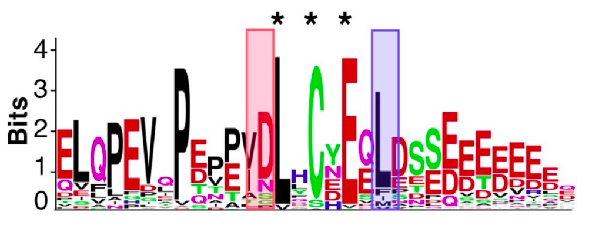

<style>
details > summary:first-of-type {
   display: list-item;
}
details summary { 
  cursor: pointer;
}

details summary > * {
  display: inline;
}
</style>



**Pagina en construccion**



## Materiales
AGREGAR LINK ACÁ
* [Descargar](https://drive.google.com/file/d/1CftYKxzQh1MX24u0RoTp0X751BW4rKQx/view?usp=sharing)

## Recursos a utilizar
* ELM: [http://elm.eu.org](http://elm.eu.org)
* Consurf: [https://consurf.tau.ac.il/](https://consurf.tau.ac.il/)
* Colab: [AlphaFold2-advanced](https://colab.research.google.com/github/sokrypton/ColabFold/blob/main/beta/AlphaFold2_advanced.ipynb)

## Objetivos:
* Familiarizarse con la simbología utilizada en expresiones regulares, poder interpretar una expresión regular.
* Utilizar la simbología para poder realizar búsquedas basadas en texto
* Familiarizarse con la base de datos ELM.
 
## Ejercicios

### Ejercicio 1. Identificación de motivos cortos de interacción en p53 en un alineamiento propio.
La región amino terminal de p53 posee un motivo de unión a la E3 ligasa MDM2, el cual está caracterizado por una secuencia conservada que puede representarse por la expresión regular: `F[^P]{3}W[^P]{2,3}[VIL]`.

1. Busque las ocurrencias de esta expresión regular en las secuencias de p53.

   Para ello, abra en Jalview el alineamiento de p53 con el cuál estuvo trabajando en las clases anteriores. Jalview permite la búsqueda de motivos por expresiones regulares. Para hacerlo, utilice la función:

   *Select → Find*

   En la ventana tipee la expresión regular.
   
   <ul class="block-list has-radius is-primary">
   <li class="is-outlined is-danger">
   <p>
   Si este procedimiento falla, y tiene ventanas con otras secuencias o alineamientos abiertas, ciérrelas. Si aún así falla, asegúrese de no tener ninguna secuencica seleccionada <span style="font-style:italic;">Select → Deselect All</span>.
   Si aún así falla, identifique el motivo utilizando el filtro de conservación.
   </p>
   </li>
   </ul>

   * ¿Todas las secuencias de p53 tienen el motivo de interacción con MDM2?
   * ¿Todos los motivos MDM2 tienen la misma longitud de secuencia?
   * ¿Qué nivel de identidad de secuencia observa en esta región? ¿A qué puede deberse?

   Si pudo encontrar, en la ventana donde ingresó la secuencia regular, con el botón *New Feature* puede crear una *feature*.

   Se abrirá una ventana:
   * En *Name* deje la expresión regular que figura.
   * En *Group* y *Description* escriba MDM2. 
   * Elija el color deseado.

   De esta manera, si desea buscar más de un motivo podrá marcarlos de distintos colores en el alineamiento, también podrá exportar los datos y volverlos a cargar en el alineamiento.

   Si desea cambiar los colores:

   *View → Sequence features settings*

   Ahí encontrará todas las features creadas.

   Para exportar las features:

   *File → Export Features*

   El círculo al lado de *Jalview* debe estar tildado y elija *to textbox*.

   Se abrirá una nueva ventana donde se indica para cada secuencia el inicio y final de la feature
   * ¿Puede encontrarlos?
   * ¿Es el mismo para todas las secuencias?.

   En esa ventana vaya a:
   
   *File → Save*

   Y guarde el archivo donde desee.

   Si en futuras ocasiones desea usar estas *features* con estas secuencias, debe abrir en Jalview el alineamiento utilizando, luego ir a *File → Load features/annotations*.

### Ejercicio 2. Base de datos de motivos lineales en Eucariotas (ELMdb)
La base de datos ELM (*Eukaryotic Linear Motifs*) es una base de datos que se enfoca principalmente en la anotación y detección de motivos lineales (SLiMs). Para ello cuenta con un repositorio de motivos manualmente anotados, por lo cual está altamente curada, y también cuenta con una herramienta de predicción de motivos. Esta predicción de motivos se realiza mediante una búsqueda de patrones de secuencia basada en texto utilizando expresiones regulares (en particular, todas las expresiones regulares definidas dentro de la base de datos).

1. Busque en [ELMdb](http://elm.eu.org/) en la pestaña Prediction la proteína PGC-1-alpha utilizando el accession number o uniprot ID (Q9UBK2 - PRGC1_HUMAN). Esta es una de las proteínas de la lista que usamos en el ejercicio donde construimos la expresión regular `L[^P][^P]LL` del motivo NRBox en otro trabajo práctico.
 
   Para cada motivo encontrado, se indica con símbolos (descriptos en la parte superior de la página) si la instancia del motivo es predicha o fue identificada experimentalmente (anotadas o “True Positives”). Responda:
   
   * ¿Encuentra el motivo NRBox entre los True positives?
   * ¿Cuántas instancias True Positive existen para esta proteína?
   * ¿Cómo es la estructura de la proteína donde se encuentran estos motivos?

2. Pegue y copie la siguiente secuencia en ELM y utilice los parámetros que se indican a continuación.

   ```
   >seq
   MEEPQSDPSVEPPLSQETFSDLWKLLPENNVLSPLPSQAMDDLMLSPDDI  
   EQWFTEDPGPDEAPRMPEAAPPVAPAPAAPTPAAPAPAPSWPLSSSVPSQ  
   KTYQGSYGFRLGFLHSGTAKSVTCTYSPALNKMFCQLAKTCPVQLWVDST  
   PPPGTRVRAMAIYKQSQHMTEVVRRCPHHERCSDSDGLAPPQHLIRVEGN  
   LRVEYLDDRNTFRHSVVVPYEPPEVGSDCTTIHYNYMCNSSCMGGMNRRP  
   ILTIITLEDSSGNLLGRNSFEVRVCACPGRDRRTEEENLRKKGEPHHELP  
   PGSTKRALPNNTSSSPQPKKKPLDGEYFTLQIRGRERFEMFRELNEALEL  
   KDAQAGKEPGGSRAHSSHLKSKKGQSTSRHKKLMFKTEGPDSD
   ```

   Modifique los valores de los distintos parámetros de la siguiente manera:

   > * **Cell Compartment:** Not specified
   > * **Motif Probability Cutoff:** 100
   >* **Taxonomic context:** (leave blank) 

   * ¿Cuántas instancias predichas de motivos se encuentran? Para verlo investigue la tabla llamada *Filtering Summary*.
   * ¿Cuántas son retenidas luego del filtro?
   * ¿Qué se puede decir sobre la estructura de la proteína? ¿Se observa algún dominio?
   * ¿Se observan regiones desordenadas?
   * ¿Los predictores estructurales y filtros (SMART, GlobPlot, IUPRED, Secondary Structure) coinciden sobre qué regiones son estructuradas/desordenadas?

3. Por si no se dió cuenta, la proteína utilizada en el ejercicio anterior es p53 de humanos.
   
   Abra en una nueva pestaña la página de [ELMdb](http://elm.eu.org/).  
   Vaya de nuevo a la pestaña de predicción.  
   Limpie el formulario con el botón Reset Form.  
   Ingrese el Uniprot ID de la proteína (P53_human).

   * ¿Qué compartimentos celulares se le asignaron? ¿Tienen sentido?

   Realice la predicción y conteste:
   * ¿Cuántas instancias de motivos se encuentran ahora?
   * ¿Cuántas instancias de motivos son retenidas luego del filtro?
   * ¿A qué se debe esta diferencia con el punto anterior?

   Investigue el motivo `CLV_PCSK_FUR_1` en la predicción realizada sólo con la secuencia (la del punto 1).
   * ¿Por qué cree que fue filtrado?

   Observe las distintas instancias predichas:
   * ¿Cuántas instancias anotadas como *true positive* posee esta proteína?
   * Compare la ubicación de dichas instancias con la información estructural proveniente de IUPred. ¿Qué observa?
   * ¿Cuántas instancias de la clase `MOD_CK1_1` se encontraron? ¿Cuál es la diferencia entre estas instancias?
   * ¿Cuántos degrons anotados hay en p53? ¿Cuál es la función de estos motivos?
   * ¿Existe algún sitio anotado CDK en p53?
   * ¿Existe algún sitio anotado `DOC_CYCLIN_RXL_1`? ¿Qué relación funcional existe entre este sitio y el sitio CDK?

   Abra una nueva pestaña y vaya de nuevo a la pestaña de predicción en [ELMdb](http://elm.eu.org/).  
   Limpie el formulario con el botón Reset Form.  
   Ingrese el UniProt ID (P53_HUMAN) y modifique el parámetro:  

   > **Motif Probability Cutoff:** 0.01 (Recuerde que en el punto anterior este parámetro era de 100)

   * ¿Cuántas instancias predichas de motivos se encuentran ahora?
   * ¿Cuántas instancias de motivos son retenidas luego del filtro?
   * ¿Por qué cree que es útil usar la localización celular, el contexto taxonómico y el umbral de probabilidad del motivo?

   Busque la proteína P53_MOUSE en [ELMdb](http://elm.eu.org/).
   * ¿Qué compartimentos celulares y que contexto taxonómico se asignaron?
   * ¿Existen instancias anotadas?
   * ¿Existen instancias asignadas por homología? ¿A qué organismo pertenecen?

### Ejercicio 3. Identificando interacciones entre motivos lineales y proteínas globulares

La proteína Retinoblastoma participa en la regulación del ciclo celular. Rb está conformada por tres módulos. El dominio N, el dominio pocket y el dominio C.

El dominio pocket está conformado por dos sub-dominios A y B. Este dominio interactúa con numerosas proteínas celulares, incluyendo los factores de transcripción E2F, HDAC y otras proteínas reguladoras del ciclo celular como también proteínas virales.

Hasta la fecha, se identificaron dos dominios que interactúan con el dominio pocket. El motivo LxCxE que se une al sub-dominio B y el motivo LxxLFD que se une en un bolsillo conservado entre los subdominios A y B. El motivo LxCxE se encuentra en kinasas, histonas desacetilasas entre otras. El motivo LxxLFD se encuentra en el dominio de transactivación de los factores de transcripción E2F.

Numerosas proteínas virales interactúan con Rb, vía estos motivos de manera tal que desregulan la interacción de Rb con E2F y otros reguladores del ciclo celular forzando la progresión del ciclo celular.

El core del motivo LxCxE es: consiste en 3 posiciones fijas que median la interacción con Rb: L, C, y E.

1. Abra en Chimera el PDB: 1GUX.

   * Identifique qué proteínas forman parte del complejo.

   ```
   sel #0:.A #0:.B; namesel Rb_1gux
   sel #0:.E;namesel LxCxE
   ```

   * Elimine las aguas y oculte los residuos que se ven

   ```
   delete :HOH
   ~display
   ```
   
   * Por último, visualice el motivo:

   ```
   ribbon LxCxE
   ribscale licorice LxCxE
   display LxCxE
   color byhet,a LxCxE
   ```

   * ¿Puede identificar las posiciones core del motivo?

2. Identifique si existe formación de puentes de hidrógeno entre el péptido que contiene el motivo y Rb.

   <ul class="block-list has-radius is-primary">
   <li class="is-outlined is-info has-icon">
   <span class="icon"><i class="fas fa-lightbulb fa-2x"></i></span>
   <p>
   <span style="font-weight:bold;">Recuerde !!!</span>
   <br>
   Debe tener el motivo seleccionado (sel LxCxE)
   <br>
   <br>
   En FindHBonds debe seleccionar <span style="font-style:italic;">Only Find H-bonds</span> with at least one end selected.
   Seleccione <span style="font-style:italic;">if endpoint atom hidden, show endpoint residue</span>
   </p>
   </li>
   </ul>

   * ¿Qué puentes de hidrógeno puede observar? ¿Se dan entre residuos de la cadena principal del péptido/dominio, o entre residuos de la cadena lateral?
   * ¿Cuáles de estos tipos de puentes de hidrógeno diría que contribuyen a la afinidad del motivo y cuáles a la especificidad?

3. Seleccione los residuos de Rb que interactúan con los residuos del core del motivo. 

   * Pensar: ¿Cómo haría esto? ¿Cómo se define una interacción o contacto? (Pista... comando `zr`)
   * ¿Qué carácter químico tienen los residuos identificados?

   * Detecta visualmente otras interacciones que puedan contribuir a la estabilidad o afinidad de este complejo?

El core del motivo LxxLFD que se encuentra en los factores de transcripcion E2F consiste en 4 posiciones fijas que median la interacción con Rb: L, L, F y D.

4. Abra en chimera el PDB: 1N4M

5. Alinee contra la proteína 1GUX
	
6. Para facilitar el trabajo, eliminaremos la cadena que no alineó con 1GUX y el ligando asociado:

   ```
	delete #1:.B #1:.D #1:.E
   ```

   * ¿Qué observa en la nueva estructura? ¿De qué complejo se trata?

   ```
   sel #1:.A; namesel Rb_1n4m
   sel #1:.C;namesel E2F
   ```

   Elimine las aguas, y visualice el motivo:

   ```
   delete :HOH
   ribbon E2F
   ribscale licorice E2F
   display E2F
   color byhet,a E2F
   ```

7. Identifique los residuos “core” del motivo (que en esta proteína es IxxLFD).

8. Identifique si existe formación de puentes de hidrógeno entre el péptido que contiene este segundo motivo y Rb

   <ul class="block-list has-radius is-primary">
   <li class="is-outlined is-info has-icon">
   <span class="icon"><i class="fas fa-lightbulb fa-2x"></i></span>
   <p>
   <span style="font-weight:bold;">Recuerde !!!</span>
   <br>
   Debe tener el motivo seleccionado (sel E2F)
   <br>
   <br>
   En FindHBonds debe seleccionar <span style="font-style:italic;">Only Find H-bonds</span> with at least one end selected.
   Seleccione <span style="font-style:italic;">if endpoint atom hidden, show endpoint residue</span>
   </p>
   </li>
   </ul>

   <ul class="block-list has-radius is-primary">
   <li class="is-outlined is-danger has-icon">
   <span class="icon"><i class="fa fa-exclamation-triangle fa-2x"></i></span>
   <p>
   <span style="font-weight:bold;">IMPORTANTE !!!</span>
   <br>
   Tiene más de un modelo abierto en su sesión de chimera, asegúrese que en <span style="font-style:italic;font-weight:bold;">Find these bonds</span> esté seleccionado <span style="font-style:italic;font-weight:bold;">Intra-model</span> 
   </p>
   </li>
   </ul>

9. Seleccione los residuos de Rb que interactúan con dichas posiciones.

   * ¿Qué carácter químico tienen estos residuos?

No cierre la sesión ya que seguiremos analizando este complejo en el siguiente ejercicio.

### Ejercicio 4. Analizando superficies de interacción entre motivos lineales y proteínas globulares

#### 1. Análisis de superficies hidrofóbicas. 

Represente la superficie de Rb y coloréela por hidrofobicidad.

A partir de ahora nos manejaremos con la superficie de 1gux, por lo que oculte Rb_1n4m:

```
~ribbon Rb_1n4m
```

Enmarque la región de la cual queremos renderizar la superficie:

```
sel Rb_1gux; surfcat RbSurf sel; surface RbSurf
rangecolor kdHydrophobicity,s -4.5 dodger blue 0 white 4.5 orange red Rb_1gux
```

* ¿Observa bolsillos hidrofóbicos en la región de interacción de los motivos?
* ¿Qué residuos del “core” de cada motivo se encuentran en ellos?

* Grabe la sesión de Chimera: *File → Save Session*
* Elija el nombre: RbHydro

#### 2. Análisis de superficies electrostáticas

En este punto, analizaremos la complementariedad de cargas:

*Tools* → *Surface/Binding Analysis* → *Coulombic Surface Coloring*

Se abrirá una ventana, seleccione la superficie correspondiente (RbSurf) y haga click en *Apply*.

* ¿Qué tipo de residuos cargados observa en la cercanía del cleft de unión al motivo? ¿Postivos o negativos?

* Grabe la sesión de Chimera: *File → Save Session*
* Elija el nombre: RbElectrostatica

El dominio Rb tiene un PI (punto isoeléctrico) de 8.9.
* ¿Qué le dice esto sobre el carácter químico de Rb?

* Investigue los residuos con carga positiva en el entorno del motivo LxCxE

```
color white Rb_1gux
sel #0:arg.A,lys.A,arg.B,lys.B; namesel resPositivos
```

En model panel deseleccione la columna de la s en la superficie (que no esté tildada)

```
color blue,a,s resPositivos
display resPositivos
color orange LxCxE
color byhet,a LxCxE
```

* ¿Que argininas y lisinas están en el entorno del motivo LxCxE? En model panel seleccione la columna de la s en la superficie (que esté tildada), y observe las regiones con carga positiva en el entorno del motivo LxCxE

* Grabe la sesión de Chimera: File → Save Session
* Elija el nombre: RbSuperficiePositiva

Considerando que en la proteína E7, el logo de secuencia es el siguiente. 

<p style="text-align:center">

</p>
<br>

* ¿Guarda alguna relación lo observado en los puntos anteriores con el logo del péptido LxCxE de E7?

#### 3. Análisis de conservación en superficie.

Consurf permite estimar la conservación evolutiva de las posiciones en una molécula de proteína/ADN/ARN según las relaciones filogenéticas entre secuencias homólogas. El grado de conservación de una posición depende de la importancia estructural y funcional. Así, evaluar la conservación entre los miembros de la misma familia, puede revelar la importancia de cada posición para la estructura o función.

<hr>
<details>
<summary> <h6> Si quiere saber cómo se generaron los materiales que utilizaremos puede hacer click acá </h6> </summary>

Preparando los datos:

Sin cerrar la sesión de chimera anterior. 
Abra una nueva sesión.
Cargue el pdb 1gux y elimine la cadena E y las aguas

delete :.E; delete :HOH

Ahora renombraremos las cadenas A y B para que pasen a ser una única cadena A utilizando el siguiente comando:

changechains B A :645-785.B

IMPORTANTE: Si usted planea realizar esto en otras estructuras, proceda con precaución ya que generará conflictos si hay dos residuos con la misma numeración, probablemente Chimera arroje un Warning si esto sucede y no lo dejará avanzar.
Grabe el pdb: File → Save PDB con el nombre: PocketDomain.pdb

Abra el visualizador de secuencia:
Tools → Sequence

Grabe la secuencia en formato fasta con el nombre: PocketDomain.fasta

File → Save As…

Vaya a ProViz, busque la proteína Rb utilizando el accession number: P06400, elija la primera.
En alineamiento elija Metazoa, pida que muestre todas las secuencias. Luego, pida que muestra las secuencias con gaps.

A la izquierda, en la pestaña de Options, vaya a la sección Download → Export all to fasta.

Guarde el alineamiento como Rb_Metazoa.fasta

Abra el alineamiento en Jalview, vaya a:

File → Add sequences → From File y abra: PocketDomain.fasta

Seleccione la secuencia y muevala utilizando las flechas hacia la parte superior del alineamiento.

Alinee manualmente la secuencia con P06400.

Recuerde: debe deseleccionar todo: (Select → deselect all), con F2 activa el cursor para editar, y con la barra espaciadora agrega gaps, aseguree que este completo con gaps hasta el final.

Elimine P06400 (Seleccione la secuencia y vaya a Edit → delete)

Guarde el alineamiento como Rb_Metazoa_1gux.fasta
</details>
<hr>

1. Vaya al servidor de [Consurf](https://consurf.tau.ac.il/) y complete los parámetros según lo siguiente:

   > * **Analyze Nucleotides or Amino Acids?** Amino acids
   > * **Is there a known protein structure?** YES
   > * Suba el pdb: PocketDomain.pdb y haga click en *next*
   > * **Do you have a Multiple Sequence Alignment (MSA) to upload? (If not, ConSurf will make an MSA for you.)** YES
   > * Suba el alineamiento: Rb_Metazoa_1gux.fasta
   > **And indicate the Query Sequence Name** Busque 1GUX y haga click en *Update selection*
   > * **Do you have a Tree file to upload?** NO
   > Deje los parámetros por defecto
   > Ingrese el nombre del trabajo: Rb_Metazoa_1gux
   > Ingrese su email
   > y haga click en *submit*

2. Descargue los resultados de Consurf haciendo click en *Download all ConSurf outputs in a click!*
3. En la sesión de chimera que tiene con los motivos, abra el pdb que se encuentra entre los archivos descargados de consurf que se llama: `PocketDomain_pdb_ATOMS_section_With_ConSurf.pdb`
4. Deseleccione la superficie en model panel (recuerde que debe destildar la S)
5. Asegúrese que este modelo está alineado con su estructura y que se abrió como el modelo `#2`.

   <ul class="block-list has-radius is-primary">
   <li class="is-outlined is-danger has-icon">
   <span class="icon"><i class="fa fa-exclamation-triangle fa-2x"></i></span>
   <p>
   <span style="font-weight:bold;">IMPORTANTE !!!</span>
   <br>
   Si el modelo se cargó con otro número, consulte a sus docentes.
   </p>
   </li>
   </ul>

6. Ahora vamos a colorear utilizando los mismos colores que usa consurf utilizando el script que se encuentra en los materiales descargados, para eso:

   *File → Open*

   En *File Type* seleccione *Chimera commands [.com,.cmd]*

7. Muestre la surperficie

   ```
   surface #2
   ```

   * ¿Puede observar parches de conservación en la superficie?
   * ¿Se correlacionan con los sitios de unión de los motivos?

   * Grabe la sesión y cierre Chimera.


### Ejercicio 5. Modelado de un motivo unido a un dominio globular en Alphafold2
Uno de los blancos celulares de Rb es la Histone desacetilasa 1 (HDAC) que posee el motivo LxCxE. Sin embargo la afinidad de HDAC1 por Rb, es mucho menor (20µM) en comparación a la afinidad del motivo de la proteína E7 (5nM).

Una estructura tridimensional permite entender desde el aspecto molecular las diferencias en las interacciones que podrían llevar a diferencias en afinidades. Sin embargo, hasta la fecha, no se posee una estructura del complejo Rb-HDAC1.

1. Modele el complejo utilizando el colab: [AlphaFold2_advanced](https://colab.research.google.com/github/sokrypton/ColabFold/blob/main/beta/AlphaFold2_advanced.ipynb). Los resultados se encuentran en la carpeta de materiales, pero si quiere realizarzo siga las instrucciones, si no, vaya al punto 2.

   Este colab, a diferencia del utilizado en la clase de modelado, permite identificar puntos de corte intracatenarios y permite modelar hetero-complejos.

   Para tardar menos en el modelado vamos a realizar algunas modificaciones.

   En lugar de ingresar la secuencia completa de Rb, vamos a ingresar únicamente la correspondiente al dominio Rb, 

   Dado que en 1GUX hay residuos no modelados, no los incluiremos en este análisis utilizando la `/` para indicar los puntos de corte intracatenarios.

   Al final, indicaremos con el `:` el incio de la cadena correspondiente al motivo HDAC (`DKRIACEEEFSD`).

   Obteniendo finalmente:

   ```
   NTIQQLMMILNSASDQPSENLISYFNNCTVNPKESILKRVKDIGYIFKEKFAKAVGQGCVEIGSQRYKLGVRLYYRVMESMLKSE/NFSKLLNDNIFHMSLLACALEVVMATY/SFPWILNVLNLKAFDFYKVIESFIKAEGNLTREMIKHLERCEHRIMESLAWLSDSPLFDLIKQSK/TSLSLFYKKVYRLAYLRLNTLCERLLSEHPELEHIIWTLFQHTLQNEYELMRDRHLDQIMMCSMYGICKVKNIDLKFKIIVTAYKDLPHAVQETFKRVLIKEEEYDSIIVFYNSVFMQRLKTNILQYASTRPPTLSPIPHI:DKRIACEEEFSD
   ```

   Además, este colab permite seleccionar el número de modelos a analizar. Dada la duración de la corrida, seleccionaremos un único modelo.

   > * En la sección *Run AlphaFold* en *num_moldes* elija 1.
   > * En la seccion *Refine structures with Amber-Relax (optional)*, en *num_relax* elija All.

   Luego, corra todo con `ctrl+F9` o vaya a *Runtime → Runall*

2. Abra el modelo obtenido por AlphaFold2 en chimera.
3. Abra el pdb 1GUX
4. Alinee ambos complejos representados en ribbon.
5. Oculte las posiciones que se observan (~display)
6. Represente ambos motivos en licorice (ribscale licorice) (recuerde seleccionar el motivo correspondiente antes!) y muestre las cadenas laterales coloreando por heteroatomos.

   ```
   sel #0:.E, namesel E7
   sel #1:.E, namesel HDAC
   ribscale licorice E7
   ribscale licorice HDAC
   delete :HOH
   delete element.H
   display E7
   display HDAC
   ```
   * ¿Qué encuentran conservado, y qué diferente?
   * ¿Por qué podría tener más baja afinidad HDAC1 que E7?
   * Observa la posición hidrofóbica luego del core del motivo: LxCxE para E7 y para HDAC. 
   * ¿Observa variabilidad en la posición hidrofóbica?
   * Busque en ELM el motivo LxCxE: `LIG_Rb_LxCxE_1`. La expresión regular observará que es mucho más compleja que LxCxE ¿Observa la variabilidad de la posición hidrofóbica en la regex?

## Ejercicios Adicionales
### Ejercicio Adicional 1. Motivos lineales en proteínas virales
La familia viral Adenoviridae (adenovirus) son virus ADNdc desnudos. Los adenovirus que infectan a humanos son responsables de muchas enfermedades respiratorias y de numerosos casos de gastroenteritis en niños. El único género de adenovirus que posee la proteína E1A es el género Mastadenovirus que infecta a mamíferos. Hasta la fecha, no existe ningún homólogo reportado en los restantes géneros de esta familia viral. La proteína E1A posee un rol importante en la replicación del genoma viral ya que desregula el ciclo celular induciendo la división celular. Esta estimulación de la progresión de la fase G1 a la fase S, permite que el virus use la maquinaria celular de replicación del ADN para replicar su propio genoma. Una vez expresada la proteína E1A su localización en la célula infectada es nuclear y minoritariamente citosólica.

1. Busque en [ELMdb](http://elm.eu.org ) en la pestaña Prediction la proteína E1A del virus Human adenovirus 5 (E1A_ADE05). 

   Utilice los siguientes parámetros:

   >* **Cell Compartment:** Not specified
   >* **Motif Probability Cutoff:** 100
   >* **Taxonomic context:** (leave blank)

   * ¿Cuántas clases y cuántas instancias de motivos encuentras?

2. En base a los conocimientos que poseemos de E1A_ADE05 modifique los parámetros Cell Compartment (se puede seleccionar más de un compartimento celular utilizando la tecla ctrl) y taxonomic context.

   * ¿Cómo cambia el número de motivos encontrados?
   * ¿Qué otros filtros observa que está utilizando ELM? ¿Por qué se le ocurre que se eligen automáticamente esos filtros?
   * ¿Qué se puede decir de la estructura de la proteína E1A? ¿Se observa algún dominio? ¿Se observan regiones desordenadas?

3. En cada una de las clases de motivos encontrados, se indica con distintos símbolos (descriptos en la parte superior de la página) si la instancia del motivo es predicha o fue identificada experimentalmente (instancias anotadas o True Positives). 

   * ¿Cuantas instancias anotadas existen?

4. E1A tiene dos motivos de interacción con la proteína Retinoblastoma, un regulador del ciclo celular (motivo AB_groove y motivo LxCxE). Explore la clase `LIG_Rb_LxCxE_1`, para esto haga click sobre el nombre de la misma, en la lista de la izquierda. Se abrirá la página correspondiente a esa clase donde se listan todas las instancias reportadas en la literatura que están anotadas en ELM.
   * ¿En qué tipos de proteínas se encuentra el motivo LxCxE?

5. Existen dos tipos de instancias.
   *True Positives (TP):* Son instancias identificadas por la expresión regular y que la evidencia experimental muestra que es funcional.
   *False Positives (FP):* Son instancias identificadas por la expresión regular, que la evidencia experimental sugieren que son funcionales, pero cuando fue evaluada se cree que no es realmente funcional.

   * ¿Se te ocurre algún ejemplo donde esto pueda ocurrir?

6. Busque en ELM E1A_ADECR.
   * ¿Cuál es el contexto taxonómico?
   * ¿Cuántas instancias anotadas hay? ¿Se encuentran los motivos anotados de E1A_ADE05? ¿A qué puede deberse?

7. La proteína Retinoblastoma (Rb) controla la transición en el ciclo celular de la fase G1 a la fase S mediante la interacción con factores de transcripción de la familia E2F.
   * Vaya a ProViz (http://proviz.ucd.ie/) y busque la proteína E2F1_HUMAN (Q01094).
   * ¿Puede identificar el motivo de interacción con Rb? (Pista: Hay una línea a la izquierda que se llama ELM).
   * El motivo ¿Está en un contexto estructural desordenado? ¿Se encuentra conservado? ¿Es el mismo motivo usado por la proteína E1A para interactuar con Rb?
   * ¿Qué otros motivos identifica? ¿Algunos de estos motivos están involucrados en el ciclo celular?
 
### Ejercicio Adicional 2. Motivos lineales en la Proteína CagA de Helicobacter pylori.
La infección por *H. pylori* puede causar gastritis, úlcera péptica o cáncer de estómago. Hay una mayor probabilidad de desarrollar cáncer estomacal si la infección es producida por una cepa del Este asiático (como F32) en comparación a una cepa del Oeste (como NCTC 11637). Estas cepas difieren en el número y contexto de secuencia de los motivos EPIYA (Higashi, H., et al., 2002; Jones, K.R., et al., 2009).

1. Copie y pegue en ELM las secuencias la proteína CagA de una cepa del Oeste y una cepa del Este asiático, especificando Cytosol como compartimento celular, Homo sapiens como contexto taxonómico y un umbral de corte de la probabilidad del motivo de 0.001.

   ```
   > NCTC11637_CagA
   MTNETIDQQPQTEAAFNPQQFINNLQVAFLKVDNAVASYDPDQKPIVDKNDRDN  
   RQAFDGISQLREEYSNKAIKNPTKKNQYFSDFINKSNDLINKDNLIDIGSSIKS  
   FQKFGTQRYRIFTSWVSHQNDPSKINTRSIRNFMENIIQPPIPDDKEKAEFLKS  
   AKQSFAGIIIGNQIRTDQKFMGVFDEFLKERQEAEKNGEPTGGDWLDIFLSFVF  
   NKEQSSDVKEAINQEPVPHVQPDIATTTTHIQGLPPESRDLLDERGNFSKFTLG  
   DMEMLDVEGVADIDPNYKFNQLLIHNNALSSVLMGSHNGIEPEKVSLLYAGNGG  
   FGAKHDWNATVGYKNQQGDNVATLINVHMKNGSGLVIAGGEKGINNPSFCLYKE  
   DQLTGSQRALSQEEIRNKIDFMEFLAQNNAKLDNLSEKEKEKFQNEIEDFQKDS  
   KAYLDALGNDRIAFVSKKDPKHSALITEFGKGDLSYTLKDYGKKADRALDREKN  
   VTLQGNLKHDSVMFVNYSNFKYTNASKSPDKGVGVTNGVSHLDAGFSKVAVFNL  
   PDLNNLAITSFVRRNLENKLVTEGLSLQEANKLIKDFLSSNKELVGKALNFNKA  
   VADAKNTGNYDEVKKAQKDLEKSLRKREHLEKEVEKKLESKSGNKNKMEAKAQA  
   NSQKDKIFALINKEANRDARAIAYSQNLKGIKRELSDKLEKINKDLKDFSKSFD  
   EFKNGKNKDFSKAEETLKALKGSVKDLGINPEWISKVENLNAALNEFKNGKNKD  
   FSKVTQAKSDLENSVKDVIVNQKITDKVDNLNQAVSMAKATGDFSRVEQALADL  
   KNFSKEQLAQQTQKNESFNVGKKSEIYQSVKNGVNGTLVGNGLSGIEATALAKN  
   FSDIKKELNEKFKNFNNNNNNGLENEPIYAKVNKKKTGQVASPEEPIYAQVAKK  
   VNAKIDRLNQAASGLGGVGQAGFPLKRHDKVDDLSKVGRSVSPEPIYATIDDLG  
   GPFPLKRHDKVDDLSKVGRSVSPEPIYATIDDLGGPFPLKRHDKVDDLSKVGRS  
   VSPEPIYATIDDLGGPFPLKRHDKVDDLSKVGLSRNQELAQKIDNLSQAVSEAK  
   AGFFSNLEQTIDKLKDSTKYNSVNLWVESAKKVPASLSAKLDNYATNSHTRINS  
   NIQNGAINEKATGMLTQKNPEWLKLVNDKIVAHNVGSVPLSEYDKIGFNQKNMK  
   DYSDSFKFSTKLNNAVKDVKSSFTQFLANAFSTGYYSLARENAEHGIKNVNTKG  
   GFQKS
   ```

   ```
   > F32_CagA
   MTNETIDQTTTPDQTGFVPQRFINNLQVAFIKVDNAVASFDPDQKPIVDKNDKD  
   NRQAYEKISQLREEYANKAIKNPAKKNQYFSDFINKSNDLINKDNLIAVDSSVE  
   SFRKFGDQRYQIFTSWVSLQKDPSKINTQQIRNFMENVIKPPISDDKEKAEFLR  
   SAKQSFAGIIIGNQIRSDEKFMGVFDESLKARQEAEKNAEPAGGDWLDIFLSFV  
   FNKKQSSDLKETLNQEPRPDFEQNLATTTTDIQGLPPEARDLLDERGNFFKFTL  
   GDVEMLDVEGVADKDPNYKFNQLLIHNNALSSMLMGSHSNIEPEKVSLLYGDNG  
   GPEARHDWNATVGYKNQQGNNVATLINAHLNNGSGLIIAGNEDGIKNPSFYLYK  
   EDQLTGLKQALSQEEIQNKVDFMEFLAQNNAKLDNLSEKEKEKFQTEIENFQKD  
   RKAYLDALGNDHIAFVSKKDPKHLALVTEFGNGELSYTLKDYGKKQDKALDGET  
   KTTLQGSLKYDGVMFVNYSNFKYTNASKSPNKGLGTTNGVSHLEANFSKVAVFN  
   LPNLNNLAITNYIRRDLEDKLWAKGLSPQEANKLIKDFLNSNKEMVGKVSNFNK  
   AVAEAKNTGNYDEVKKAQKDLEKSLRKREHLEKEVAKKLESRNDNKNRMEAKAQ  
   ANSQKDKIFALISQEASKEARVATFDPYLKGVRSELSDKLENINKNLKDFGKSF  
   DELKSGKNNDFSKAEETLKALKDSVKDLGINPEWISKIENLNAALNDFKNGKNK  
   DFSKVTQAKSDLENSIKDVIINQKITDKVDNLNQAVSEIKLTGDFSKVEQALAE  
   LKNLSLDLGKNSDLQKSVKNGVNGTLVSNGLSKTEATTLTKNFSDIRKELNEKL  
   FGNSNNNNNGLKNNTEPIYAQVNKKKTGQATSPEEPIYAQVAKKVSAKIDQLNE  
   ATSAINRKIDRINKIASAGKGVGGFSGAGRSASPEPIYATIDFDEANQAGFPLR  
   RSAAVNDLSKVGLSREQELTRRIGDLSQAVSEAKTGHFGNLEQKIDELKDSTKK  
   NALKLWVESAKQVPTSLQAKLDNYATNSHTRINSNVQSGTINEKATGMLTQKNP  
   EWLKLVNDKIVAHNVGSAPLSAYDKIGFNQKNMKDYSDSFKFSTKLNNAVKDIK  
   SSFVQFLTNTFSTGSYSLMKANVEHGVKNTNTKGGFQKS
   ``` 

   * ¿Cuáles son las diferencias en las predicciones del motivo EPIYA?
   * ¿Existen diferencias en la asignación por homología?
 
### Ejercicio Adicional 3. Usando JalView con la proteína TIR aislada de E. coli patogénica
Las proteínas TIR son secretadas por la cepa patogénica de E. coli y se asocian a ciertas células de mamíferos, proyectando sus extremos N- y C-terminal a través de la membrana plasmática hacia la parte interior de la célula huésped tomando el control de la regulación celular local, por ejemplo induciendo junto con otras proteínas la formación de un pedestal de actina esencial para el ciclo patogénico de esta bacteria. La porción central de la proteína TIR permanece en el compartimiento extracelular y se asocia a la bacteria. Existen numerosas secuencias de TIR obtenidas de diferentes aislamientos de E. coli patogénica almacenadas en la base de datos UNIPROT.

1. Cargue el alineamiento de proteínas TIR que se encuentra en la carpeta MSA del TP de la materia (tir_aligned.fasta) en la ventana de JalView.
2. La expresión regular del motivo de unión a Ciclina es: `[RK].L.{0,1}[FLMP]`

   La expresión regular del motivo de fosforilación por CDK (quinasa dependiente de ciclina) es: `[ST]P.{0,2}[RK]`

   La fosforilación de proteínas durante el ciclo celular es realizada por complejos Ciclina-CDK, y requiere la presencia de ambos motivos en la proteína a ser fosforilada.

   Utilice las expresiones regulares para encontrar estos motivos en las secuencias. Para poder resaltarlas, en la ventana donde ingresó la expresión regular cliquee en New Feature. Ahí puede crear un grupo y seleccionar un color para el mismo.

   * ¿Todas las secuencias tienen ambos motivos?
   * ¿Los distintos ejemplos de motivos están alineados o se encuentran en lugares diferentes de la secuencia?
   * Algunos motivos están yuxtapuestos ¿considera que pueden ser los dos funcionales al mismo tiempo?

3. Existe evidencia que el ciclo celular puede ser interrumpido por la cepa patogénica de E. coli (PMID: 11598051).

   El dominio SH2 une un motivo que posee una tirosina fosforilada. Busque el motivo SH2 utilizando la expresión regular del motivo SH2: `Y..[IVLM]`

   * ¿Todas las secuencias tienen motivos SH2?
   * ¿En base a tu respuesta anterior, espera que las proteínas TIR sean o no fosforiladas por tirosin quinasas dentro de la célula?
 
### Ejercicio Adicional 4. Usando JalView con la proteína CagA aislada de la cepa Helicobacter patogénica
Las proteínas efectoras CagA son secretadas por la cepa patogénica de Helicobacter ingresando directamente al citoplasma de la célula huésped, en parte utilizando un motivo funcional llamado motivo EPIYA. Estas proteínas modulan el citoesqueleto de actina y el estado general de la célula.

1. Cargue el alineamiento de las proteínas CagA.(CagA_aligned.fasta).
2. Busque el motivo EPIYA utilizando la expresión regular del motivo: `EP[IL]Y[TAG]`
   * ¿Las secuencias de CagA: tienen un motivo EPIYA o más de uno?
   * ¿Todas las secuencias tienen el mismo número?
   * ¿Cuál es el mayor número de motivos EPIYA en una proteína?
   * ¿Algún motivo EPIYA se superpone con algún motivo SH2?
   * ¿Cree que las proteínas CagA son fosforiladas por tirosin-quinasas?

### Ejercicio Adicional 5. Familiarizándose con la base de datos ELM.
1. Realice la búsqueda de la secuencia de la proteína Paxillina (P49023) en ELM, utilizando los parámetros por defecto. Compare los resultados con una búsqueda de la misma secuencia pero modificando el parámetro cellular compartment plasma membrane.
2. Busque la proteína SRC_MOUSE (P05480) en ELM.
   * ¿Existen instancias anotadas?
   * Si no, ¿cuál es la instancia anotada más cercana que se puede encontrar?. Investigue de dónde proviene esta información.
3. Busque en ELM la proteína MDM4_HUMAN y encuentre el motivo de unión a USP (DOC_USP7_MATH_1).
   * ¿Cuántas instancias del motivo se encuentran en esta secuencia?
4. Busque en ELM la proteína AMPH_HUMAN y encuentre la clase `LIG_Clathr_ClatBox_1`.
   * ¿Cuál es la relevancia biológica de cada una de estas instancias?
   * ¿La anotación de la relevancia biológica coincide con la estructura globular?

5. Busque todas las instancias anotadas para Homo sapiens que contienen el término cilium (pista: Usa http://elm.eu.org/elms/browse_instances.html).
   * ¿Cuántas instancias hay?
   * ¿Qué evidencia experimental está anotada y cuán confiable es esta evidencia?

6. Busque todas las instancias anotadas que contienen el término ”retinoblastoma” (Pista: usa http://elm.eu.org/elms/browse_instances.html).
   * Compare el número de instancias humanas con el número de instancias virales.
   * ¿Por qué hay tantas proteínas virales que interactúan con retinoblastoma? (Pista: La respuesta está en el abstract de la clase del motivo `LIG_Rb_LxCxE_1`)

