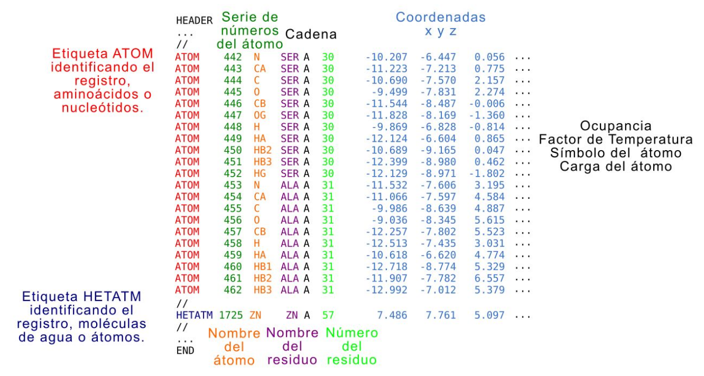
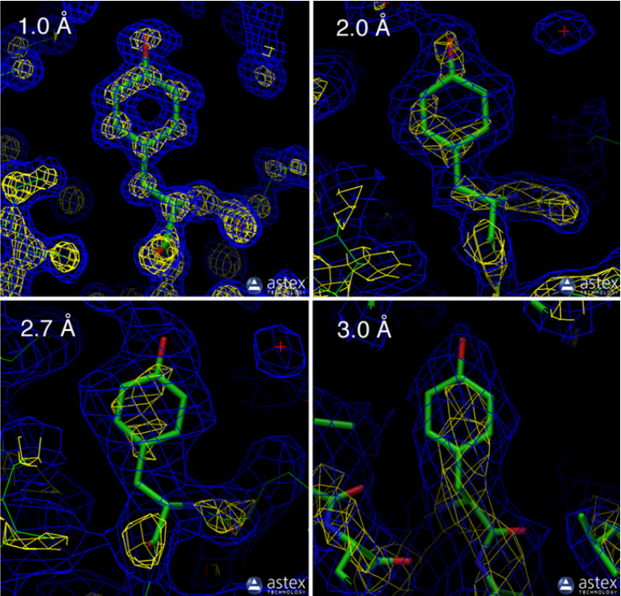
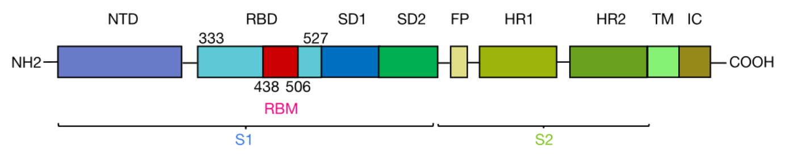

<style>
details > summary:first-of-type {
   display: list-item;
}
details summary { 
  cursor: pointer;
}

details summary > * {
  display: inline;
}

/* ol { list-style-type: upper-alpha; } */
</style>



**Pagina en construccion**



## Recursos Online
* PDB: [https://www.rcsb.com](https://www.rcsb.com)

## Objetivos
* Familiarizarse con el uso de la base de datos de estructuras de proteínas
* Aprender a visualizar estructuras 3D de proteínas o complejos proteicos, incluyendo diferentes niveles de análisis
* Identificar diferentes tipos de unión molecular tales como puentes de hidrógeno o interacciones mediadas por carga y entender el rol de los mismos.
* Identificar interacciones hidrofóbicas y entender el rol de las mismas.
* Aprender a superponer estructuras relacionadas y analizar los resultados.

## Bases de Datos Estructurales.
¿Dónde se almacenan todas las estructuras? ¿Cómo accedemos a ellas? La base de datos de proteínas (Protein Data Bank, PDB) almacena actualmente más de 150000 estructuras. Puedes acceder a ella aquí: [http://www.rcsb.org/](http://www.rcsb.org/). Existe también una versión europea de esta base de datos (European Protein Data Bank, PDBe). Puedes acceder a ella desde aquí: [https://www.ebi.ac.uk/pdbe/](https://www.ebi.ac.uk/pdbe/).

Las estructuras poseen un identificador de 4 caracteres alfanuméricos. Por ejemplo: 1GUX es el identificador, o PDB ID, de la proteína retinoblastoma unida a un péptido de la proteína E7 de Papillomavirus.

La búsqueda de estructuras puede realizarse utilizando palabras claves, por ejemplo, la palabra clave retinoblastoma devuelve un total de 316 estructuras, o por otras características como nombre de alguno de los autores que participó en el estudio de esa estructura, por ejemplo, “Rubin, S.M.” devuelve un total de 35 estructuras. Pueden explorar la base de datos RCSB PDB para familiarizarse con ella.

El repositorio PDB es mantenido por tres sitios independientes:
* [RCSB](http://www.rcsb.org) PDB en estados unidos.
* [PDBe](http://www.ebi.ac.uk/pdbe) en Europa.
* [PDBj](https://pdbj.org/) en Japón.

Si bien los datos principales y recursos son compartidos, cada sitio provee un conjunto exclusivo de servicios para que los usuarios puedan inspeccionar los datos.

### El archivo PDB. ¿Cómo están codificadas las estructuras?

Las estructuras tridimensionales de las proteínas pueden generarse por diferentes métodos (cristalografía de rayos X o X-Ray, resonancia magnética nuclear o RMN, criomicroscopía electrónica o CryoEM) y están codificadas en archivos pdb. Un archivo pdb está compuesto por múltiples líneas de registros, cada uno identificado por una etiqueta determinada incluidos dentro de distintas secciones. En la Figura 1 se muestra un fragmento de la sección de coordenadas que describe la estructura de la proteína dando las coordenadas “x”, “y” y “z” (azul claro) de cada uno de los átomos identificados.

<p style="text-align:center">

</p>

<figcaption align = "center">

**Fig 1.** Archivo PDB.

</figcaption>
<br>
<br>


En cada línea, además, se identifica si es un átomo (rojo) perteneciente a un aminoácido o nucleótido, o heteroátomo (azul oscuro), la numeración (verde oscuro), el nombre del átomo (naranja), el nombre del residuo en el que está incluido el átomo (violeta), la cadena a la que pertenece (negro), el número del residuo al que pertenece (verde claro). Este archivo puede incluir más columnas para cada átomo con datos relacionados con la movilidad del átomo (el factor de temperatura o B-factor), el sı́mbolo que representa al átomo y la carga del mismo (señaladas con “...” en la figura). El encabezado o header del archivo PDB puede tener muchísima información no relacionada directamente con la conformación tridimensional de la proteína, sino con cómo se hizo el experimento, las publicaciones relacionadas y otros. La descripción del resto del contenido de las secciones del archivo pdb puede obtenerse en la sección documentación de [http://www.wwpdb.org/](http://www.wwpdb.org/). Recientemente, se desarrolló un nuevo formato de archivo, MMCIF, que puede codificar estructuras de complejos macromoleculares mucho más grandes. Sin embargo, no todos los programas utilizados para visualizar estructuras soportan este formato.

### ¿Qué significa la resolución de una estructura?
Otra característica de las estructuras es la resolución con la cuál se obtuvieron. Hay una muy buena explicación en [pdb-101](https://pdb101.rcsb.org/learn/guide-to-understanding-pdb-data/resolution) que traigo aquí.

La resolución es una medida de la calidad de los datos que se recolectaron del cristal. Si el cristal es perfecto, es decir que todas las proteínas están estructuralmente alineadas de manera idéntica, entonces el patrón de difracción generado mostrará detalles muy finos. Por otro lado, si las proteínas en el cristal no alinean estructuralmente debido a movimientos o flexibilidad local, el patrón de difracción no brindará mucha información. Estructuras de alta resolución, con valores de 1 Å o similar, están altamente ordenadas y es fácil ver cada átomo en un mapa de densidad electrónica. Estructuras de baja resolución, con valores de 3 Å o mayores, muestran los contornos de la cadena proteica y la estructura atómica debe inferirse. En general, la localización de los átomos en estructuras que tienen un valor de resolución pequeño es de mayor confianza.

<p style="text-align:center">

</p>

<figcaption align = "center">

**Fig 2.** Resolución en una estructura.

</figcaption>
<br>
<br>

En la Figura 2 se muestra el mapa de densidad electrónica de distintas estructuras (las regiones de alta densidad electrónica se muestran en azul y amarillo) dentro de un rango de resoluciones. Las tres primeras muestran la tirosina 103 de la mioglobina (con palitos verdes se muestra el modelo atómico), los pdbs correspondientes son 1a6m (resolución de 1.0 Å), 106m (resolución de 2.0 Å) y 108m (resolución de 2.7 Å). El último ejemplo muestra la tirosina 130 de la cadena B de la hemoglobina del pdb 1s0h (resolución de 3.0 Å).

En la estructura de resolución de 1.0 Å se pueden ver la alta densidad electrónica en cada uno de los carbonos del anillo de la tirosina. A medida que aumenta ese valor, la densidad electrónica se va reduciendo (disminuye el contorno amarillo).
Si bien los archivos PDB pueden inspeccionarse con un editor de texto cualquiera (para revisar el encabezado por ejemplo), normalmente es mejor utilizar un programa de visualización particular que mostrará la estructura en un sistema virtual de coordenadas tridimensionales. De esta manera, el usuario podrá hacer zoom, rotar y trasladar la estructura. Cambiar la representación, mostrar las uniones y calcular las distancias, encontrar características estructurales de interés, etc. Estas herramientas pueden accederse online y están disponibles en los sitios de PDB, pero existen programas más poderosos y versátiles que se pueden descargar (como UCSF Chimera o Pymol).

Los archivos PDB normalmente tienen un modelo para cada molécula. Sin embargo, una entrada PDB puede tener uno o múltiples modelos de la misma molécula. Por ejemplo, debido a características de la técnica, las estructuras resueltas por NMR usualmente tienen 20 modelos alternativos en el mismo archivo.  

Muchas entradas PDB poseen missing residues. Estas son porciones que no fueron observadas durante la determinación experimental de la estructura posiblemente debido a un aumento en la flexibilidad de esa región. La amplitud de estas regiones puede variar desde pequeños loops dentro de dominios globulares hasta largos segmentos desordenados. 

La secuencia de la proteína en un PDB no necesariamente se corresponde al 100% con la de la entrada UniProt, debido a decisiones del experimentalista o dificultades técnicas. Siempre hay que revisar.

## PDB - Ejercicios

### Ejercicio 1. Familiarizándonos con el PDB.

La proteína oxy-mioglobina de organismo Physeter catodon posee una estructura cuyo PDB ID es 1A6M.
1. Busque la estructura en el PDB. Si quiere, puede descargar el archivo PDB utilizando los botones en la parte superior derecha. 
2. Inspecciona la sección *Structure Summary*. 
    * ¿Cuándo se publicó la estructura en la PDB?
    * ¿Es una estructura de buena calidad?
3. En la sección *Macromolecules*, encontrará la mención a la proteína Mioglobina.
    * ¿Cuántas cadenas tiene?
    * ¿Puede identificar su UniProt accession?
4. En la sección *Protein Feature View* hay un mapeo sitio-específico entre UniProt y el PDB, con algunos adicionales de otras bases de datos. Si hace click en **expand**, podrá acceder a toda la información.
    * ¿Qué tipo de estructura secundaria adopta esta proteína?
    * ¿Puede encontrar los sitios de unión del hierro?
    * ¿Qué aminoácidos están involucrados?
5. Vuelva a la pestaña *Structure Summary*
    * ¿Esta estructura tiene unida una molécula de oxígeno?
6. En la sección *Macromolecules*, en la subsección *Entity groups* encuentre cuantas cadenas de otras entradas en el PDB son 100% idénticas a esta proteína.
7. Inspeccione la pestaña *Experiment* y responda:
    * ¿A qué pH fueron realizados los experimentos de cristalización?

## Visualización de estructuras proteicas con Chimera

### Introducción
#### Chimera, software de visualización de estructuras.
Para poder visualizar estructuras macromoleculares tales como proteínas globulares y ácidos nucleicos, se usará el software UCSF Chimera. Existen otros softwares similares pero Chimera tiene la ventaja de ser mantenido actualmente por sus desarrolladores.
Chimera es un programa disponible de manera gratuita, y está disponible para descargar e instalar en tu propia computadora en [https://www.cgl.ucsf.edu/chimera/download.html](https://www.cgl.ucsf.edu/chimera/download.html).

Existen un alto número de guías y tutoriales disponibles online que pueden encontrarse en: [https://www.cgl.ucsf.edu/chimera/current/docs/UsersGuide/](https://www.cgl.ucsf.edu/chimera/current/docs/UsersGuide/).


<ul class="block-list has-radius is-primary">
<li class="is-highlighted is-info has-icon">
<span class="icon"><i class="fas fa-question"></i></span>

    <span style="font-weight:bold;">Antes de empezar, pueden responder:</span><br>
    <ul>
    <li>¿Por qué es importante visualizar estructuras proteicas?</li>
    <li>¿Qué información podríamos obtener de ellas?</li>
    <li>¿Estas estructuras, son un objeto real o un modelo?</li>
    </ul>

</li>
</ul>


## Chimera - Ejercicios
### Ejercicio 1. Familiarizándonos con Chimera
Chimera es un programa con muchas potencialidades y herramientas de análisis. En la siguiente guía, introduciremos el uso de las funciones más comunes de este programa, en relación al análisis estructura-función de proteínas. 

#### Manos a la obra!
1. Localice chimera en su computadora y ábralo. En la parte superior se encuentra el **Menú**. Vaya a *Favorites* y elija *Command Line*. Aparecerá en la parte inferior la **Línea de comandos**.

2. Vaya nuevamente a *Favorites* y elija *Reply Log*, se abrirá una ventana. En el **Reply Log** aparecerán información, resultados numéricos y errores que nos devuelve Chimera.

3. Vaya nuevamente a *Favorites* y elija *Model Panel*, se abrirá una ventana. En **Model Panel** van a ir apareciendo las estructuras que estén abiertas en nuestra sesión.

Para cargar una estructura en Chimera escribe en la línea de comandos:

```
open 2aze
```

Si ya hay una estructura ya descargada en la computadora se puede abrir usando:

```
open path/to/file/fileName.extension
```

<ul class="block-list has-radius is-primary">
<li class="is-highlighted is-info has-icon">
<span class="icon"><i class="fa fa-exclamation-triangle fa-2x"></i></span>

    <span style="font-weight:bold;">IMPORTANTE.</span><br>
    Si en el nombre del archivo o directorio existen espacios debes incluir el nombre completo entre comillas:<br>
    "path/to/file/file Name.extension"   
</li>
</ul>

El **log** y el panel de modelos se actualizan y aparecerá información asociada a la estructura cargada.

4. Mira el log y responde:
    * ¿Qué proteínas están incluidas en este pdb?
    * ¿Qué aparece en el panel de modelos?

#### Antes de seguir… Familiarizate con el uso del mouse:
* El botón izquierdo del mouse permite rotar la estructura.
* El botón derecho del mouse permite trasladar la estructura.
* La rueda del mouse permite ampliar o reducir la imagen (hacer zoom).

### Ejercicio 2. Conociendo la nomenclatura en Chimera

Esta es una de las partes **más importantes** para tener bien en claro ya que nos permitirá hacer todas las selecciones para analizar la estructura.

1. **Definiendo modelos.**
    Cada estructura que abrimos en Chimera se carga como un **modelo**. Los modelos se nombran con el símbolo `#` seguido de un número. 
    
    Prueba seleccionar el modelo entero escribiendo en la línea de comandos:

    ```
    select #0
    ```

    Para borrar la selección escribe:

    ```
    ~select
    ```

    <ul class="block-list has-radius is-primary">
    <li class="is-highlighted is-info has-icon">
    <span class="icon"><i class="fa fa-exclamation-triangle fa-2x"></i></span>

        <span style="font-weight:bold;">IMPORTANTE.</span><br>
        La mayoría de los comandos permiten utilizar el símbolo de negación “~” por delante para ocultar lo que se hizo.
    </li>
    </ul>


2. **Definiendo cadenas:** Para indicar una **cadena** del modelo se utiliza el símbolo `.` seguido de la letra correspondiente.

    Prueba seleccionar la cadena A del modelo escribiendo en la línea de comandos:

    ```
    select #0:.A
    ```

    Otra forma de hacerlo, es:

    ```
    select :.A
    ```

    Si hubiera más de un modelo, ese comando seleccionaría TODAS las cadenas nombradas A.

    Si se desea, se puede seleccionar más de una cadena separando por **comas** cada una de ellas o un rango de cadenas separando los identificadores por **guiones**.

    ```
    select #0:.A,.B
    select #0:.A-C
    ```

3. **Definiendo residuos:** Para indicar **residuos** se utiliza el símbolo `:` seguido del número de residuo correspondiente. Prueba seleccionar el residuo 300

    ```
    select :300
    ```

    * ¿Cuántos residuos se seleccionaron? 

    Para seleccionar uno de los dos residuos utiliza el siguiente comando:

    ```
    select :300.A
    ```

    En base a lo que aprendimos hasta ahora:
    * ¿Cómo sería el comando para seleccionar un rango de residuos?
    * ¿y para seleccionar residuos separados?.

    También es posible indicar los residuos por el código de tres letras de los aminoácidos (Si no lo recordás podés encontrarlo [acá](https://es.wikipedia.org/wiki/Nomenclatura_de_amino%C3%A1cidos).
    
    Prueba seleccionar por ejemplo todos los ácidos glutámicos.

    ```    
    select #0:glu.A
    ```

4. **Definiendo átomos:** Para indicar **átomos** se utiliza el símbolo `@` seguido del nombre del átomo correspondiente dentro de la proteína. Prueba seleccionar los CA (carbonos alfa).

    ```
    select #0:.A@CA
    ```

    * ¿Puedes entender lo que se seleccionó?

    Para ver más claro lo que estamos seleccionando, mostraremos las cadenas laterales de los residuos. Ingresa el siguiente comando y luego selecciona los carbonos beta y colorealos de verde.

    ```
    display #0:.A
    select #0:.A@CB
    color green,a sel
    ```

    Hay dos cosas que cambiamos:
    * `sel` : permite aplicar el comando `color` sobre lo que está seleccionado.
    * `a` : específica que sólo se coloreen los átomos. Prueba qué ocurre si no incluís a.

5. **Definiendo palabras claves:** Existen numerosas palabras clave que permiten seleccionar grupos de cosas predefinidas, además de las que presentamos a continuación puedes encontrar más información.

    <div class="table">

    **En relación a:**      | **Palabra Clave**         | **Ejemplo:**              |
    Estructura Secundaria   | `helix`<br>`strand`<br>`coil`   | `select #0:.C & helix` <br> `select #0:.C & strand` <br> `select #0:.C & coil` |
    Extremos                | `start`<br>`end`              | `select #0:start-855.C` <br> `select #0:855-end.C` |
    Partes de la proteína   | backbone: `@n,ca,c,o & protein` <br> sidechain: `without CA/C1'` | `select #0:.A@n,ca,c,o & protein` <br> `sel #0:TYR.A & without CA/C1'`|
    Otros                   | `solvent`<br> `ions` <br> `ligand` <br> | `select solvent` <br> `select ions` <br> `select ligand` |

    </div>

    Si necesitas ayuda con algún comando, puedes escribir en la línea de comando: `help comando`. Por ejemplo: `help select` te abrirá la ayuda para el comando `select`.

### Ejercicio 3. Análisis de la estructura del Receptor Binding Domain (RBD) de Spike del Coronavirus SARS-COV-2 unido a ACE2

La proteína Spike (S) de coronavirus (UNIPROT ID: P0DTC2, SPIKE_SARS2) corresponde a una proteína de membrana tipo I, de entre 180-200 kDa que presenta 1273 residuos y numerosas glicosilaciones (Figura 3).

Cada monómero se encuentra formado por un extremo N-terminal que constituye la mayoría de la proteína y se encuentra orientado hacia el espacio extracelular, un dominio transmembrana (TM) y un segmento C-terminal intracelular corto (IC). Spike se organiza formando trímeros en la superficie del virus, otorgando la apariencia de corona distintiva para la especie.

En el extremo N-terminal, a su vez, se pueden distinguir un péptido señal (residuos 1-13) y dos regiones denominadas S1 (residuos 14-685) y S2 (residuos 686-1273). Estas son las encargadas de mediar la unión y fusión de la membrana viral a la célula hospedera. 

Adicionalmente, S1 está compuesta por dos secciones; una región N-terminal (NTD) (residuos 14–305) y **un dominio llamado RBD (Receptor Binding Domain, residuos 333–527), que es indispensable para que el SARS-CoV-2 pueda unirse a su receptor, la enzima convertidora de angiotensina 2 (ACE2). Dentro del dominio RBD se encuentra el motivo RBM (Receptor-Binding Motif, aminoácidos 438-506) que interacciona de forma directa con ACE2.**

Por otra parte, S2 se encuentra muy conservada entre todos los coronavirus. Contiene dos regiones, HR1 y HR2, en las que se repiten grupos de siete aminoácidos (heptad repeats) y el péptido de fusión (FP). De esta forma, durante el proceso de infección, S1 reconoce y se une a la enzima ACE2 presente en la membrana de la célula hospedadora. Esta unión trae aparejada la escisión proteolítica de los dominios S1 y S2, conduciendo a la activación del péptido de fusión que conecta la envoltura viral con la membrana plasmática. La reconfiguración de la región existente entre los dominios HR1 y HR2 da lugar a una estructura compuesta por 6 hélices (6-HB) que une ambas membranas, catalizando su fusión y permitiendo la entrada del virus a la célula.

<p style="text-align:center">

</p>

<figcaption align = "left">

**Fig 3.** Representación topológica de la proteína Spike (monómero). Se encuentra compuesta por diferentes dominios: NTD, dominio N-terminal; SD1, subdominio 1; SD2, subdominio 2; FP, péptido de fusión; HR1, repetición en héptada 1; HR2, repetición en héptada 2; TM, región transmembrana; IC, dominio intracelular. El dominio RBD (Receptor Binding Domain), indispensable para que el SARS-CoV-2 pueda unirse a su receptor en la célula hospedera se muestra en cian, mientras que el motivo RBM (Receptor-Binding Motif) está indicado en rojo.

</figcaption>
<br>
<br>

El objetivo principal de los siguientes ejercicios consiste en introducir la utilización de Chimera en estudios estructurales de complejos proteicos. Utilizando la estructura de RBD-ACE2 como modelo, se emplearán variadas metodologías elementales de visualización, que permitan analizar los diferentes niveles de organización de la estructura de las proteínas. Se focalizará en el reconocimiento de cadenas polipeptídicas y elementos de su entorno. A su vez, se visualizarán distintos tipos de estructura secundaria en relación con la secuencia primaria y se estudiarán interacciones determinantes para el establecimiento de estructura terciaria.

#### 1. Cargando la estructura en Chimera.

* Descargue del Protein Data bank la entrada: 6m0j y guárdela en un lugar de preferencia. 
* Inicie Chimera y abra el archivo “6m0j.pdb”. Este corresponde a una estructura resuelta a 2.45 Å por difracción de rayos X 

**File** → **Open…** (Navegue hasta donde guardó la entrada 6m0j)

* Alternativamente, puede hacerlo con la línea de comandos en Chimera:

    ```
    open 6m0j
    ```

    <ul class="block-list has-radius is-primary">
    <li class="is-highlighted is-info has-icon">
    <span class="icon"><i class="fa fa-exclamation fa-2x"></i></span>

        <p>
        <span style="font-weight:bold;">Antes de seguir:</span><br>¡asegúrese que sabe cómo rotar, trasladar y hacer zoom sobre la estructura! ¡Recuerde comandos del mouse, los vamos a necesitar!
        </p>

    </li>
    </ul>


#### 2. Reconociendo la estructura

* ¿Cuántas cadenas se pueden reconocer?

* Pinte de diferentes colores cada cadena. Para esto, primero debe seleccionar cada cadena por separado:

    **Select** → **Chain** 

* ¿Cuántas aparecen disponibles? ¿Qué pasa en la estructura al elegir alguna?

* Una vez seleccionada la cadena, asignarle un color. 

    **Actions** → **Color** 

* Repetir para la otra cadena.

* Para hacerlo con la línea de comandos sería:

    ```
    color red #0:.A
    color blue #0:.E
    ```

    o bien

    ```
    rainbow chain #0
    ```

* ¿Se distinguen mejor?
* ¿Cuál podría corresponder a ACE2 y cuál a RBD? (pista, ACE2 es una metaloproteasa con zinc).

    **Select** → **Residue** (buscar entre la lista bajo *all nonstandard*)

    o por líneas de comandos:

    ```
    select @zn
    ```

#### 3. Visualizar la secuencia primaria de las cadenas.

* Para visualizar la secuencia de la proteína:

    **Favorites** → **Sequence** y luego **Show** en la nueva ventana
 

    o por líneas de comandos:

    ```
    sequence #0
    ```

* ¿Entre qué residuos se extienden las proteínas?
* Identificar los extremos amino y carboxilo terminales en la estructura marcando los residuos en el panel **Sequence** con el mouse.
* ¿Qué pasa con los residuos recuadrados en rojo? ¿Cuáles serían entonces los límites de la construcción utilizada para cristalizar en cada caso, y cuál es la región resuelta en la estructura?

#### 4. Explorar diferentes visualizaciones preestablecidas.

* Utilizaremos diferentes formas de visualización:

    **Presets**	→ **Interactive 1 (ribbons)**

    **Presets** → **Interactive 2 (all atoms)**

    **Presets** → **Interactive 3 (hydrophobicity surface)** (solo recomendable con recursos gráficos elevados)

* ¿Para qué podría utilizarse cada visualización?

#### 5. Analizar estructuras secundarias.

Presets → Interactive 1 (ribbons)
Tools → Depiction → Color Secondary Structure y OK en la nueva ventana

o Alternativamente por linea de comando:

color red,r helix; color purple,r strand; color gray,r coil

¿Qué tipo de estructuras secundarias predominan en ACE2? ¿Y en RBD? En las ventanas con las secuencias. ¿A que corresponden las secciones indicadas en amarillo? ¿Y aquellas en verde? Seleccionarlas con el puntero. ¿Se logran distinguir distintos tipos de láminas-β? ¿Cuáles?    

6. Análisis del entorno.
Select → Residue → HOH 

O bien por línea de comando:
select :HOH

Actions → Atoms/Bonds → sphere (preparamos el estilo de visualización)
Actions → Atoms/Bonds → show (visualizamos)

¿A qué corresponden estas moléculas? ¿Por qué están en la estructura?

Para eliminarlas del modelo se utilizará la línea de comandos.

delete :HOH
 
7. Elementos que estabilizan la estructura secundaria/terciaria. Puentes disulfuro. 

¿Qué residuos forman puentes disulfuro? Seleccionarlos.

Select → Residue (buscar entre la lista bajo “standard amino acid”)

O bien por línea de comando:
sel #0:cys

De acuerdo a las selecciones en las ventanas de secuencias. ¿Cuántos residuos tiene cada cadena?
Para visualizarlos.
 
Actions → Atoms/Bonds → ball & stick (preparamos el estilo de visualización)
Actions → Atoms/Bonds → show (visualizamos)

represent bs sel
display sel

¿Cuántos puentes disulfuro se encuentran en cada cadena? ¿Todas las cisteínas forman puentes disulfuro?

Longitud del puente disulfuro: Elegir un puente disulfuro en la estructura y seleccionar uno de los átomos de azufre con el puntero. Para tal fin mantener presionada la tecla “control”.
Luego presionando las teclas “control+shift” seleccionar con el puntero el segundo átomo de azufre. El objetivo es que solo estén seleccionados ambos S. Esto se lo puede verificar en la “lupa verde” de la parte inferior derecha.

Tools → Structure Analysis → Distances y Create 
¿Cuánto mide?

Para eliminar la selección (deseleccionar):
Select → Clear selection

Para hacerlo por línea de comandos para los residuos 379 y 432 por ejemplo:

distance #0:379.E@SG #0:432.E@SG

Para ocultarla:

~distance

8. Modificaciones postraduccionales.

Hacer foco en el residuo 343 de la cadena E mediante la línea de comandos:

focus :343.e

Alejar y ajustar para visualizar correctamente. ¿Qué tiene unido el residuo? ¿Qué sucede con la visualización al mover la estructura? Con qué código se identifica a la molécula unida (mantener unos instantes el puntero sobre algún átomo de la molécula). ¿Qué sugiere el código respecto a su identidad?     
Seleccionar el residuo utilizando el puntero (manteniendo presionada la tecla “control”). Identificar el residuo seleccionado en la ventana de la secuencia de la cadena E. ¿De qué residuo se trata? ¿Se ajusta a lo esperado?

Para volver a la visualización estándar. En la línea de comandos: 

focus

¿Existen otras moléculas similares? 

Select → Residue (buscar entre la lista bajo “all nonstandard” el código de la molécula)

¿Cuántas son? (utilizar la “lupa verde” de la parte inferior derecha). ¿Qué indica la presencia de estas moléculas sobre el sistema empleado para expresar estas proteínas?  

9. Puentes de hidrógeno. 

En primer lugar, deseleccionar cualquier posible elemento seleccionado previamente. 

Select → Clear Selection (importante para que las acciones posteriores tengan efecto global)

o bien en la linea de comandos:

~sel

Esconder la visualización “ribbon” y experimentar con diferentes estilos de la cadena “backbone”.

Actions → Ribbon → hide 
Actions → Atoms/Bonds → backbone only → chain trace/minimal/full

Al terminar mantener el estilo “full”, colorear los átomos de acuerdo a su elemento y volver a la representación “ribbon”. De ser necesario volver a colorear por estructura secundaria.  

Actions → Color → by element
Actions → Ribbon → show
Tools → Depiction → Color Secondary Structure y OK en la nueva ventana

o Alternativamente por linea de comando:

color red,r helix; color purple,r strand; color gray,r coil

Buscar puentes de hidrógeno. 

Tools → Structure Analysis → FindHBond y OK en la nueva ventana


¿Qué se observa? ¿En qué estructuras?

Elegir la α-hélice en la ventana de secuencias de la Cadena A (ACE2) que va del residuo 56 al residuo 82 utilizando el mouse. Alternativamente para seleccionarla en la línea de comandos, tipee:

select :56-82.a; namesel unaAlfa 

Hacer foco sobre la selección. 

Actions → Focus

Esconder la visualización “ribbon” (pero esta vez solo de la sección seleccionada).

Actions → Ribbon → hide

Esto también puede hacerse por línea de comandos:

focus unaAlfa; ~ribbon unaAlfa
 

Si no aparecen los átomos representados como sticks ingresar en la línea de comandos:
display unaAlfa


¿Entre qué átomos se observan los puentes de hidrógeno? ¿Cuál actúa como dador y cuál como aceptor? ¿Cómo es la relación entre la numeración de residuos que forman el puente de hidrógeno? 

Medir la distancia entre los átomos dador y aceptor de manera similar a la empleada para los puentes disulfuro.

¿Cuál es su longitud?

El comando para buscar puentes de hidrógeno hbonds es el siguiente:

sel; hbonds selRestrict any reveal false showDist false color yellow lineWidth 2 lineType dashed interSubmodel false interModel true intraMol true intraModel true relax true log true

como pueden ver tiene muchas opciones! Veamos algunas de ellas:

saltOnly: true | false
Permite limitar los resultados a puentes salinos (true), es decir puentes de hidrógeno entre grupos funcionales cargados o no limitar (false)
selRestrict: any | cross | both | atom-spec2
Permite limitar los resultados a:
any.  Puentes de hidrógeno que tengan al menos un átomo en la selección (en este caso, #0)
cross. Puentes de hidrógeno que tenga exactamente un átomo en la selección (en este caso, #0)
both. Puentes de hidrógeno con ambos átomos en la selección (en este caso, #0)
atom-spec2. Puentes de hidrógeno entre la selección  (en este caso, #0) y una segunda selección.
reveal: true | false
Permite mostrar las cadenas laterales de los residuos entre los cuáles hay un puente de hidrógeno.
showDist: true | false
Imprime una etiqueta con la longitud del puente de hidrógeno.
interSubmodel true | false
interModel true | false
intraModel true | false
intraMol true | false
intraRes true | false
Estas son opciones que permite restringir la búsqueda de puentes de hidrógeno entre submodelos del mismo modelo (en este caso estamos trabajando con un modelo que no tiene submodelos), entre modelos (en este caso tenemos un único modelo), dentro del modelo y dentro de un mismo residuo.
relax true | false
Permite relajar los criterios para la selección de puentes de hidrógeno
color yellow lineWidth 2 lineType dashed
Estas son opciones de formato de como se muestran los puentes de hidrógeno.

 log true | false
Imprime en el reply log los puentes de hidrógeno encontrados y sus longitudes.

Corra el comando y observe en el reply log la longitud de los puentes de hidrógeno. ¿Entre qué valores oscilan?

Volver a la visualización original utilizando el siguiente comando:

~select; focus; ribbon

Seleccionar una sección de una lámina-β utilizando la siguiente instrucción en la línea de comandos.

select :394-400.e,510-516.e; namesel unaBeta 

 Ponerla en primer plano y desactivar la visualización “ribbon”.

Actions → Focus
Actions → Ribbon → hide

o por línea de comandos:

focus unaBeta; ~ribbon unaBeta; display unaBeta

¿En este caso qué se observa? ¿Cómo es la relación entre la numeración de los residuos? Medir la distancia entre un par de átomos dador y aceptor. 
 
10. Gráfico de Ramachandran. 

Acceder a la ventana de modelos.
 
Favorites → Model Panel 

Asegurarse que la línea correspondiente al modelo “6m0j.pdb” se encuentre seleccionada (resaltada) y que haya tildes bajo las columnas A y S. A continuación, entre las opciones listadas a la derecha buscar Ramachandran plot… (es posible que sea necesario extender el tamaño de la ventana Model Panel para que aparezca).

Acomodar en la pantalla la ventana de la estructura y del Gráfico de Ramachandran de tal modo que se puedan visualizar simultáneamente.

Seleccionar las diferentes cadenas.

Select → Chain 

¿Qué sucede con los puntos en el Gráfico de Ramachandran cuando se selecciona la cadena A o la cadena E?

Seleccionar la α-hélice y lámina-β del punto 8.

sel unaAlfa
 
sel unaBeta 

¿Cómo es la distribución de puntos en cada caso? ¿Se ajusta a lo esperado? 
Es posible que algunos puntos seleccionados no logren distinguirse en el gráfico ya que se encuentran debajo de otros puntos. En ese caso maximizar la ventana del Gráfico de Ramachandran.

Con el puntero seleccionar algún punto del Gráfico de Ramachandran. Para facilitar su identificación en la estructura asignarle un color distintivo y hacer foco sobre la selección. 

Actions → Color 

Actions → Focus

¿A qué residuo corresponde?

Para volver a la visualización completa de la estructura utilizar el siguiente comando.

focus
 
11. Guarde y cierre la sesión

File → Save Session As…

File → Close Session

Otros recursos

### PDBe: Quick tour
[https://www.ebi.ac.uk/training/online/course/pdbe-quick-tour](https://www.ebi.ac.uk/training/online/course/pdbe-quick-tour)
### PDBe: Exploring a Protein Data Bank (PDB) entry
[https://www.ebi.ac.uk/training/online/course/pdbe-exploring-protein-data-bank-pdb-entry](https://www.ebi.ac.uk/training/online/course/pdbe-exploring-protein-data-bank-pdb-entry)
### PDBe: Searching the Protein Data Bank
[https://www.ebi.ac.uk/training/online/course/pdbe-searching-protein-data-bank](https://www.ebi.ac.uk/training/online/course/pdbe-searching-protein-data-bank)
### PDBe: Searching for biological macromolecular structures
[https://www.ebi.ac.uk/training/online/course/pdbe-searching-biological-macromolecular-structure](https://www.ebi.ac.uk/training/online/course/pdbe-searching-biological-macromolecular-structure)


