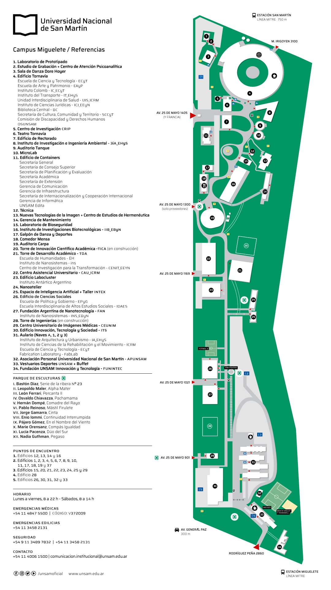

---
tags:
  - Campus
---

## Ubicación
Las clases se dictan en el Aula 1 del Edificio Innovación, Tecnología y Sociedad (ITS - Referencia 30) del Campus Miguelete de la Universidad Nacional de San Martín

## Transporte Público
Campus Miguelete Campus están ubicado en el distrito de San Martin (Provincia de Buenos Aires). Se puede llegar al Campus Miguelete mediante tren, colectivo o auto.

### En tren

- Línea **Mitre** (Ramal José León Suárez) Estación San Martín o Miguelete.

### Colectivos

- Líneas 21, 28, 57, 78, 87, 106, 117, 123, 161, 169, 176.

### En auto

- Desde zona norte: Av. General Paz. Bajada est. Miguelete - INTI, seguir por colectora hacia 25 de Mayo y luego tomar Rodríguez Peña.

- Desde zona Sur: Av. General Paz. Bajada San Martín, seguir por colectora y tomar el puente que cruza a la Av. 25 de Mayo. Doblar en Rodríguez Peña a la derecha.

### Campus Miguelete

