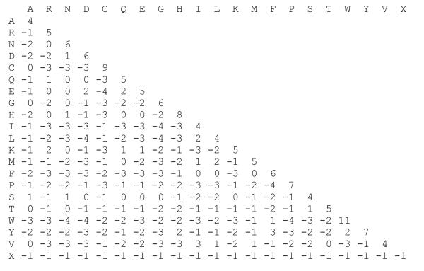
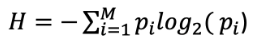

# **TP 6**. Predicción de desorden y bases de datos {markdown data-toc-label 'TP 6'}

## Materiales

[:fontawesome-solid-download: Materiales](https://drive.google.com/file/d/1hAEaOGRobxBHe-1_oh5A4ZAscxM5s_Ti/view?usp=sharing){ .md-button .md-button--primary }


## Parte I: Análisis de alineamientos múltiples de secuencia de proteínas

### Recursos a utilizar

* ProViz: [http://slim.icr.ac.uk/proviz/](http://slim.icr.ac.uk/proviz/)
* JalView: [https://www.jalview.org/](https://www.jalview.org/)
* PFAM: [https://pfam.xfam.org/](https://pfam.xfam.org/) [Legacy Version]
* InterPro: [https://www.ebi.ac.uk/interpro/](https://www.ebi.ac.uk/interpro/)

### Objetivos

* Aprender a utilizar Jalview para visualizar un MSA y familiarizarse con el manejo de programas de visualización de alineamientos.
* Interpretar alineamientos múltiples de secuencias. Identificar regiones de secuencia conservadas y asociarlas a diferentes elementos funcionales de las proteínas. 
* Identificar regiones ordenadas y desordenadas en alineamientos múltiples de secuencia
* Visualizar y analizar los patrones de sustitución aminoacídica encontrados en proteínas modulares. Correlacionar con sus conocimientos sobre matrices de sustitución 

### Ejercicio 1. Visualización de Alineamientos en ProViz.


!!! idea "Antes de empezar"
   
      ¿Porqué es importante visualizar un MSA? ¿Qué información podemos obtener de los MSA?


**ProViz** es una herramienta que permite visualizar alineamientos y estructura de dominios de una proteína online.

Ingresa a la web de **ProViz** [http://slim.icr.ac.uk/proviz/](http://slim.icr.ac.uk/proviz/), y busca la proteína p53 ingresando su Accession Number en la ventana “search” (Accession Number: P04637):

Selecciona la proteína que se llama: [Cellular tumor antigen p53 (TP53) Homo sapiens (Human)](http://slim.icr.ac.uk/proviz/proviz.php?uniprot_acc=P04637). Es la primera de la lista.

!!! Importante
      Para responder las preguntas debajo, asegúrate de que en el panel superior de la página, en **alignments**, esté seleccionada la opción **QFO**. Puedes investigar qué pasa si cambian a otras opciones, como *mammalian* o *vertebrates*.

      En **Options** a la izquierda haz click en *Show/hide gaps*. Aparecen más posiciones con gaps en el alineamiento que antes estaban ocultas.    

1. ¿Qué regiones parecen estar mejor alineadas (indicar aproximadamente de qué posición a qué posición de la primera secuencia)?

2. ¿Existe diferencia en la composición de secuencia entre las regiones mejor alineadas y las no tan bien alineadas?

3. ¿Se observan diferencias en el grado de conservación de estas regiones?

4. ¿A qué pueden deberse las diferencias observadas?

5. Observe las distintas regiones en la parte inferior del alineamiento. ProViz reúne la información de numerosas bases de datos y permite visualizarlas conectadas a un alineamiento.

   Recuerde la información recolectada de UniProt y PFAM en los trabajos prácticos anterior. Encuentre esta información en ProViz (Si no recuerda donde la dejó: utilizando el código UNIPROT (P04637), busque la proteína p53 humana (P53_HUMAN) en la base de datos PFAM (Vaya a [Interpro](https://www.ebi.ac.uk/interpro/search/sequence/)).

   * ¿Qué observa en el alineamiento en las regiones que abarcan los dominios PFAM respecto de la conservación?
   * ¿En qué regiones de la secuencia se encuentran estos dominios? Anotar de qué residuo a qué residuo abarca cada dominio, para usar más adelante (O recupérelo del trabajo práctico anterior).


### JalView, software de visualización de alineamientos.

Para poder visualizar alineamientos múltiples de secuencias (MSA, de sus siglas en inglés: Multiple Sequence Alignment) utilizaremos el visualizador de alineamientos JalView desarrollado en JAVA. Jalview permite generar alineamientos, manipularlos, editarlos y anotarlos. Tiene una interfaz que permite acceder remotamente numerosas herramientas como programas para realizar alineamientos múltiples de secuencia y predictores de estructura secundaria. A lo largo de la guía de ejercicios, introduciremos este programa usandolo para visualizar alineamientos múltiples de secuencias (MSAs) de proteínas modulares y discutir características de secuencia asociadas a los dominios y motivos funcionales encontrados en las proteínas.

JalView es un programa que se ofrece de manera gratuita, y está disponible para descargar e instalar en tu propia computadora en [https://www.jalview.org/](https://www.jalview.org/)
 
Existen un alto número de guías y tutoriales disponibles online que pueden encontrar en: [https://www.jalview.org/training](https://www.jalview.org/training)

Los desarrolladores de JalView crearon numerosos videos de entrenamiento disponibles en el [Canal de YouTube de JalView](https://www.youtube.com/channel/UCIjpnvZB770yz7ftbrJ0tfw)

### Ejercicio 2. Usando JalView para analizar un MSA de p53
1. Abre Jalview y cargue el conjunto de secuencias de p53 que descargó en trabajos prácticos anteriores.

      *File* → *Input Alignment* →  *From File*

2. Para realizar el alineamiento utilizaremos el programa Clustal, al cual accederemos de manera remota desde JalView de la siguiente manera:

      *Web Service* → *Alignment* →  *Clustal* → *With defaults*

      Si no llegara a funcionar, pues Internet, Virtualidad, la vida... Tienen las secuencias ya alineadas en el archivo `p53_aligned.fasta`

3. Inspecciona el alineamiento visualmente y reconoce algunas características de las secuencias. Si no se muestran todos los residuos y algunos aparecen como `.` ve a:

      *Format* → *Show Non-Conserved*

      * Algunas secuencias son más cortas que otras ¿por qué crees que es esto?
      * ¿Todas las secuencias comienzan con el aminoácido metionina? ¿A qué corresponden las secuencias que no?  
      * ¿Si quieren construir un alineamiento de alta calidad, preservarían o descartarían estas secuencias?  
      * Remuevan las secuencias que **no** corresponden a proteínas completas.
         
         Para ello seleccionar las secuencias haciendo click sobre el nombre de la misma en el panel izquierdo, la secuencia se marcará con una caja roja punteada. Remover la secuencia seleccionada utilizando la tecla *Backspace* o *Del*.

      * ¿Existen regiones del alineamiento que no estén alineadas correctamente?

         Para editar el alineamiento, primero asegurate de realizar:
         
         *Select* → *Deselect All*

         **Eliminar gaps:** Seleccione con el mouse el gap o arrastrando sobre el grupo de gaps que desea eliminar y presione “Backspace” o “Del”

         **Agregar gaps:** Presione F2. En primera posición del alineamiento en la primera secuencia aparecerá un cursor de color negro. Colóquelo en la posición donde desee ingresar un gap y presione la barra espaciadora.


### Ejercicio 3. Análisis de distintas propiedades del MSA utilizando el menú COLOUR.

El menú *Colour* permite colorear el alineamiento con diferentes paletas de colores que permiten visualizar determinadas características fisicoquímicas o relacionadas con la conservación o identidad de secuencia que facilitan el análisis de la información contenida en el MSA.

Por ejemplo: 

* *Percentage identity* colorea los residuos según el porcentaje de identidad en la columna.

* *Hydrophobicity* colorea los residuos según el grado de hidrofobicidad.

También es posible disminuir la intensidad de los colores según el grado de conservación (*By conservation*) o filtrar los colores según el porcentaje de identidad (*Above identity threshold*) a partir de un umbral deseado.

1. Seleccione para colorear el alineamiento desde el menú la opción:

      *Colour* → *Clustalx*

      Este esquema es muy comúnmente utilizado para la visualización de MSAs y permite representar información importante contenida en los patrones de sustitución de un MSA.

      Observando el alineamiento intente identificar:

      * ¿Cuál es la base del esquema de color “ClustalX” provisto por Jalview? *Nota:* Google provee respuestas pero... pueden ir directamente al [esquema de colores de ClustalX](http://www.jalview.org/help/html/colourSchemes/clustal.html)  
      * ¿Cuántos colores existen?  
      * ¿Qué propiedades fisicoquímicas representa cada grupo de color?  
      * La cisteína cumple un rol estructural importante en algunas proteínas (¿cual?). ¿Qué observa respecto de la coloración de la cisteína? ¿Es siempre igual? ¿A qué se debe el cambio en la representación?


!!! Info "Atención"

      En Proviz la cisteína estaba siempre coloreada del mismo color, pero en el esquema de colores de ClustalX no lo está.  

      * ¿En qué situaciones los residuos no están coloreados?  
      * Hay residuos que siempre están coloreados? ¿Cuáles son y a qué cree que se debe?


2. Manteniendo el esquema de color Clustal, es posible filtrar regiones de acuerdo al % identidad en el alineamiento múltiple. Para ello, aplique el filtro de identidad yendo a:

      *Colour* → *Above identity threshold*

      Se abrirá una ventana en la cual podrá seleccionar el % identidad del filtro en escala de 0 a 100%. Explore los cambios en todo el alineamiento al variar la escala de 0 a 100%.

      Utilizando el filtro, respondan:

      * ¿Qué regiones muestran una identidad de secuencia mayor al 80% en el MSA de p53? ¿Y al 100%?
      * Anote los límites de estas regiones y responda: ¿Qué correlación observa con la información obtenida de PFAM?
      
      En las regiones conservadas, observe los patrones de sustitución en diferentes columnas del MSA. Estos patrones son un reflejo de la historia evolutiva de la proteína y contienen mucha información funcional que aprenderemos a cuantificar más adelante en la materia. Observando detenidamente, responda:

      * ¿Qué tipos de patrones observa?  
      * ¿Qué relación guardan estos patrones con las matrices PAM y BLOSUM utilizadas para construir alineamientos de proteínas?

!!! Info

      Una matriz *BLOSUM (BLOcks SUbstitution Matrix)* es una matriz de sustitución para los 210 pares de aminoácidos.
      
      La construcción de las matrices BLOSUM se realizó con bloques conservados de proteínas (es decir, sin gaps) en alineamientos de proteínas que comparten como máximo un cierto porcentaje de identidad. A partir de estos alineamientos, se calcula la frecuencia de las sustituciones observadas para cada par de aminoácidos y se calcula el logaritmo de la probabilidad de que dos aminoácidos aparezcan en esa posición por azar. Una matrix blosum construida con secuencias que comparten como máximo el 50% de identidad se llama BLOSUM-50). Las matrices BLOSUM se utilizan para puntuar alineamientos de proteínas. Una BLOSUM 80 se usa para proteínas menos divergentes y BLOSUM 45 por ejemplo para proteínas más divergentes.

      Las matrices *PAM (point accepted mutation)* a diferencia de las BLOSUM, se calcularon a partir de la observación de mutaciones en 71 familias de proteínas relacionadas a lo largo del árbol filogenético. Las proteínas incluídas tenían al menos 85% de identidad, y por lo tanto, se asume que cualquier mismatch es el resultado de un evento único de mutación (y no una acumulación de mutaciones en esa posición a lo largo del tiempo). La puntuación de cada par de aminoácidos en la matriz está relacionada con la distancia evolutiva. Así, una PAM120 se utiliza para proteínas menos divergentes y una PAM250 para proteínas más divergentes.


<p style="text-align:center">

</p>
<figcaption style="text-align:center;max-width:70%">
Figura 1. Matrix BLOSUM62.</figcaption>

En base a este alineamiento analice las regiones desordenadas y ordenadas ya reconocidas en p53. Compare sus observaciones en este alineamiento con el alineamiento visualizado en ProViz en el **Ejercicio 1**.

   * ¿Puede distinguir las mismas regiones?
   * ¿Ve diferencias en la composición de secuencia en cada región?
   * ¿Se observan diferencias en el grado de conservación?
   * ¿Las especies a las que corresponde cada secuencia son las mismas en los alineamientos? ¿Cuál posee organismos más distantes?
   * Discuta qué ventajas considera que tiene trabajar con un alineamiento propio respecto de trabajar con el alineamiento de ProViz?


## Parte II: Predicción de Desorden

### Recursos a utilizar:

* IUPred2A            [https://iupred2a.elte.hu](https://iupred2a.elte.hu)

### Objetivos.

* Familiarizarse con la base de datos DisProt
* Entender las técnicas experimentales que permiten la identificación de regiones desordenadas

### Métodos de predicción de desorden

Uno de los mayores desafíos en el campo de las proteínas es la predicción de la estructura tridimensional a partir de la estructura primaria incluyendo aquellas proteínas que son total o parcialmente desordenadas. Mientras que las proteínas globulares adquieren una única estructura nativa, las proteínas intrínsecamente desordenadas (IDPs) son un conjunto de estructuras tridimensionales. También pueden existir regiones desordenadas conectando dos dominios globulares, como los *loops*; o incluso regiones más largas, que abarcan más de 30 residuos de longitud, que reciben el nombre de IDRs (del inglés *intrinsically disordered proteins*).

La predicción de IDRs a partir de la secuencia de aminoácidos permite un análisis rápido y abarcativo de distintas proteínas permitiendo establecer hipótesis sobre la presencia de desorden en las proteínas (Dunker et al., 2008; van der Lee et al., 2014). La importancia que adquirieron las IDRs/IDPs en los últimos años llevó al desarrollo de numerosos métodos de predicción, pero en general se basan en tres estrategias de predicción de desorden: 

1. a partir de composición de secuencia, 
2. a partir de _machine learning_ sobre estructuras determinadas por cristalografía de rayos X y 
3. a partir de meta-predictores que integran los resultados predichos por diferentes métodos.

Entre los algoritmos que se basan en composición de secuencia podemos nombrar IUPred (Dosztányi et al., 2005; Mészáros et al., 2018), que aplica un campo de energı́a desarrollado a partir de un gran número de proteínas con estructura determinada obtenidas de PDB. El primer algoritmo en _machine learning_ fue PONDR (Obradovic et al., 2003; Romero et al., 1997), entrenado a partir de un grupo estructuras de proteínas globulares y atributos de secuencia asociados a residuos no resueltos en dichas estructuras, que corresponden a regiones flexibles dentro del cristal. GlobPlot (Linding et al., 2003) fue entrenado estudiando la tendencia de un residuo a adquirir determinada estructura secundaria, hélices α o láminas β.

### Ejercicio 1. Predicción de desorden a partir de la secuencia.

Ingresa en la web de **IUPred2A**: [https://iupred2a.elte.hu](https://iupred2a.elte.hu)

Ingresa la proteína p53 (puede ingresarse la secuencia de aminoácidos, el **Uniprot ID** - P53_HUMAN o el **accession number** - P04637). 

El algoritmo IUPred considera que un residuo es:

* **Desordenado** cuando el valor de IUPred es mayor o igual a 0.5
* **Ordenado** cuando es menor a 0.5

1. Anota las posiciones iniciales y finales de las regiones predichas como desordenadas. ¿Se correlacionan las regiones predichas como ordenadas o desordenadas con las diferencias observadas en el ejercicio anterior?

2. Descargue los datos en formato `texto` y guarde el archivo como `P53_HUMAN.iupred`.

!!! info "Nota"

      Imaginemos que queremos correr la predicción de desorden para cientos de proteínas, o que queremos contar el porcentaje de aminoácidos que se encuentran en regiones desordenadas:

      * ¿Le parece que el visualizador online sería una herramienta útil para hacerlo? ¡Claro que no!
      
      Por suerte, el algoritmo IUPred puede también correrse de manera local y además es rápido. Para esto necesita tener instalado Python3 en su computadora.


3. Explora el archivo descargado y responde.

   * ¿Cómo es el formato de los datos?

   * ¿Las columnas tienen nombre? ¿Serán interpretadas correctamente por R?

4. **Crea un script en R.**

      Para esto, abre RStudio y elije New --> RScript.

      Recuerda ver en qué directorio estás trabajando y configurarlo para trabajar en el directorio deseado, por si no lo recuerdas las funciones eran: ```getwd()``` y ```setwd()```.

5. **¡A cargar los datos!** Para esto se utiliza la función `read.csv()`. Vamos a modificar algunos argumentos para que lea correctamente el archivo. Si querés saber qué es cada argumento siempre se puede revisar el uso de las funciones con ```help(read.csv)```

      ``` R
      p53 <- read.csv(file="/directorio_correspondiente/P53_HUMAN.iupred",
                     header=F ,sep="\t", col.names=c("Posición","Aminoácido","Iupred","Anchor"),
                     comment.char="#")
      ```

      Asegurate que los datos se cargaron correctamente, esperamos un dataframe con 4 columnas.

5. Ahora quisiéramos clasificar las posiciones en pase a la predicción realizada por IUPred como *Orden* y *Desorden*.

      Primero crearemos una columna en el dataframe:

      ``` R
      umbral <- 0.5
      p53$Prediccion <- NA
      p53$Prediccion[p53$Iupred>=umbral] <- "Desorden"
      p53$Prediccion[p53$Iupred<umbral] <- "Orden"
      ```

      Para obtener un gráfico similar al que brinda el servidor de IUPred, utilizaremos la librería `ggplot2`.
      Si no la instalaron aún recuerden que se puede instalar usando el comando: `install.packages('ggplot2')`

      ``` R
      library(ggplot2)

      plot_p53 <- ggplot(p53,aes(x=Posición,y=Iupred)) +
      scale_x_continuous(n.breaks = 20,expand = c(0.01,0.01)) +
      scale_y_continuous(n.breaks = 10,limits = c(0,1),expand = c(0,0.01)) +
      geom_line(color="navyblue") +
      geom_point(aes(color=Prediccion)) +
      geom_hline(yintercept = 0.5,lty="dotted",size=1) +
      theme_linedraw()
      ```

      Debería obtener un gráfico como el siguiente:

      

      Ahora, quisiéramos evaluar el porcentaje de residuos predichos ordenados y desordenados. Por suerte, R tiene una función que “cuenta” por nosotros:

      ``` R
      cuentaTotal <- table(p53$Prediccion)
      porcentaje <- 100*cuentaTotal/length(p53$Posición)
      ```

6. En base a los valores obtenidos, ¿diría que la proteína p53 es altamente desordenada?

7. Por último, analizaremos la composición de aminoácidos de p53. Pero antes: ¿Qué residuos espera ver enriquecidos en las regiones desordenadas y cuales en las ordenadas? ¿Por qué?

      Vamos a graficar el porcentaje de cada aminoácido predicho como ordenado o desordenado en la secuencia de p53

      ``` R
      aminoacidos <- table(p53$Aminoácido,p53$Prediccion)
      ```

      * ¿Qué hizo la función ```table``` en este caso?

      Para calcular el porcentaje de aminoácidos:

      ``` R
      aminoacidos_porcentaje <- 100*aminoacidos/length(p53$Posición)
      ```

      Ahora vamos a convertir la tabla en un dataframe para graficar con `ggplot2`:

      ``` R
      aminoacidos_df<-as.data.frame(aminoacidos_porcentaje)
      colnames(aminoacidos_df) <- c("Aminoacidos","Prediccion","Porcentaje")

      plot_aa <- ggplot(aminoacidos_df,aes(x=Aminoacidos,y=Porcentaje,fill=Prediccion)) +
            geom_col(position = "dodge") +
            scale_y_continuous(n.breaks = 10,limits = c(0,10),expand = c(0,0.01)) +
            theme_bw()
      ```
      Deberías obtener un gráfico como el siguiente:

      

      * ¿Qué aminoácidos son los más abundantes en las regiones desordenadas? ¿La abundancia de los aminoácidos coincide con lo esperado?

8. Ahora vamos a ver si se observa o no correlación con los valores de pLDDT. Para esto vamos a cargar la librería `bio3d` que nos permite leer archivos en formato `pdb`.

      ``` R
      library(bio3d)
      ```

      Leemos el archivo:

      ``` R
      pdbP53 <- read.pdb(file = "/directorioQueCorresponda/AF-P04637-F1-model_v2.pdb")
      ```

      Guardamos en el dataframe de p53 los datos que me intersan.

      El pLDDT está guardado en el campo de b-factors del pdb, y necesitamos un único valor por residuo. Por lo tanto, elegimos que sea el correspondiente a los carbonos α y lo guardamos en una columna que se llama pLDDT

      ``` R
      p53$pLDDT <- pdbP53$atom[pdbP53$calpha,"b"]
      ```

      Luego, clasificamos las posiciones según el valor de pLDDT

      ``` R
      p53$pLDDT_Prediccion <- ">80"
      p53$pLDDT_Prediccion[which(p53$pLDDT<=50)]<-"<=50"
      p53$pLDDT_Prediccion[which(p53$pLDDT>50 & p53$pLDDT<=80)]<-">50 & <= 80"
      ```

      Hago el gráfico de IUPred y pLDDT por posición:

      ``` R
      pLDDT_con_Iupred <- ggplot(p53,aes(x=Posición,y=Iupred)) +
      scale_x_continuous(n.breaks = 20,expand = c(0.01,0.01)) +
      scale_y_continuous(n.breaks = 10,limits = c(0,1),expand = c(0,0.01)) +
      geom_line(color="navyblue") +
      geom_line(data = p53,mapping = aes(x=Posición,y=pLDDT/100),col="red")+
      geom_hline(yintercept = 0.5,lty="dotted",size=1) +
      theme_linedraw() 
      pLDDT_con_Iupred
      ```

      Observe el gráfico y responda:

      * ¿Qué es la línea azul?
      * ¿Qué es la línea roja?
      * ¿Por qué cree que se utiliza pLDDT/100 en el gráfico?
      * ¿Que puede decir de la relación entre la predicción de desorden y los valores de pLDDT?

      Estudiemos la correlación entre IUPred y el pLDDT:

      ``` R
      pLDDT_vs_IUPred<-ggplot(p53,aes(x=pLDDT,y=Iupred)) +
      scale_x_continuous(n.breaks = 10,expand = c(0,0.01),limits=c(0,100)) +
      scale_y_continuous(n.breaks = 10,limits = c(0,1),expand = c(0,0.01)) +
      geom_point(aes(col=pLDDT_Prediccion)) +
      geom_hline(yintercept = 0.5,lty="dotted",size=1) +
      geom_vline(xintercept = 50,lty="dotted",size=1) +
      theme_linedraw()
      pLDDT_vs_IUPred
      ```

## Parte III: Bases de Datos

### Recursos a utilizar:

* DisProt: [https://www.disprot.org](https://www.disprot.org)
* MobiDB: [http://mobidb.bio.unipd.it/](http://mobidb.bio.unipd.it/)
* PED: [https://proteinensemble.org/](https://proteinensemble.org/)

### Ejercicio 1. Base de datos DisProt

#### Disprot
La base de datos [DisProt](https://disprot.org/) es una colección de evidencia de desorden experimental recolectada de la literatura y curada manualmente. La evidencia corresponde a una región proteica, e incluye por lo menos:

* un experimento,
* el artículo científico correspondiente a ese experimento,
* el inicio y final de la región desordenada en la secuencia proteica
* un término de anotación que corresponde a la Ontología de desorden.
    
**Cada una de las entradas en la base de datos posee un identificador único**.

La ontología de desorden está organizada en tres categorías diferentes:

* Estado estructural (*Structural State*): Orden o Desorden (*Order or Disorder*)

* Transición estructural (*Structural Transition*): Transiciones que pueden ocurrir entre diferentes estados estructurales (*Disorder to order*)

* Función de desorden (*Disorder Function*): La función de una región incluyendo términos específicos a desorden.


### Ejercicio 1. Conociendo la base de datos Disprot usando p53.

La proteína p53 es una proteína supresora de tumores, es decir que su mutación favorece el crecimiento tumoral. p53 es uno de los genes más mutados en el cáncer humano, y actúa como un factor de transcripción que se expresa en todos los tejidos. Cumple un rol principal en el ciclo celular y es el regulador principal de la apoptosis. Es esencial para inducir la respuesta celular ante el daño al ADN, deteniendo el ciclo celular cuando las células no pueden reparar el ADN dañado por agentes genotóxicos. Si falla p53 podrían facilitar la formación de tumores celulares y en consecuencia producir cáncer. Alrededor de un 50% de los tumores humanos identificados poseen mutaciones en la proteína p53. Esta proteína, por su importancia para la salud humana, es una de las proteínas más estudiadas en cuanto a su estructura y función.

Ingresa a la página web de [DisProt](https://disprot.org/) y encuentra la proteína p53 (P04637). La búsqueda puede realizarse utilizando el Accession Number o por palabras claves. El identificador de DisProt que deberían encontrar es DP00086.

1. Expande *Disprot consensus* ¿Qué tipo de información observa en la página?

2. Expande *Structural state* y luego expande *Disorder*. ¿A qué corresponden los segmentos coloreados? ¿Qué tipo de evidencia poseen dichos fragmentos?

3. ¿Cuál es el rol de las regiones desordenadas?

      * Expande *Molecular function* ¿Qué tipo de información encuentra? ¿Qué técnicas se usaron para obtener esta información?
      
      * Expande *Disorder Function* ¿Qué tipo de funciones están indicadas? ¿Qué técnicas se usaron para identificarlas?

4. Observa la línea que corresponde a InterPro.

      * Compare la información de dominios con el estado estructural. ¿Se observa algún dominio InterPro que se superponga con una región desordenada?

5. ¿La evidencia experimental recolectada coincide con las predicciones realizadas por IUPred y lo observado en ProViz?


### Ejercicio 2. Base de datos MobiDB

La base de datos MobiDB centraliza diferentes recursos que facilitan la anotación de proteínas desordenadas y de su función. MobiDB abarca distintos aspectos del desorden, desde regiones que carecen una estructura tridimensional definida anotadas o predichas como desordenadas hasta regiones que interactúan con otras proteínas, ADN o ARN preservando una estructura desordenada. Los datos provienen de bases de datos externas con datos manualmente curados, de datos experimentales como estructuras tridimensionales de las proteínas o predicciones.

1. Ingresa a la web de MobiDB: [http://mobidb.bio.unipd.it](http://mobidb.bio.unipd.it)

      Busca la proteína p53 (P04637).

2. En la parte superior, sobre la estructura hay tres pestañas:

      * Overview
      * Disorder
      * Binding
      
      Ingresa a **Disorder**.
      
      En la primera línea se indica la secuencia. 
      
      A la izquierda aparece una lista de métodos que aportan distinta información de desorden.
      
      Observa la línea **Disorder**. Este es el consenso de desorden.
      
      Si haces click en la la felchita verás que se pliega o despliega una lista de métodos para distinguir desorden.

3. Expande MobiDB-Lite y luego expande **Prediction (majority)**. Se expande una lista de predictores de desorden.

      * ¿Cuáles regiones son predichas como desordenadas por la mayoría de los métodos?
      * ¿Qué métodos predicen más desorden y cuáles menos? ¿Hay mucha variación?

3. Ahora observa la línea que dice **Missing residues (strict)**, donde se indica el consenso en base a la evidencia estructural. Ubique el mouse sobre las distintas regiones y responda: ¿Qué significan los distintos colores de las regiones marcados en el consenso?

4. Exploremos la evidencia proveniente de la estructura cristalográfica. Para ello despliega la sección *Missing residues (strict)*.

      * ¿Qué regiones tienen una estructura? 

      * Observa la entrada 5AOM_A. Ahora ve a la página web del [Protein Data Bank](www.rscb.org) y busca el PDB 5AOM, o puedes ir directamente desde [aquí](https://www.rcsb.org/structure/5AOM). En la web de la base de datos de PDB ve a la sección *Macromolecules*. Mira la sección correspondiente a la cadena A (UNMODELED A). ¿Puedes decir cómo se determinó que estas regiones eran desordenadas?


### Ejercicio 3. Base de datos de Ensambles Estructurales

El primer lanzamiento de la base de datos [PED](https://proteinensemble.org/) fue en el año 2013. PED recolecta la información estructural de los ensambles de IDPs y proteÍnas desnaturalizadas determinadas por RMN o SAXS. La última versión cuenta con 481 entradas con 560 ensambles con más de 325000 estructuras proteicas correspondiente a un total de 305 proteínas (Mayo 2024).

1. Busque en la base de datos PED la proteína E1A (P03255). Ingrese a la entrada que **no posee a Rb (P06400)**. Baje un ensamble y abra el ensamble en Chimera.

      * ¿Cuantos modelos tiene?

2. Seleccione una region de residuos:

      ```
      select :60-90
      ```

3. Intente utilizar el matchmaker para alinear esa región (*Further restrict matching to current selection* debe estar tildado)
 
      * ¿Pudo alinear las proteínas?

      * Las regiones que poseen estructura secundaria,  ¿Pertenecen a la misma región siempre?
 

### Ejercicio 4. Base de datos de proteínas involucradas en liquid-liquid phase separation
 
[PhaSePro](https://phasepro.elte.hu/) es una base de datos de proteínas involucradas en liquid-liquid phase separation (LLPS) en células. LLPS es un proceso molecular que forma organelas sin membrana que median funciones celulares cruciales.

PhaSePro es curada manualmente y abarca únicamente casos verificados de LLPS integrando un amplio rango de información biofísica, funciones biológicas y regulación de estos sistemas moleculares.

1. Ingrese a PhaSePro
2. Entre a Browse/Search e investigue las distintas organellas. ¿Reconoce alguna?
3. Busque la entrada: P35974
4. ¿Qué region media LLPS?
5. Busque en disprot la entrada de la proteína homóloga: `DP00133 - Phosphoprotein`.
6. ¿Qué información experimental hay disponible para esa región?


## Ejercicios Complementarios

### Ejercicio 1. Predicción de regiones de baja complejidad de secuencia.
El servidor PlaToLoCo ([PLAtform of TOols for LOw COmplexity](https://platoloco.aei.polsl.pl/#!/query)) permite la predicción de regiones de baja complejidad de secuencia (*low complexity regions*, LCR) utilizando distintos algoritmos:

* **SEG:** Fue el primer algoritmo desarrollado para detectar LCRs. Calcula un vector de complejidad cuantificando el número de aminoácidos de cada tipo dentro de una ventana de longitud L. Para cada vector, se calcula la complejidad composicional y la probabilidad de ocurrencia y se clasifican los segmentos como de baja o alta complejidad según un valor umbral para la entropía de secuencia.
Hay 3 configuraciones para SEG:

    * Relaxed (default): Es el parámetro más relajado de manera que se obtenga la mayor cantidad de LCRs.
   
    * Intermediate: Está optimizado para detectar más largas y más repetitivas LCRs en eucariotas.
   
    * Strict: Asegura que las regiones identificadas correspondan fuertemente con regiones que presenten un bias composicional.
 
* **CAST:** Detecta regiones composicionalmente biased (compositionally biased regions, CBRs). Utiliza una base de datos de 20 secuencias homopoliméricas contra las cuales compara la secuencia query. Detectando así CBRs que se superponen con distintos tipos de residuos dentro de la misma secuencia.
 
* **fLPS:** Anota CBRs detectando desvíos en la composición de aminoácidos únicos o múltiples. Para cada secuencia fLPS busca subsecuencias de residuo único y de baja probabilidad (LPSs), y luego iterativamente busca por desvíos de residuos múltiples. La configuración default y strict difieren en el tamaño de la ventana mínimo y máximo y el umbral de probabilidad. fLPS strict está mejor ajustado a la detección de CBRs
 
* **SIMPLE:** Este algoritmo provee dos tipos de información:
    * Identidad del motivo de aminoácidos
    * Frecuencia de Información del motivo encontrado, definida como la frecuencia con la cual un motivo dado es detectado como repeticiones (sobre un umbral) dentro de una secuencia dada.
 
* **GBSC:** Identifica y agrupa regiones repetitivas. Busca repeticiones de un aminoácido (homorepeats) o de unos pocos aminoácidos (STRs -  short tandem repeats).

PlaToLoCo además brinda:

* **Entropía de Shannon:** Mide la incertidumbre en un set de datos dentro de una longitud de 20 aminoácidos.

   <p style="text-align:center">
   
   </p>

Donde *p<sub>i</sub>* es la fracción de residuos del tipo de aminoácido *i*, y se realiza la sumatoria sobre los 20 tipos de aminoácidos. *H* varía entre 0 (un unico tipo de residuo) a 4.322 (los 20 aminoácidos están igualmente representados). Por lo tanto, a menor valor, menor complejidad de secuencia.

* **Domains:**  Información de la base de datos PFAM.
* **Transmembrane topology y signal peptide predictor:** Phobius es un método de predicción basado en Hidden Markov Model (HMM) similar a TMHMM pero también es capaz de predecir péptidos señal.
* **Amino acid frequencies:** Frecuencias de aminoácidos de la secuencia de interés comparados con distintas bases de datos.
 
Ingrese la proteína p53 en Platoloco. Identifique las distintas regiones identificadas como low-complexity regiones,

* ¿Son las mismas identificadas por PFAM?

* ¿ Qué composición observa en el alineamiento de p53 de estás regiones?

### Ejercicio 2. Selección de regiones para determinar la estructura de una proteína.

Una de las aplicaciones principales de la predicción de desorden es encontrar regiones que son más adecuadas para determinar la estructura tridimensional de una proteína por cristalografía de rayos X.

* ¿Por qué cree que predecir las regiones desordenadas puede ayudar a seleccionar el dominio para cristalizar?

   Dada la siguiente proteína misteriosa:

   ```
   >mystery_protein  
   MMQDLRLILIIVGAIAIIALLVHGFWTSRKERSSMFRDRPLKRMKSKRDDDSYDEDVEDD
   EGVGEVRVHRVNHAPANAQEHEAARPSPQHQYQPPYASAQPRQPVQQPPEAQVPPQHAPH
   PAQPVQQPAYQPQPEQPLQQPVSPQVAPAPQPVHSAPQPAQQAFQPAEPVAAPQPEPVAE
   PAPVMDKPKRKEAVIIMNVAAHHGSELNGELLLNSIQQAGFIFGDMNIYHRHLSPDGSGP
   ALFSLANMVKPGTFDPEMKDFTTPGVTIFMQVPSYGDELQNFKLMLQSAQHIADEVGGVV
   LDDQRRMMTPQKLREYQDIIREVKDANA
   ```

1. Utilizando IUPred2A, pega solamente la secuencia sin el header ¿Qué región de la proteína trataría de cristalizar?

3. Para ver si la selección fue la correcta, haz un blast de la secuencia en la página web [https://blast.ncbi.nlm.nih.gov/Blast.cgi](https://blast.ncbi.nlm.nih.gov/Blast.cgi).

      * Pegue la secuencia en el box *Enter Query Sequence*. Chequear que el box *align two or more sequences* no esté seleccionado.

      * En la sección **Choose Search Set**, selecciona la **database Protein Data Bank proteins (pdb)**.

      * Explora los resultados. ¿Elegimos correctamente?

4. En los materiales se encuentra el modelo AlphaFold para esta proteína. Carguelo en Chimera. ¿Coincide con lo elegido?

5. [XtalPred](https://xtalpred.godziklab.org/XtalPred-cgi/xtal.pl) compara las características bioquímicas y biofísicas de una proteína con las distribuciones de probabilidad de cristalización calculadas a partir de la base de datos TargetDB. A partir de estos datos, realiza una predicción de cristalización combinando las probabilidades de cristalización individuales de ocho características proteicas en una puntuación de cristalización. En base a esta puntuación, se clasifica a la proteína de interés en una de cinco clases de cristalización. Cada clase representa diferentes tasas de éxito de cristalización en TargetDB.

      Algunas de las características utilizadas son la longitud, el punto isoeléctrico, el gravy index (es el valor de hidrofobicidad del péptido), el desorden estructural predicho, entre otras.
   
      * Ingrese la mistery protein en XtalPred ¿Como se clasifica la proteína según la capacidad de ser cristalizada?
      * Pruebe ingresando sólo el dominio de interés ¿Mejora?