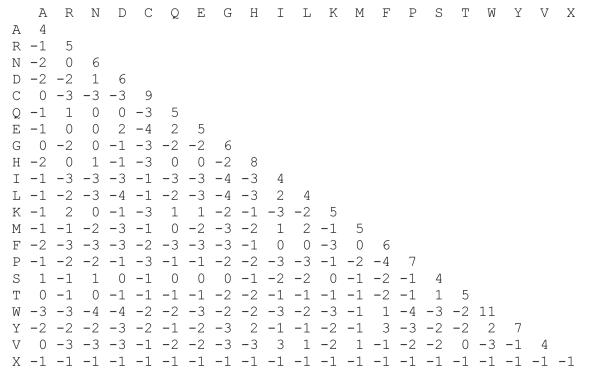
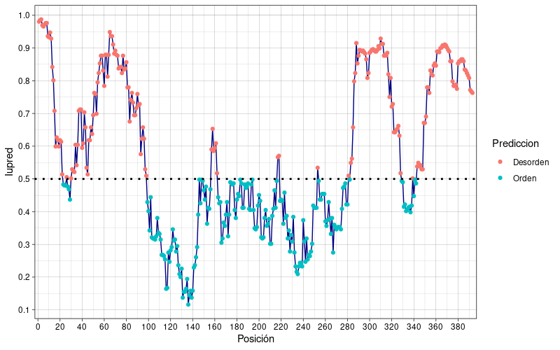
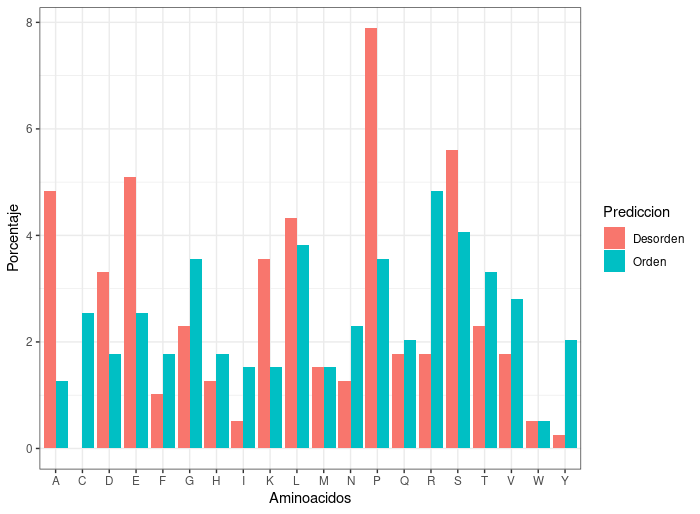
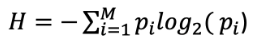

# **TP 5**. Predicción de desorden y bases de datos {markdown data-toc-label 'TP 5'}

## Materiales

[:fontawesome-solid-download: Materiales](https://drive.google.com/file/d/1XUmp9b69L4vSz8fqTrfrq_wnDQ0IRSRZ/view?usp=sharing){ .md-button .md-button--primary } &nbsp;&nbsp;
[:fontawesome-solid-file-powerpoint: Presentación](https://docs.google.com/presentation/d/1svJ48FtCXDD1T26IQO44oq8Ne4iQLgwQfNyjd_rpJ-M/edit?usp=sharing){ .md-button .md-button--primary }

## Parte I: Análisis de alineamientos múltiples de secuencia (MSA) de proteínas

### Recursos

* ProViz: [http://slim.icr.ac.uk/proviz/](http://slim.icr.ac.uk/proviz/)
* JalView: [https://www.jalview.org/](https://www.jalview.org/)
* PFAM: [https://pfam.xfam.org/](https://pfam.xfam.org/) [Legacy Version]
* InterPro: [https://www.ebi.ac.uk/interpro/](https://www.ebi.ac.uk/interpro/)

### Objetivos

* Aprender a utilizar Jalview para la visualizacion, edición y anotación de MSAs.
* Interpretar alineamientos múltiples de secuencias. Identificar regiones de secuencia conservadas y asociarlas a diferentes elementos funcionales de las proteínas. 
* Diferenciar regiones ordenadas y desordenadas mediante el análisis de alineamientos.
* Correlacionar los patrones de sustitución aminoacídica visualizados con matrices de puntuación.

### Ejercicio 1. Visualización de Alineamientos en ProViz.


!!! idea "Antes de empezar"
   
      ¿Porqué es importante visualizar un MSA? ¿Qué información podemos obtener de los MSA?


**ProViz** permite integrar información de alineamientos con estructuras de dominios, motivos y modificaciones post-traduccionales (PTMs). En este ejercicio, vamos a analizar la proteína p53, con la que estuvimos trabajando en TPs anteriores.

1. Acceder a [**ProViz**](http://slim.icr.ac.uk/proviz/) y buscar la proteína p53 ingresando su **Accession Number** en la ventana “search” (Accession Number: P04637).

2. Seleccionar **Visualize**. Se va a abrir una nueva ventana con el MSA de p53, junto con información de estructura secundaria, dominios, motivos, PTMs, entre otros datos. 

!!! Importante
      Para responder las preguntas debajo, la opción desplegable de la esquina superior derecha debe decir **QFO**. Pueden investigar qué pasa si cambian a otras opciones, como *mammalian* o *vertebrates*.


3. Análisis de conservación:

      1. Identificar los rangos de residuos (posiciones de inicio y fin) de las regiones mejor alineadas.

      2. Evaluar si existe un sesgo en la composición aminoacídica entre las regiones mejor y peor alineadas.
      
      3. Comparar el grado de conservación entre estas regiones.
      
      4. ¿Cuál puede ser la causa biológica de las diferencias observadas?

4. Integración con bases de datos:

      ProViz reúne la información de numerosas bases de datos y permite visualizarlas conectadas a un alineamiento. El el TP1 recolectamos información sobre p53 de UniProt y PFAM/InterPro. 

      1. Localizar los dominios identificados previamente en UniProt y/o Pfam dentro de la interfaz de ProViz

      2. Registrar las regiones y límites de cada dominio para comparaciones posteriores.

### JalView, software de visualización de alineamientos.

Para poder visualizar alineamientos múltiples de secuencias (MSA, de sus siglas en inglés: Multiple Sequence Alignment) utilizaremos el visualizador de alineamientos **JalView** desarrollado en JAVA. Jalview permite generar alineamientos, manipularlos, editarlos y anotarlos. Tiene una interfaz que permite acceder remotamente numerosas herramientas como programas para realizar alineamientos múltiples de secuencia y predictores de estructura secundaria. A lo largo de la guía de ejercicios, introduciremos este programa usándolo para visualizar alineamientos múltiples de secuencias (MSAs) de proteínas modulares y discutir características de secuencia asociadas a los dominios y motivos funcionales encontrados en las proteínas.

* JalView es un programa que se ofrece de manera gratuita, y está disponible para descargar e instalar en [https://www.jalview.org/](https://www.jalview.org/)
 
* Existen un alto número de guías y tutoriales disponibles online que se encuentran en: [https://www.jalview.org/training](https://www.jalview.org/training)

* Los desarrolladores de JalView crearon numerosos videos de entrenamiento disponibles en el [Canal de YouTube de JalView](https://www.youtube.com/channel/UCIjpnvZB770yz7ftbrJ0tfw)

### Ejercicio 2. Manejo y edición de MSAs en Jalview

1. Carga de datos 

      Abrir Jalview y cargar el conjunto de secuencias de p53 disponible en [los materiales del TP1](https://drive.google.com/file/d/1L8vrfYpbvOb3ToTHLf4CLJ1g6NdflZSF/view?usp=sharing).

      *File* → *Input Alignment* →  *From File*

2. Alineamiento 

      Ejecutar el servicio remoto de **Clustal**. En caso de no funcionar, utilizar el archivo `p53_aligned.fasta` 

      *Web Service* → *Alignment* →  *Clustal* → *With defaults* 

3. Curado del alineamiento 

      Inspeccionar el alineamiento visualmente y reconocer algunas características de las secuencias. Si no se muestran todos los residuos y algunos aparecen como `.`, es porque se encuentran ocultos. Para mostrar los residuos ocultos, ir a:

      *Format* → *Show Non-Conserved* y destildar la opción.

      1. Algunas secuencias son más cortas que otras ¿por qué puede pasar esto?

      2. ¿Todas las secuencias comienzan con el aminoácido metionina? ¿A qué corresponden las secuencias que no?

      3. ¿Para construir un alineamiento de alta calidad, preservarían o descartarían estas secuencias?

      4. Remover las secuencias que **no** corresponden a proteínas completas.
         
         Seleccionar las secuencias haciendo click sobre el nombre de la misma en el panel izquierdo, la secuencia se marcará con una caja roja punteada. Remover la secuencia seleccionada utilizando la tecla *Backspace* o *Del*.

      5. Ajustar manualmente regiones mal alineadas eliminando o agregando gaps.

         Para editar el alineamiento, primero realizar:
         
         *Select* → *Deselect All*

         **Eliminar gaps:** Seleccionar con el mouse el gap o arrastrando sobre el grupo de gaps a eliminar y presionar “Backspace” o “Del”

         **Agregar gaps:** Presionar F2. En primera posición del alineamiento en la primera secuencia aparecerá un cursor de color negro. Colocarlo en la posición donde se desee ingresar un gap y presione la barra espaciadora.


### Ejercicio 3. Propiedades fisicoquímicas y conservación

El menú *Colour* permite colorear el alineamiento con diferentes paletas de colores, muy útiles para visualizar determinadas características fisicoquímicas o relacionadas con la conservación o identidad de secuencia, lo que facilita el análisis de la información contenida en el MSA.

Por ejemplo: 

* *Percentage identity* colorea los residuos según el porcentaje de identidad en la columna.

* *Hydrophobicity* colorea los residuos según el grado de hidrofobicidad.

También es posible disminuir la intensidad de los colores según el grado de conservación (*By conservation*) o filtrar los colores según el porcentaje de identidad (*Above identity threshold*) a partir de un umbral deseado.

1. Esquema de color

      Aplicar desde el menú la opción:

      *Colour* → *Clustalx*

      Este esquema es muy comúnmente utilizado para la visualización de MSAs y permite representar información importante contenida en los patrones de sustitución de un MSA.

      1. Investigar los criterios de color de este esquema.
      *Nota:* Google provee respuestas pero pueden ir directamente al [esquema de colores de ClustalX](http://www.jalview.org/help/html/colourSchemes/clustal.html)  
      
      2. ¿Cuántos colores existen y qué propiedades fisicoquímicas representa cada grupo de color?

      3. La cisteína cumple un rol estructural importante en algunas proteínas (¿cual?). ¿Qué se observa respecto de la coloración de la cisteína? ¿Es siempre igual? ¿A qué se debe el cambio en la representación?


!!! Info "Atención"

      En ProViz la cisteína estaba siempre coloreada del mismo color, pero en el esquema de colores de ClustalX no lo está.  

      * ¿En qué situaciones los residuos no están coloreados?  
      * Hay residuos que siempre están coloreados? ¿Cuáles son y a qué cree que se debe?


2. Filtros de identidad

      Manteniendo el esquema de color Clustal, es posible filtrar regiones de acuerdo al % identidad en el alineamiento múltiple:

      *Colour* → *Above identity threshold*

      Se abrirá una ventana en la cual se puede seleccionar el porcentaje de identidad del filtro en escala de 0 a 100%. Utilizando el filtro, responder:

      1. ¿Qué regiones muestran una identidad de secuencia mayor al 80% en el MSA de p53? ¿Y al 100%?
      2. Correlacionar estas regiones con los dominios globulares de Pfam. 

3. Patrones de sustitución

      En las regiones conservadas, observar los patrones de sustitución en diferentes columnas del MSA. Estos patrones son un reflejo de la historia evolutiva de la proteína y contienen mucha información funcional. 

      1.  ¿Qué tipos de patrones se observan?

      2. ¿Qué relación guardan estos patrones con las matrices PAM y BLOSUM utilizadas para construir alineamientos de proteínas?

!!! Info

      Una matriz *BLOSUM (BLOcks SUbstitution Matrix)* es una matriz de sustitución para los 210 pares de aminoácidos.
      
      La construcción de las matrices BLOSUM se realizó con bloques conservados de proteínas (es decir, sin gaps) en alineamientos de proteínas que comparten como máximo un cierto porcentaje de identidad. A partir de estos alineamientos, se calcula la frecuencia de las sustituciones observadas para cada par de aminoácidos y se calcula el logaritmo de la probabilidad de que dos aminoácidos aparezcan en esa posición por azar. Una matrix blosum construida con secuencias que comparten como máximo el 50% de identidad se llama BLOSUM-50). Las matrices BLOSUM se utilizan para puntuar alineamientos de proteínas. Una BLOSUM 80 se usa para proteínas menos divergentes y BLOSUM 45 por ejemplo para proteínas más divergentes.

      Las matrices *PAM (point accepted mutation)* a diferencia de las BLOSUM, se calcularon a partir de la observación de mutaciones en 71 familias de proteínas relacionadas a lo largo del árbol filogenético. Las proteínas incluídas tenían al menos 85% de identidad, y por lo tanto, se asume que cualquier mismatch es el resultado de un evento único de mutación (y no una acumulación de mutaciones en esa posición a lo largo del tiempo). La puntuación de cada par de aminoácidos en la matriz está relacionada con la distancia evolutiva. Así, una PAM120 se utiliza para proteínas menos divergentes y una PAM250 para proteínas más divergentes.


<p style="text-align:center">

</p>
<figcaption style="text-align:center;max-width:70%">
Figura 1. Matrix BLOSUM62.</figcaption>

4. Discusión 

      En base a este alineamiento, analizar las regiones desordenadas y ordenadas ya reconocidas en p53. Comparar el alinamiento propio en JalView con el de ProViz del **Ejercicio 1**.
      
      1. ¿Se pueden distinguir las mismas regiones?
      
      2. ¿Hay diferencias en la composición de secuencia en cada región? ¿Se observan diferencias en el grado de conservación?
      
      4. ¿Las especies a las que corresponde cada secuencia son las mismas en los alineamientos? ¿Cuál posee organismos más distantes?
      
      5. ¿Qué ventajas tiene trabajar con un alineamiento propio respecto de trabajar con el alineamiento de ProViz?


## Parte II: Predicción de Desorden

### Recursos:

* IUPred3            [https://iupred3.elte.hu](https://iupred3.elte.hu)

### Objetivos.

* Familiarizarse con la base de datos DisProt
* Entender las técnicas experimentales que permiten la identificación de regiones desordenadas

### Métodos de predicción de desorden

Uno de los mayores desafíos en el campo de las proteínas es la predicción de la estructura tridimensional a partir de la estructura primaria incluyendo aquellas proteínas que son total o parcialmente desordenadas. Mientras que las proteínas globulares adquieren una única estructura nativa, las proteínas intrínsecamente desordenadas (IDPs) son un conjunto de estructuras tridimensionales. También pueden existir regiones desordenadas conectando dos dominios globulares, como los *loops*; o incluso regiones más largas, que abarcan más de 30 residuos de longitud, que reciben el nombre de IDRs (del inglés *intrinsically disordered proteins*).

La predicción de IDRs a partir de la secuencia de aminoácidos permite un análisis rápido y abarcativo de distintas proteínas permitiendo establecer hipótesis sobre la presencia de desorden en las proteínas (Dunker et al., 2008; van der Lee et al., 2014). La importancia que adquirieron las IDRs/IDPs en los últimos años llevó al desarrollo de numerosos métodos de predicción, pero en general se basan en tres estrategias de predicción de desorden: 

1. a partir de composición de secuencia, 
2. a partir de _machine learning_ sobre estructuras determinadas por cristalografía de rayos X y 
3. a partir de meta-predictores que integran los resultados predichos por diferentes métodos.

Entre los algoritmos que se basan en composición de secuencia podemos nombrar IUPred (Dosztányi et al., 2005; Mészáros et al., 2018), que aplica un campo de energı́a desarrollado a partir de un gran número de proteínas con estructura determinada obtenidas de PDB. El primer algoritmo en _machine learning_ fue PONDR (Obradovic et al., 2003; Romero et al., 1997), entrenado a partir de un grupo estructuras de proteínas globulares y atributos de secuencia asociados a residuos no resueltos en dichas estructuras, que corresponden a regiones flexibles dentro del cristal. GlobPlot (Linding et al., 2003) fue entrenado estudiando la tendencia de un residuo a adquirir determinada estructura secundaria, hélices α o láminas β.

### Ejercicio 1. Predicción de desorden a partir de la secuencia.

1. Ejecución

      En la web de **IUPred3**: [https://iupred3.elte.hu](https://iupred3.elte.hu) ingresar la proteína p53 (se puede utilizar la secuencia de aminoácidos, el **Uniprot ID** - P53_HUMAN o el **accession number** - P04637). 

      El algoritmo IUPred considera que un residuo es:

      * **Desordenado** cuando el valor de IUPred es mayor o igual a 0.5
      * **Ordenado** cuando es menor a 0.5

      1. Anotar las posiciones iniciales y finales de las regiones predichas como desordenadas. ¿Cómo correlacionan estas regiones con las diferencias observadas en el ejercicio anterior?

2. Procesamiento de datos

      1. Descargar los datos en formato `texto` y guardar el archivo como `P53_HUMAN.iupred`.

      2. Explorar el archivo descargado. ¿Cómo es el formato de los datos? ¿Las columnas tienen nombre? ¿Serán interpretadas correctamente por R?

!!! info "Nota"

      Imaginemos que queremos correr la predicción de desorden para cientos de proteínas, o que queremos contar el porcentaje de aminoácidos que se encuentran en regiones desordenadas:

      * ¿El visualizador online sería una herramienta útil para hacerlo? ¡Claro que no!
      
      Por suerte, el algoritmo IUPred puede también correrse de manera local y además es rápido. Para esto es necesario tener instalado Python3 en la computadora.

3. Análisis con R.

      1. Abrir RStudio y seleccionar New --> RScript.
      
      Antes de empezar con el código, ver en qué directorio se está trabajando y configurarlo para trabajar en el directorio deseado (las funciones eran: ```getwd()``` y ```setwd()```).

      2. Cargar los datos.  
      
      Vamos a utiliza la función `read.csv()`, con algunos argumentos modificados para que lea correctamente el archivo. Para saber qué es cada argumento siempre se puede revisar el uso de las funciones con ```help(read.csv)``` o presionando F1 sobre la función.

      ``` R
      p53 <- read.csv(file="/directorio_correspondiente/P53_HUMAN.iupred",
                     header=F ,sep="\t", col.names=c("Posición","Aminoácido","Iupred","Evidencia_experimental"),
                     comment.char="#")
      ```

      Asegurarse que los datos se cargaron correctamente, esperamos un dataframe con 4 columnas.

      3. Clasificar las posiciones en pase a la predicción realizada por IUPred como *Orden* y *Desorden*.

      Primero crearemos una columna en el dataframe:

      ``` R
      umbral <- 0.5
      p53$Prediccion <- NA
      p53$Prediccion[p53$Iupred>=umbral] <- "Desorden"
      p53$Prediccion[p53$Iupred<umbral] <- "Orden"
      ```

      Para obtener un gráfico similar al que brinda el servidor de IUPred, utilizaremos `ggplot2`.
      Si aparece un error de paquete no disponible, es necesario instalarlo previamente: `install.packages('ggplot2')`

      ``` R
      library(ggplot2)

      plot_p53 <- ggplot(p53,aes(x=Posición,y=Iupred)) +
      scale_x_continuous(n.breaks = 20,expand = c(0.01,0.01)) +
      scale_y_continuous(n.breaks = 10,limits = c(0,1),expand = c(0,0.01)) +
      geom_line(color="navyblue") +
      geom_point(aes(color=Prediccion)) +
      geom_hline(yintercept = 0.5,lty="dotted",size=1) +
      theme_linedraw()
      ```

      Se genera el siguiente gráfico:

      

      4. Evaluar el porcentaje total de residuos en las regiones ordenadas y desordenadas.

      ``` R
      cuentaTotal <- table(p53$Prediccion)
      porcentaje <- 100*cuentaTotal/length(p53$Posición)
      ```

      En base a los valores obtenidos, ¿La proteína p53 es altamente desordenada?

      5. Analizar la composición de aminoácidos de p53. 
      
      ¿Qué residuos se esperan ver enriquecidos en las regiones desordenadas y cuales en las ordenadas? ¿Por qué?

      ``` R
      aminoacidos <- table(p53$Aminoácido,p53$Prediccion)
      
      # ¿Que hace la funcion table?
      ```

      Para calcular el porcentaje de aminoácidos:

      ``` R
      aminoacidos_porcentaje <- 100*aminoacidos/length(p53$Posición)
      ```

      Convertir la tabla en un dataframe para graficar con `ggplot2`:

      ``` R
      aminoacidos_df<-as.data.frame(aminoacidos_porcentaje)
      colnames(aminoacidos_df) <- c("Aminoacidos","Prediccion","Porcentaje")

      plot_aa <- ggplot(aminoacidos_df,aes(x=Aminoacidos,y=Porcentaje,fill=Prediccion)) +
            geom_col(position = "dodge") +
            scale_y_continuous(n.breaks = 10,limits = c(0,10),expand = c(0,0.01)) +
            theme_bw()
      ```
      Se obtiene un gráfico como el siguiente:

      

      ¿Qué aminoácidos son los más abundantes en las regiones desordenadas? ¿La abundancia de los aminoácidos coincide con lo esperado?

4. Validación con AlphaFold2

      Ahora vamos a ver si se observa o no correlación con los valores de pLDDT. Para esto vamos a cargar la librería `bio3d` que nos permite leer archivos en formato `pdb`.

      1. **Cargar el modelo**

      ``` R
      library(bio3d)

      pdbP53 <- read.pdb(file = "/directorioQueCorresponda/AF-P04637-F1-model_v2.pdb")
      ```
      
      2. **Extraer información:** El pLDDT está guardado en el campo de b-factors del pdb, y necesitamos un único valor por residuo. Por lo tanto, elegimos que sea el correspondiente a los carbonos α y lo guardamos en una columna que se llama pLDDT

      ``` R
      p53$pLDDT <- pdbP53$atom[pdbP53$calpha,"b"]
      ```

      3. **Clasificar las posiciones según el valor de pLDDT**

      ``` R
      p53$pLDDT_Prediccion <- ">80"
      p53$pLDDT_Prediccion[which(p53$pLDDT<=50)]<-"<=50"
      p53$pLDDT_Prediccion[which(p53$pLDDT>50 & p53$pLDDT<=80)]<-">50 & <= 80"
      ```

      4. **Graficar valores de IUPred y pLDDT por posición**

      ``` R
      pLDDT_con_Iupred <- ggplot(p53,aes(x=Posición,y=Iupred)) +
      scale_x_continuous(n.breaks = 20,expand = c(0.01,0.01)) +
      scale_y_continuous(n.breaks = 10,limits = c(0,1),expand = c(0,0.01)) +
      geom_line(color="navyblue") +
      geom_line(data = p53,mapping = aes(x=Posición,y=pLDDT/100),col="red")+
      geom_hline(yintercept = 0.5,lty="dotted",size=1) +
      theme_linedraw() 
      pLDDT_con_Iupred
      ```

      5. **Observar el gráfico y responder:**

      * ¿Qué es la línea azul?
      * ¿Qué es la línea roja?
      * ¿Por qué cree que se utiliza pLDDT/100 en el gráfico?
      * ¿Que puede decir de la relación entre la predicción de desorden y los valores de pLDDT?

      6. **Correlación entre IUPred y el pLDDT:**

      ``` R
      pLDDT_vs_IUPred<-ggplot(p53,aes(x=pLDDT,y=Iupred)) +
      scale_x_continuous(n.breaks = 10,expand = c(0,0.01),limits=c(0,100)) +
      scale_y_continuous(n.breaks = 10,limits = c(0,1),expand = c(0,0.01)) +
      geom_point(aes(col=pLDDT_Prediccion)) +
      geom_hline(yintercept = 0.5,lty="dotted",size=1) +
      geom_vline(xintercept = 50,lty="dotted",size=1) +
      theme_linedraw()
      pLDDT_vs_IUPred
      ```

## Parte III: Bases de Datos

### Recursos

* DisProt: [https://www.disprot.org](https://www.disprot.org)
* MobiDB: [http://mobidb.bio.unipd.it/](http://mobidb.bio.unipd.it/)
* PED: [https://proteinensemble.org/](https://proteinensemble.org/)

#### Disprot
La base de datos [DisProt](https://disprot.org/) es una colección de evidencia de desorden experimental recolectada de la literatura y curada manualmente. La evidencia corresponde a una región proteica, e incluye por lo menos:

* un experimento,
* el artículo científico correspondiente a ese experimento,
* el inicio y final de la región desordenada en la secuencia proteica
* un término de anotación que corresponde a la Ontología de desorden.
    
**Cada una de las entradas en la base de datos posee un identificador único**.

La ontología de desorden está organizada en tres categorías diferentes:

* Estado estructural (*Structural State*): Orden o Desorden (*Order or Disorder*)

* Transición estructural (*Structural Transition*): Transiciones que pueden ocurrir entre diferentes estados estructurales (*Disorder to order*)

* Función de desorden (*Disorder Function*): La función de una región incluyendo términos específicos a desorden.


### Ejercicio 1. DisProt.

Ingresar a la página web de [DisProt](https://disprot.org/) y encontrar la proteína p53 (P04637). La búsqueda puede realizarse utilizando el Accession Number o por palabras claves. El identificador de DisProt que deberían encontrar es DP00086.

1. Expandir *Disprot consensus* ¿Qué tipo de información se observa en la página?

2. Expandir *Structural state* y luego expandir *Disorder*. ¿A qué corresponden los segmentos coloreados? ¿Qué tipo de evidencia poseen dichos fragmentos?

3. ¿Cuál es el rol de las regiones desordenadas?

      * Expandir *Molecular function* ¿Qué tipo de información se encuentra? ¿Qué técnicas se usaron para obtener esta información?
      
      * Expandir *Disorder Function* ¿Qué tipo de funciones están indicadas? ¿Qué técnicas se usaron para identificarlas?

4. Observar la línea que corresponde a InterPro.

      * Comparar la información de dominios con el estado estructural. ¿Se observa algún dominio InterPro que se superponga con una región desordenada?

5. ¿La evidencia experimental recolectada coincide con las predicciones realizadas por IUPred y lo observado en ProViz?


### Ejercicio 2. MobiDB

La base de datos MobiDB centraliza diferentes recursos que facilitan la anotación de proteínas desordenadas y de su función. MobiDB abarca distintos aspectos del desorden, desde regiones que carecen una estructura tridimensional definida anotadas o predichas como desordenadas hasta regiones que interactúan con otras proteínas, ADN o ARN preservando una estructura desordenada. Los datos provienen de bases de datos externas con datos manualmente curados, de datos experimentales como estructuras tridimensionales de las proteínas o predicciones.

1. Ingresar a la web de MobiDB: [http://mobidb.bio.unipd.it](http://mobidb.bio.unipd.it). Buscar la proteína p53 (P04637).

2. En la parte superior, sobre la estructura hay tres pestañas:

      * Overview
      * Disorder
      * Binding
      
      Ingresar a **Disorder**.
      
      En la primera línea se indica la secuencia. 
      
      A la izquierda aparece una lista de métodos que aportan distinta información de desorden.
      
      Observar la línea **Disorder**. Este es el consenso de desorden.
      
      Al hacer click en la flechita se pliega o despliega una lista de métodos para distinguir desorden.

3. Expandir MobiDB-Lite y luego expandir **Prediction (majority)**. Se expande una lista de predictores de desorden.

      * ¿Cuáles regiones son predichas como desordenadas por la mayoría de los métodos?
      * ¿Qué métodos predicen más desorden y cuáles menos? ¿Hay mucha variación?

3. Ahora observar la línea que dice **Missing residues (strict)**, donde se indica el consenso en base a la evidencia estructural. ¿Qué significan los distintos colores de las regiones marcados en el consenso?

4. Explorar la evidencia proveniente de la estructura cristalográfica, desplegando la sección *Missing residues (strict)*.

      * ¿Qué regiones tienen una estructura? 

      * Observar la entrada 5AOM_A. Buscar en la página del [Protein Data Bank](https://www.rscb.org) el PDB 5AOM, o ir directamente desde [este link](https://www.rcsb.org/structure/5AOM). En la web de la base de datos de PDB ir a la sección *Macromolecules*. Mirar la sección correspondiente a la cadena A (UNMODELED A). ¿Cómo se determinó que estas regiones eran desordenadas?


### Ejercicio 3. Base de datos de Ensambles Estructurales

El primer lanzamiento de la base de datos [PED](https://proteinensemble.org/) fue en el año 2013. PED recolecta la información estructural de los ensambles de IDPs y proteÍnas desnaturalizadas determinadas por RMN o SAXS. La última versión cuenta con 481 entradas con 560 ensambles con más de 325000 estructuras proteicas correspondiente a un total de 305 proteínas (Mayo 2024).

1. Buscar en la base de datos PED la proteína E1A (P03255). Ingresar a la entrada que **no posee a Rb (P06400)**. Descargar un ensamble y abrirlo en Chimera.

      * ¿Cuantos modelos tiene?

2. Seleccionar una region de residuos:

      ```
      select :60-90
      ```

3. Utilizar el matchmaker para alinear esa región (*Further restrict matching to current selection* debe estar tildado)
 
      * ¿Se pudieron alinear las proteínas?

      * Las regiones que poseen estructura secundaria,  ¿Pertenecen a la misma región siempre?
 

### Ejercicio 4. Base de datos de proteínas involucradas en liquid-liquid phase separation
 
[PhaSePro](https://phasepro.elte.hu/) es una base de datos de proteínas involucradas en liquid-liquid phase separation (LLPS) en células. LLPS es un proceso molecular que forma organelas sin membrana que median funciones celulares cruciales.

PhaSePro es curada manualmente y abarca únicamente casos verificados de LLPS integrando un amplio rango de información biofísica, funciones biológicas y regulación de estos sistemas moleculares.

1. Ingresar a PhaSePro
2. Entrar a Browse/Search e investigar las distintas organelas. ¿Reconocen alguna?
3. Buscar la entrada: P35974
4. ¿Qué region media LLPS?
5. Buscar en disprot la entrada de la proteína homóloga: `DP00133 - Phosphoprotein`.
6. ¿Qué información experimental hay disponible para esa región?


## Ejercicios Complementarios

### Ejercicio 1. Predicción de regiones de baja complejidad de secuencia.
El servidor PlaToLoCo ([PLAtform of TOols for LOw COmplexity](https://platoloco.aei.polsl.pl/#!/query)) permite la predicción de regiones de baja complejidad de secuencia (*low complexity regions*, LCR) utilizando distintos algoritmos:

* **SEG:** Fue el primer algoritmo desarrollado para detectar LCRs. Calcula un vector de complejidad cuantificando el número de aminoácidos de cada tipo dentro de una ventana de longitud L. Para cada vector, se calcula la complejidad composicional y la probabilidad de ocurrencia y se clasifican los segmentos como de baja o alta complejidad según un valor umbral para la entropía de secuencia.
Hay 3 configuraciones para SEG:

    * Relaxed (default): Es el parámetro más relajado de manera que se obtenga la mayor cantidad de LCRs.
   
    * Intermediate: Está optimizado para detectar más largas y más repetitivas LCRs en eucariotas.
   
    * Strict: Asegura que las regiones identificadas correspondan fuertemente con regiones que presenten un bias composicional.
 
* **CAST:** Detecta regiones composicionalmente biased (compositionally biased regions, CBRs). Utiliza una base de datos de 20 secuencias homopoliméricas contra las cuales compara la secuencia query. Detectando así CBRs que se superponen con distintos tipos de residuos dentro de la misma secuencia.
 
* **fLPS:** Anota CBRs detectando desvíos en la composición de aminoácidos únicos o múltiples. Para cada secuencia fLPS busca subsecuencias de residuo único y de baja probabilidad (LPSs), y luego iterativamente busca por desvíos de residuos múltiples. La configuración default y strict difieren en el tamaño de la ventana mínimo y máximo y el umbral de probabilidad. fLPS strict está mejor ajustado a la detección de CBRs
 
* **SIMPLE:** Este algoritmo provee dos tipos de información:
    * Identidad del motivo de aminoácidos
    * Frecuencia de Información del motivo encontrado, definida como la frecuencia con la cual un motivo dado es detectado como repeticiones (sobre un umbral) dentro de una secuencia dada.
 
* **GBSC:** Identifica y agrupa regiones repetitivas. Busca repeticiones de un aminoácido (homorepeats) o de unos pocos aminoácidos (STRs -  short tandem repeats).

PlaToLoCo además brinda:

* **Entropía de Shannon:** Mide la incertidumbre en un set de datos dentro de una longitud de 20 aminoácidos.

   <p style="text-align:center">
   
   </p>

Donde *p<sub>i</sub>* es la fracción de residuos del tipo de aminoácido *i*, y se realiza la sumatoria sobre los 20 tipos de aminoácidos. *H* varía entre 0 (un unico tipo de residuo) a 4.322 (los 20 aminoácidos están igualmente representados). Por lo tanto, a menor valor, menor complejidad de secuencia.

* **Domains:**  Información de la base de datos PFAM.
* **Transmembrane topology y signal peptide predictor:** Phobius es un método de predicción basado en Hidden Markov Model (HMM) similar a TMHMM pero también es capaz de predecir péptidos señal.
* **Amino acid frequencies:** Frecuencias de aminoácidos de la secuencia de interés comparados con distintas bases de datos.
 
Ingresar la proteína p53 en Platoloco. Identificar las distintas regiones identificadas como low-complexity regiones,

* ¿Son las mismas identificadas por PFAM?

* ¿Qué composición observa en el alineamiento de p53 de estás regiones?

### Ejercicio 2. Selección de regiones para determinar la estructura de una proteína.

Una de las aplicaciones principales de la predicción de desorden es encontrar regiones que son más adecuadas para determinar la estructura tridimensional de una proteína por cristalografía de rayos X.

* ¿Por qué predecir las regiones desordenadas puede ayudar a seleccionar el dominio para cristalizar?

   Dada la siguiente proteína misteriosa:

   ```
   >mystery_protein  
   MMQDLRLILIIVGAIAIIALLVHGFWTSRKERSSMFRDRPLKRMKSKRDDDSYDEDVEDD
   EGVGEVRVHRVNHAPANAQEHEAARPSPQHQYQPPYASAQPRQPVQQPPEAQVPPQHAPH
   PAQPVQQPAYQPQPEQPLQQPVSPQVAPAPQPVHSAPQPAQQAFQPAEPVAAPQPEPVAE
   PAPVMDKPKRKEAVIIMNVAAHHGSELNGELLLNSIQQAGFIFGDMNIYHRHLSPDGSGP
   ALFSLANMVKPGTFDPEMKDFTTPGVTIFMQVPSYGDELQNFKLMLQSAQHIADEVGGVV
   LDDQRRMMTPQKLREYQDIIREVKDANA
   ```

1. Utilizando IUPred2A, pegar solamente la secuencia sin el header ¿Qué región de la proteína trataría de cristalizar?

3. Para ver si la selección fue la correcta, *blastear* la secuencia en la página web [https://blast.ncbi.nlm.nih.gov/Blast.cgi](https://blast.ncbi.nlm.nih.gov/Blast.cgi).

      * Pegar la secuencia en el box *Enter Query Sequence*. Chequear que el box *align two or more sequences* no esté seleccionado.

      * En la sección **Choose Search Set**, seleccionar la **database Protein Data Bank proteins (pdb)**.

      * Explorar los resultados. ¿Elegimos correctamente?

4. En los materiales se encuentra el modelo AlphaFold para esta proteína. Cargarlo en Chimera. ¿Coincide con lo elegido?

5. [XtalPred](https://xtalpred.godziklab.org/XtalPred-cgi/xtal.pl) compara las características bioquímicas y biofísicas de una proteína con las distribuciones de probabilidad de cristalización calculadas a partir de la base de datos TargetDB. A partir de estos datos, realiza una predicción de cristalización combinando las probabilidades de cristalización individuales de ocho características proteicas en una puntuación de cristalización. En base a esta puntuación, se clasifica a la proteína de interés en una de cinco clases de cristalización. Cada clase representa diferentes tasas de éxito de cristalización en TargetDB.

      Algunas de las características utilizadas son la longitud, el punto isoeléctrico, el gravy index (es el valor de hidrofobicidad del péptido), el desorden estructural predicho, entre otras.
   
      * Ingresar la mistery protein en XtalPred ¿Como se clasifica la proteína según la capacidad de ser cristalizada?
      * Probar ingresando sólo el dominio de interés ¿Mejora?