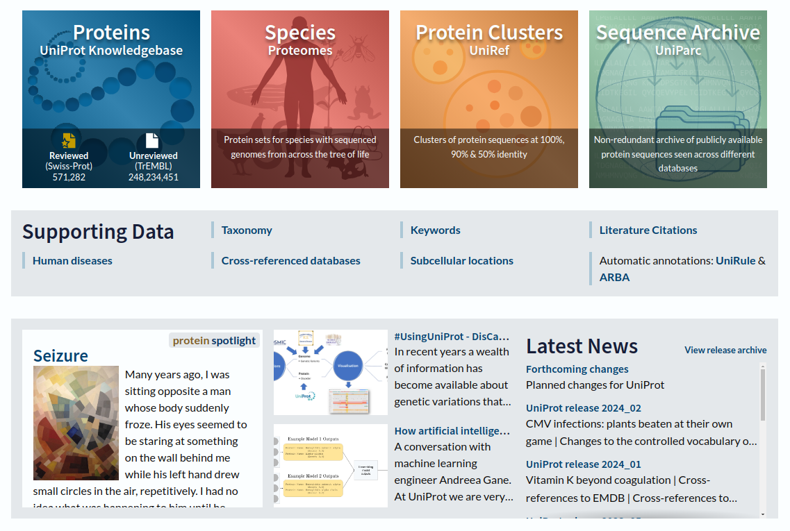
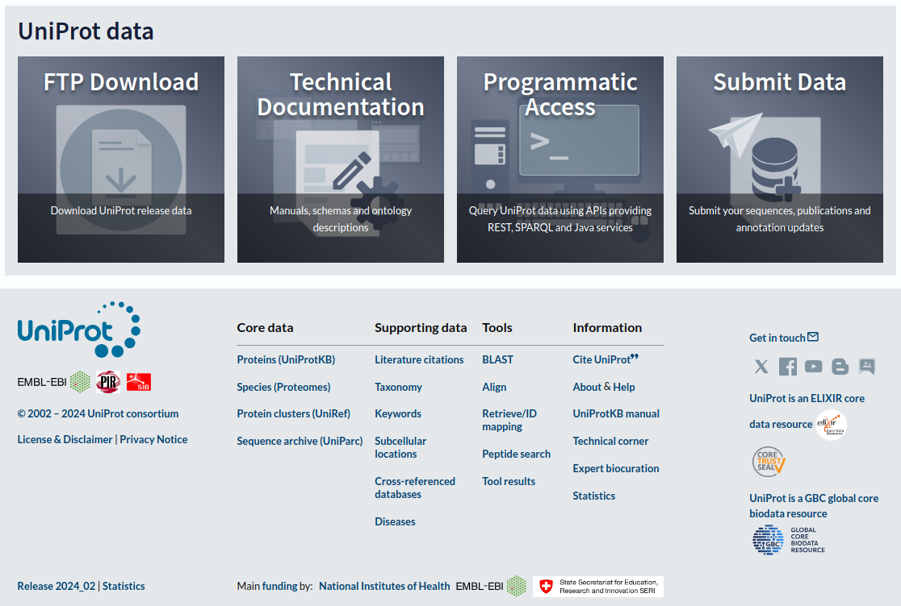
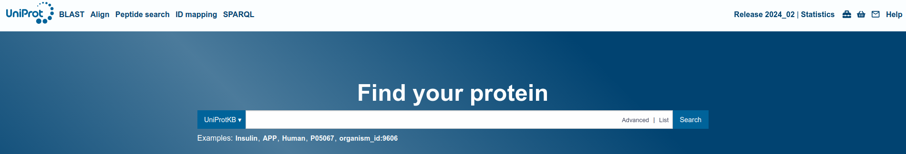
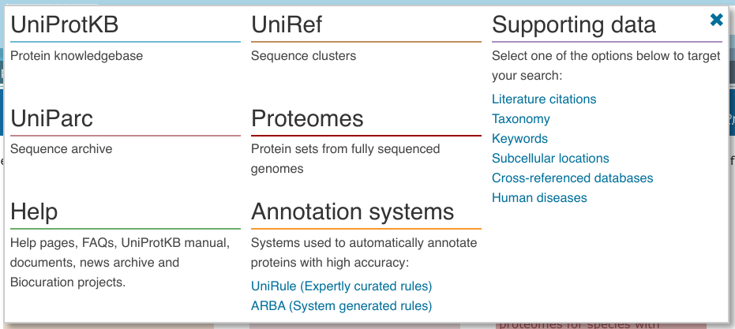
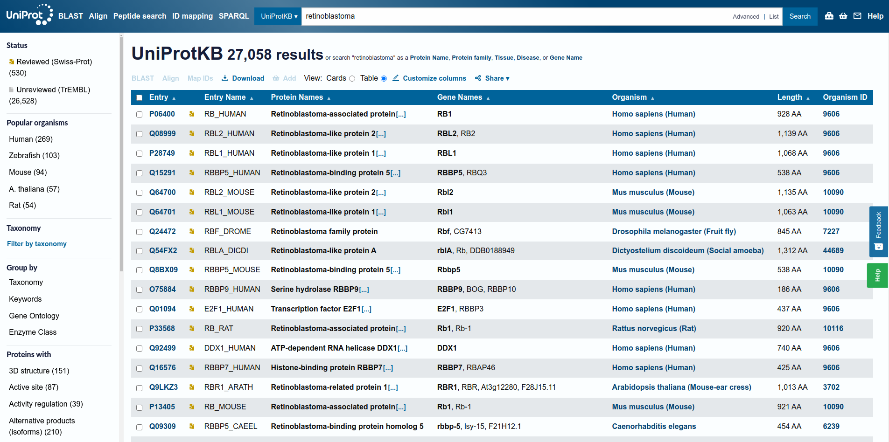
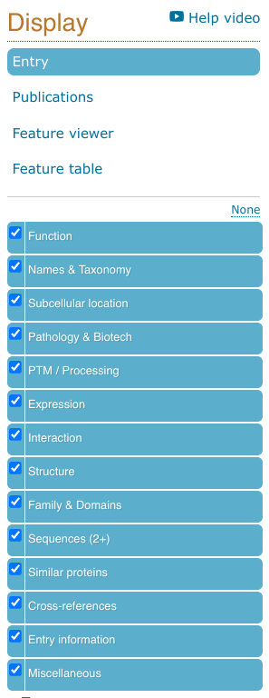
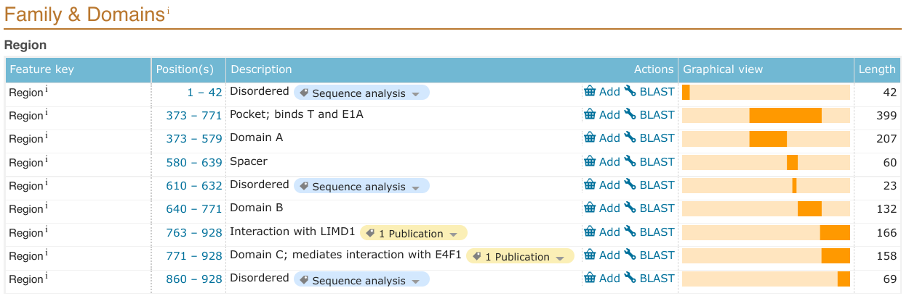
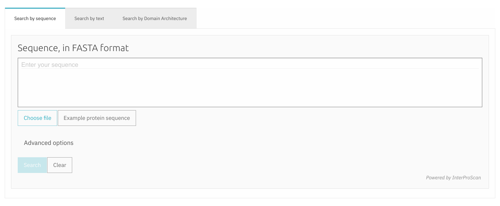

<!--
{ width="250", align="left" }
-->

# **TP 1**. Introducción a bases de Datos { markdown data-toc-label = 'TP 1' }

## Recursos Online

* UniProt: [https://www.uniprot.org/](https://www.uniprot.org/)
* Pfam: [https://Pfam.xfam.org/](https://Pfam.xfam.org/) [Legacy Version]
* TMHMM: [https://services.healthtech.dtu.dk/service.php?TMHMM-2.0](https://services.healthtech.dtu.dk/service.php?TMHMM-2.0)
* InterPro: [https://www.ebi.ac.uk/interpro/](https://www.ebi.ac.uk/interpro/)

## Objetivos
* Familiarizarse con el uso de la base de datos UniProt
* Familiarizarse con el uso de la base de datos Pfam
* Familiarizarse con el uso del predictor de regiones trans-membrana: TMHMM
* Familiarizarse con el uso de la base de datos InterPro

## Materiales

[:fontawesome-solid-download: Materiales](https://drive.google.com/file/d/1NWZrgdZescABRksw890SPZXpaQ4td06T/view?usp=sharing){ .md-button .md-button--primary }

## Organización de la guía
Cada guía consta de una introducción a la herramienta, seguida de los ejercicios a realizar en el trabajo práctico.

## UniProt
UniProt es la colección más abarcativa y actualizada de secuencias de proteínas, las cuales se encuentran anotadas a múltiples niveles. Esta base de datos debería ser el primer paso para cualquier investigador/a que esté buscando la información disponible para una proteína, ya que es tan abarcativa que evita el esfuerzo de integrar los datos de múltiples fuentes.

### UniProtKb. The UniProt KnowledgeBase.
La mayor base de datos de Uniprot es UniProtKB (UniProt **K**nowledge**B**ase) que está dividida en dos secciones: TrEMBL y Swiss-Prot.

* **TrEMBL** es una recolección de proteínas anotadas automáticamente que en su mayoría, aunque no de manera exclusiva, fueron obtenidas a partir de la traducción de secuencias nucleotídicas codificantes (CoDing Sequences, CDS) disponibles en GenBank.

!!! Info

    Una *secuencia codificante (CDS)* es una región de ADN o ARN cuya secuencia determina la secuencia de aminoácidos en una proteína. No se debe confundir con un marco abierto de lectura (Open Reading Frame, ORF) que es una región continua de codones de ADN que empiezan con un codón de inicio y termina con un codón stop. Todos los CDS son ORFs pero no todos los ORFs son CDS, por ejemplo, los ORFs incluye a los intrones.

* **Swiss-Prot** es una base de datos de proteínas que fueron revisadas y anotadas manualmente por un curador/a experto/a.

Por lo tanto, Swiss-Prot contiene la información de más alta calidad para secuencias de proteínas.

TrEMBL brinda los datos crudos para que los curadores de Swiss-Prot los revisen. Por lo tanto, TrEMBL tiene más entradas que Swiss-Prot, pero carece de la anotación manual de un experto.

### UniParc y UniRef
Dentro de UniProt también se encuentra UniParc (the UniProt Archive), una base de datos no-redundante de casi todas las secuencias proteicas disponibles en el mundo. Actualmente, UniParc contiene las secuencias de proteínas de más de 20 bases de datos públicas, como ser:

* EMBL-Bank/DDBJ/GenBank nucleotide sequence databases

* Ensembl

* EnsemblGenomes

* Protein Data Bank (PDB)

* RefSeq

* Saccharomyces Genome database (SGD)

* TAIR Arabidopsis thaliana Information Resource

* UniProtKB/Swiss-Prot, UniProtKB/Swiss-Prot protein isoforms, UniProtKB/TrEMBL

UniRef (the UniProt Reference Clusters) son colecciones de secuencias de proteínas de UniProtKB (inluyendo isoformas) y de una selección de UniParc para obtener una cobertura completa del espacio de secuencia agrupadas (o clusterizadas), según un umbral de similitud de secuencia específico, por ejemplo

* **UniRef100:** Contiene secuencias y sub-fragmentos de secuencia de cualquier organismo que son idénticos. Contiene todas las secuencias de UniProtKB y algunas secuencias seleccionadas de UniParc.

* **UniRef90:** Se construye agrupando las secuencias de UniRef100  y sub-fragmentos de secuencia de más de 11 residuos. de manera que cada grupo está compuesto por secuencias que poseen por lo menos un 90% de identidad y 80% de superposición con la secuencia de mayor longitud del grupo (la secuencia seed).

* **UniRef50:** Se construye agrupando las secuencias seed de UniRef90 que comparten un 50% de identidad y 80% de superposición con la secuencia de mayor longitud del grupo.

El identificador de la secuencias se construye como: UniRef100_P99999, o UniRef90_P99999, o UniRef50_P99999.

### Página web de UniProt

El sitio web de UniProt permite navegar los distintos conjuntos de datos desde el homepage, herramientas de análisis y a través de los links al pie de la página (Figura 1).

<figcaption style="text-align:center;max-width:60%"> Figura 1. Homepage de UniProt. </figcaption>

En la parte superior de la página web hay una barra de búsqueda y distintos accesos directos:

* **BLAST**, para realizar búsquedas por similitud en toda la base de datos UniProtKB.

* **Align**, para realizar alineamientos de pares con el algoritmo Clustal Omega.

* **Peptide search/ID mapping**, permite buscar una lista de identificadores de proteínas y obtener las entradas de UniProt individuales. También permite convertir los identificadores a sus equivalentes en bases de datos externas como GenBank, PDB, entre otras.

<figcaption style="text-align:center;max-width:60%"> Figura 2. Barra de búsqueda de UniProt. </figcaption>

### Realizando búsquedas en UniProt

Las búsquedas pueden realizarse en la barra de búsqueda en la parte superior de la página. Contiene un menú desplegable que permite seleccionar la base de datos y la opción de búsqueda avanzada (Advanced) que permite refinar la búsqueda.

!!! Info
    UniProt es actualizada constantemente. Los últimos conjuntos de datos pueden recolectarse en la sección *UniProt data* en el homepage en el link: *Download latest release*.

    ¿Puedes encontrar en qué fecha se realizó el release actual?

<!--

<figcaption align = "center">

**Fig 3.** Menú desplegable

</figcaption>
 
 
-->

La búsqueda en UniProtKB conduce a una página de resultados donde se muestra en formato tabla determinada información de las secuencias obtenidas como resultado de la búsqueda. Los distintos campos de la tabla pueden editarse utilizando el botón *Customize columns*, cuyo ícono es un lápiz en la parte superior.

Los resultados obtenidos además pueden filtrarse por la base de datos, el organismo, utilizando las opciones en *Filter* by a la izquierda de la página. También hay una sección *View* by que permite agrupar los resultados por taxonomía, pathway u otros criterios.

<figcaption style="text-align:center;max-width:70%"> Figura 3. Página de resultados de UniProt. Tabla de resultados utilizando la palabra "retinoblastoma". </figcaption>

Una vez que se selecciona una entrada haciendo click en el identificador, se abre la página correspondiente a dicha entrada.

Por debajo del nombre de la *Entry*, se muestra una barra con pestañas que permiten cambiar entre la información de la *Entry*, publicaciones, links a sitios externos y el *Feature viewer*.

La visualización *Feature viewer* es una alternativa muy útil que permite visualizar todas las anotaciones a lo largo de la secuencia de la proteína.

<figcaption style="text-align:center;max-width:70%"> Figura 5. Menú de visualización e información de la entrada</figcaption>

A la izquierda, se muestra una barra de navegación que lista todas las secciones con información para la proteína seleccionada.

<figcaption style="text-align:center;max-width:60%"> Figura 6. Secciones de Información para una entrada en UniProt </figcaption>

### Entradas Uniprot
Cada entrada en UniProt posee dos identificadores únicos.

* El **Accession number** es una secuencia de 6 a 10 caracteres alfanuméricos (ej. P04637) que se mantiene a lo largo de las actualizaciones y que debería ser usada en todas las publicaciones.

* El **Entry name** es un identificador más fácil de leer que en general se selecciona de manera tal que refleje las propiedades biológicas, como el nombre de la proteína o el organismo (ej. P53_HUMAN). Este identificador puede llegar a cambiar si se obtuviera nueva información sobre la entrada o secuencias relacionadas.

Una entrada de UniProt puede poseer datos experimentales y predichos. Los datos anotados manualmente, tomados de experimentos publicados, transferidos de experimentos en proteínas similares o importados desde otras bases de datos están indicados con un listón amarillo/dorado en la etiqueta. Los datos que son generados por anotación automática están anotados como *Automatic Annotation*.

<figcaption style="text-align:left;max-width:95%"> Figura 7. Ejemplo de evidencia predicha y experimental en uniprot para la proteína retinoblastoma de humanos (P06400). 
Muchas de las etiquetas que dicen <b>Automatic Annotation</b> corresponden a la asignación de <b>Desorden</b> (región no estructurada de la proteína) a una región de secuencia en base al análisis bioinformático de la secuencia. 
Las etiquetas con un listón amarillo que dicen <b>1 Publication</b>, indican que esas regiones poseen evidencia experimental en una publicación para la interacción con LIMD1 (región 763 a 928) y con E4F1 para el dominio C de retinoblastoma. </figcaption>

Las entradas de UniProt están ranqueadas por un sistema de 5 puntos (*Annotation score*). El puntaje de cada entrada se calcula en base al número y puntaje de sus anotaciones. Una anotación con evidencia experimental tiene mayor puntaje que una anotación equivalente predicha o inferida. Un mayor número de puntaje refleja una entrada con más anotaciones; sin embargo, este sistema no refleja la correctitud de las anotaciones.

## Uniprot - Ejercicios

### Ejercicio 1. Proteína CDC7
1. Busca en UniProt la proteína *CDC7*.
2. ¿Cuál es el nombre de la proteína? ¿Cuál es su longitud en humanos?
3. ¿Cuántas entradas existen en organismos populares y cuántas en humanos?
4. Encuentra la proteína `Q8NEY8` entre los resultados. ¿Por qué te parece que está entre los resultados?
5. Recorre la tabla hasta que aparezca la proteína `B1AMW7`. ¿Cuál es su longitud? ¿Por qué está `B1AMW7`?
5. ¿Cuántas de las entradas corresponden a entradas anotadas manualmente (Swiss-Prot) y cuántas no (TrEmBl)?
6. ¿Cuántas de las entradas que corresponden a humanas tienen el mayor score? ¿Que puntuación tienen la mayoría de las entradas? ¿Por qué cree que ocurre esto?

### Ejercicio 2. Demetilasa Lisin-específica 3B.
1. La Demetilasa Lisin-específica 3B (KDM3B) existe tanto en humanos (`Q7LBC6`) como en ratones (`Q6ZPY7`). Su función es bien conocida y en cada organismo dicha función fue anotada a partir de distintas fuentes.

    * ¿Puede identificar estás fuentes?

    Vaya a la entrada UniProt para la demetilasa Lisin-específica 3B humana. Inspeccione las distintas características anotadas disponibles (los campos pueden encontrarse en el menú de la izquierda) y conteste:

2. ¿Cuál es el nombre de la entrada?
3. ¿A qué base de datos de UniProtKB pertenece?
4. ¿Cuáles son algunas de las funciones moleculares y actividades biológicas asociadas con esta proteína?
5. ¿Dónde se localiza esta proteína?¿De donde se obtuvo esta información?
6. ¿Con cuántas proteínas se sabe que interactúa?
7. ¿Existe alguna estructura conocida para esta proteína? Si las hay, ¿Son estructuras obtenidas experimentalmente o predichas? ¿abarcan toda la secuencia?
8. ¿Cuántas isoformas están anotadas para esta proteína? Si las hay, ¿Cómo difieren de la secuencia canónica?

    !!! info

        Una **isoforma** de una proteína o variante proteica, es una proteína que pertenece a un conjunto de proteínas muy similares que se originan a partir de un único gen o familia de genes y son el resultado de diferencias genéticas. Si bien la mayoría lleva a cabo las mismas o similares funciones biológicas, algunas isoformas tienen funciones específicas y únicas. Las isoformas pueden formarse por splicing alternativo, variaciones en el uso del promotor u otras modificaciones post-transcripcionales.
        
        Cada entrada UniProtKB/swiss-Prot contiene todas las secuencias curadas producto de un gen.
        
        Para cada entrada se elige una **secuencia canónica** (o representativa) que cumple con ciertos criterios de manera que permita la descripción de la mayoría de los dominios, motivos, modificaciones post-traduccionales que ocurren en las distintas variantes. Algunos de los criterios son: funcionalidad, expresión, conservación en secuencias ortólogas. Si la información es escasa, entonces se elige la secuencia más extensa.

9. ¿Puedes encontrar la fecha de creación de esta entrada y cuál es la fecha de su última modificación? ¿Cuántas veces fue modificada? ¿Cuándo fue incorporada a SwissProt?

    ??? idea "Pista"

        Explora la pestaña *History*

10. ¿Qué información hay disponible para la posición 773 en la sección *PTM/Processing*? Inspecciona en el *Feature viewer* la misma posición.

    !!! Info

        En la parte superior gris puede enfocarse en la región deseada achicando el rango desde los extremos hacia el centro. También se puede hacer zoom con la ruedita del mouse.

### Ejercicio 3. Proteína GHSR.

La entrada de UniProt Q9UBU3 corresponde a la proteína GHSR, una hormona reguladora del apetito. Esta hormona se expresa como una pre-proteína que es clivada de modo post-traduccional para dar las proteínas maduras Grelina y Obestatina. 

1. Intenta localizar la posición de estas proteínas maduras en la secuencia completa de la pre-proteína

    ??? Idea "Pista"
    
        El *feature viewer* puede ser muy útil. Expande *Molecule processing*.
 
2. ¿Hay isoformas de alguna de las dos proteínas maduras?
3. ¿Cuántas proteínas comparten una identidad del 90% con la secuencia completa de la proteína?

### Ejercicio 4. Demetilasa Lisin-específica 5C (KDM5C).

La demetilasa Lisin-específica 5C (`P41229`) es otra histona demetilasa cuyo blanco específico es la lisina 4 de la histona H3.

1. ¿Puede localizar la *K~cat~* y el *K~m~* de esta reacción para esta entrada uniprot?

    !!! Info
    
        La ***K~cat~*** es el número de recambio. Para una enzima se define como el número máximo de moléculas de sustrato que puede convertir en producto por unidad de tiempo.
        
        La ***K~m~*** (constante de Michaelis-Menten) es la concentración de sustrato a la cual la velocidad de reacción de una enzima es la mitad de la velocidad máxima (50% de saturación de la enzima). 

2. ¿Puede descargar la secuencia de la isoforma en formato **Fasta**?

    ??? info "¿Qué es el formato fasta?"

        **Formato FASTA:** Comienza con el símbolo '>' (mayor que) con una breve descripción de la secuencia, esta sección se conoce como encabezado o *header* y es seguida por la secuencia escrita en el código de una letra en la siguiente línea. 
        
        Los archivos **Multi Fasta** tienen muchas de estas combinaciones, una luego de la otra y con una línea en blanco opcional entre cada secuencia.

3. Las entradas UniProt tienen una sección específica llamada *Family & Domains*. Esta sección describe la identidad, posición y longitud de los dominios que fueron anotados en la proteína. En *Type* filtre por las distintas categorías para responder:
    
    1. ¿Cuántos dominios puede encontrar definidos para la KDM5C?
    2. ¿De donde proviene la información relacionada a la presencia de Dominios?
    3. ¿Existen otras regiones relevantes para esta proteína?
    4. Siga explorando la sección, ¿Hay referencias cruzadas para esas regiones con otras bases de datos?
    

### Ejercicio 5 - Proteína p53. Descarga de Múltiples Secuencias
En algunos de los próximos trabajos prácticos estaremos trabajando con una proteína que se llama p53. Por eso, busquen y guarden la información que encuentren en este ejercicio: va a ser útil más adelante!

1. Busca la proteína p53 de humanos en Uniprot y recolecta la siguiente información:
    
    1. Nombre de la proteína
    1. Función de la proteína
    1. ¿Está involucrada en alguna enfermedad?
    1. ¿Qué tipo de modificaciones post-traduccionales sufre?
    1. p53 interactúa con muchas proteínas. ¿Con qué otro tipo de molécula interactúa?
    1. ¿Cuál es la longitud de la proteína?
    1. ¿Qué región abarca la estructura obtenida por AlphaFold? ¿Y las obtenidas experimentalmente?
    1. ¿Qué región está involucrada en la oligomerización de p53?
    1. Observe la sección motivos, ¿Qué elementos conocidos encuentra? ¿Qué longitud poseen?

2. La sección *Retrieve ID/mapping*, permite mapear los distintos identificadores entre las distintas bases de datos así como también realizar una búsqueda utilizando múltiples identificadores.

    Cargue el archivo con los uniprots ID que descargó de materiales o copie y pegue su contenido.
    
    En *Select options* asegúrese que en *from* esté elegido **UniProtKB AC/ID** y en *To* esté elegido **UniprotKB**. Haga click en *Submit*.

    Uniprot debería devolverle como resultado una tabla con 34 entradas.

    * Si usted lo desea puede agregar columnas que sean de su interés y descarga la tabla utilizando el botón de *Download* y seleccionando el formato *Tab-separated* y elija *Uncompressed*. Esta tabla puede luego abrirla con su programa de Hojas de Cálculo favorito.
    * Descargue las secuencias Canónicas en formato `FASTA (Uncompressed)` que serán usadas más adelante en la materia.

## Pfam

Pfam es un recurso muy útil para identificar regiones funcionales conservadas en proteínas. Permite encontrar regiones de similitud entre una secuencia *query* y una base de datos de familias de proteínas anotadas con el objetivo de incrementar el conocimiento de la arquitectura, función y relaciones de la proteína de interés (la secuencia *query*).

Una entrada Pfam se construye a partir de un alineamiento de secuencia múltiple de un conjunto de secuencias curadas que se sabe que pertenecen a una familia. Este es conocido como el alineamiento **semilla** (*seed*) y es utilizado para entrenar un *profile Hidden Markov Model* (o perfil de HMM) que brinda una representación extendida de la familia contemplando inserciones y deleciones. Este modelo probabilístico refleja la variabilidad de secuencia en cada posición de la familia y es utilizado para una búsqueda exhaustiva en una base de datos (como UniProtKB) de todas las secuencias homólogas. Las secuencias recolectadas que muestran una similitud significativa con el perfil de HMM son alineadas a este modelo obteniendo como resultado un alineamiento más completo de la familia.

!!! question "Pregunta"

    Antes de seguir leyendo, piense y discuta, ¿Cuál es la definición de un Dominio?       

Si bien algunas regiones en Pfam se llaman comúnmente Dominios, las entradas de Pfam no representan necesariamente una región de secuencia que se pliega en una estructura terciaria discreta, sino más bien, representan unidades conservadas evolutivamente.

Una **Familia (Family)** Pfam representa un conjunto de secuencias relacionadas por un HMM. Las familias grandes y divergentes pueden compartir una gran similitud de secuencia, estructura o función con los miembros de otras familias. Dada la dificultad de representar estas **superfamilias** por un único alineamiento o perfil HMM, Pfam provee un nivel superior de agrupamiento de las familias relacionadas evolutivamente en **Clanes (clans)**.

Cada residuo de cada secuencia dada sólo puede pertenecer a una familia Pfam.

Los perfiles de HMM son construidos con el paquete HMMER3 (disponible en [http://hmmer.org](http://hmmer.org)). Al igual que BLAST, HMMER3 utiliza e-values. El e-value devuelto por Pfam refleja la significancia del hit.

!!! Info

    **e-value (expectation values):** El e-value es el número de *hits* que uno espera que tengan una puntuación igual o mejor que ese valor por azar solo. Un buen e-value es mucho menor a 1. Un valor de 1 es lo que uno esperaría por azar. Los e-values dependen del tamaño de la base de datos donde se realiza la búsqueda.

Pfam utiliza un segundo sistema de puntuación (*bit score*) para el mantenimiento de los modelos que es independiente del tamaño de la base de datos donde se realiza la búsqueda.

!!! Info

    **Bit-score:**

    * Un *bit-score* de 0 significa que el likelihood del *hit* encontrado por el modelo es igual al likelihood por azar.
    * Un *bit-score* de 1 significa que el likelihood del hit es el doble que el likelihood por azar.
    * Un *bit-score* de 2 significa que el likelihood del hit es el cuádruple que el likelihood por azar.
    * Un *bit-score* de 20 significa que el likelihood del hit es 2^20^ veces el likelihood por azar.

Cuando una familia proteica es construida, se establece un umbral en el bit-score para la recolección (bit score gathering, GA) de manera manual para cada familia. Este puntaje (GA) determina el menor puntaje que una secuencia debe obtener en la búsqueda con el perfil de HMM para ser incluida en el alineamiento completo.

Tanto los alineamientos semilla, como los alineamientos completos y el perfil de HMM están disponibles en Pfam para su descarga.

En el año 2022, la base de datos Pfam fue incorporada a la base de datos InterPro. La base de datos original de Pfam puede todavía accederse parcialmente en la versión Legacy: [https://Pfam.xfam.org/](https://Pfam.xfam.org/). Pero los datos desde este servidor ya no tendrán actualizaciones y la mayoría de las cosas redirigen a InterPro.

En InterPro, [https://www.ebi.ac.uk/interpro/](https://www.ebi.ac.uk/interpro/), se pueden realizar muchas de las búsquedas que se realizaban en la página original de Pfam.

## InterPro
La base de datos InterPro es un compendio de bases de datos que incluye a Pfam entre otras bases de datos para la clasificación de proteínas. InterPro también predice **características funcionales** distintivas o **functional  signatures** de las proteínas por asignación a familias, reconocimiento de dominios y otros sitios relevantes. Sin embargo, InterPro es una meta-base de datos, ya que unifica las características de las proteínas tomando la información a partir de múltiples bases de datos independientes en un recurso único para una clasificación integradora de la secuencia.

En InterPro, una **protein signature** es un modelo computacional que refleja el patrón de conservación de aminoácidos sitio-específico en un alineamiento. Puede tener la forma de un patrón de secuencia, un perfil que describe un motivo de secuencia determinado o un sofisticado perfil de HMM, que contempla las inserciones y deleciones en las familias de proteínas. Los modelos iniciales se usan para búsquedas iterativas en distintas bases de datos como UniProtKB para recolectar homólogos remotos y aumentar el número de secuencias distantes que representa el modelo. La **protein signature** final es un modelo predictivo muy descriptivo que puede ser utilizado para el análisis de secuencias.

Dentro de las muchas bases de datos que usa InterPro están:

* Pfam.
* SMART: base de datos de arquitecturas de dominios de proteínas.
* Superfamily: una base de datos basada en perfiles de HMM de anotaciones funcionales y estructurales en proteínas.
* CATH/Gene3D: una base de datos de superfamilias de dominios con una estructura conocida y su predicción en genomas completos.
* MobiDB: un recurso central para la anotación de desorden intrínseco en secuencias UniProt.

Dado que las distintas bases de datos probablemente posean información redundante, un equipo de curadores de InterPro chequean manualmente y fusionan las *signatures* que se refieren a la misma familia, dominio o sitio en una entrada única de InterPro. Por lo tanto, cada **protein signature** posee un único código de acceso InterPro junto al código correspondiente de las bases de datos individuales.

Lo más importante de InterPro es la integración de múltiples fuentes de información, cada una con sus fortalezas y no en la cantidad de información que se extrae de ellas. Esto convierte a InterPro en una fuerte herramienta de diagnóstico. Sin embargo, una vez que se encuentran las *signatures* de interés, en general se aconseja ir a las bases de datos correspondientes para mayor información.

Una entrada InterPro puede ser de distintos tipos:

* Un Dominio (**domain**) en InterPro son unidades discretas con secuencia, estructura o función distintiva que se puede encontrar en diferentes contextos biológicos.

* Los miembros de una familia (**family**) de proteínas, además de compartir un origen evolutivo común, poseen secuencias, estructura sy/o funciones similares.
* Las entradas de una superfamilia de homólogos (**homologous superfamily**) abarca proteínas con un ancestro común que normalmente poseen baja conservación de secuencia pero una similitud estructural notable.
* Las repeticiones (**repeats**), identifican secuencias cortas que se encuentran múltiples veces dentro de una proteína.
* Un sitio (**site**), es una secuencia corta, pero con uno o más residuos conservados que poseen una función definida.
    * Sitio activo (**active site**), es una secuencia corta que contiene uno o más residuos conservados que permiten que la proteína se una a un ligando y lleve a cabo una actividad catalítica.
    * Sitio de unión (**binding site**), es una secuencia corta que contiene uno o más residuos conservados que forman un sitio de interacción de la proteína.
    * Sitios de modificación post-traduccionales (**PTMs, Post-translational modification sites**), una secuencia corta que contiene uno o más residuos conservados que son modificados post-traduccionalmente.
    * Sitio conservado (**conserved site**), una secuencia corta que posee uno o más residuos conservados.
* Los **unintegrated** son *signatures* de bases de datos que no están integradas en InterPro. Estas *signatures* pueden no haber sido curadas aún o no cumplir con los estándares de InterPro para su integración. Sin embargo, pueden brindar información importante de una proteína de interés.

### Realizando búsquedas relacionadas a Pfam en InterPro

Para realizar una búsqueda se puede utilizar el código de acceso de InterPro, que está formado por IPR más un número, o un identificador de UniProtKB o un identificador de cualquier otra base de datos miembro de InterPro. Así como también se puede utilizar la secuencia de la proteína, o keywords relacionadas con la función o actividad de una proteína.

<figcaption> Figura 8. Página principal de InterPro. </figcaption>

En esta sección nos vamos a enfocar principalmente en los datos relacionados a Pfam. Los identificadores Pfam tienen la forma `PF99999`.

<!--
Las búsquedas en Pfam pueden realizarse utilizando la secuencia de interés, el número de accession UniProt, el nombre de la entrada UniProt, el identificador Pfam para una familia o usando *keywords* relacionadas.

<figcaption align = "center">

**Fig 7.** Homepage de Pfam.

</figcaption>
 
 
La mayoría de los datos de Pfam son tomados de UniProt y mucha de la información está conectada a distintas entradas de Wikipedia cuando está disponible.
--> 

## Pfam - Ejercicios

### Ejercicio 1. Entendiendo Pfam usando la entrada PF00571

Busque en InterPro la entrada Pfam utilizando el identificador de Pfam: `PF00571`.

1. ¿Pertenece a una proteína, un dominio, una familia o un clan?
3. En la página principal de la entrada, ¿puedes encontrar el nombre de tres proteínas que poseen este dominio?
2. En el menú de la izquierda ¿Cuántas secuencias están conectadas con esta entrada?
4. En el menú de la izquierda, *Domain Architectures* lista las arquitecturas de dominios (arreglos específicos de ciertos dominios) donde se encuentra esta familia. ¿cuántas arquitecturas de dominio existen?
5. ¿Cuántas proteínas poseen la arquitectura CBSx2? ¿Cual es la proteína representante? ¿A qué organismo pertenece?
6. Otra arquitectura abundante es ‘IMPDH, CBS x 2’. En base a su conocimiento de dominios Pfam, ¿Observa algo contradictorio?
7. Vaya a la representación gráfica de la proteína representante. Observe la detección de los dominios Pfam ‘IMPDH, CBS x 2’ ¿Sigue habiendo una contradicción? ¿Por qué cree que algunos bloques muestran bordes recortados?
7. Muestre los resutados de a 100 y vaya hasta el final haciendo click en *Next* (o lo más cercano al final que pueda) donde encontrará las arquitecturas minoritarias. ¿Son parecidas a las anteriores? ¿El tamaño de los dominios CBS es similar?
8. En la sección *Alignment* del menú de la izquierda puede encontrar los distintos formatos de los alineamientos pre-calculados.

    En este caso, está disponible el alineamiento semilla (seed) con el que se construye el HMM.
    
    * ¿Con cuántas secuencias se construyó el alineamiento?
    * En *Colors* tiene distintas opciones para visualizar el alineamiento, coloree por clustal2 ¿A que residuos corresponden los distintos colores?
   
    Si quiere, puede descargar en formato FASTA el alineamiento semilla.

9. El logo del perfil HMM es un resumen gráfico del perfil que provee una vista rápida de sus propiedades. Está disponible en la sección *Signature* del menú de la izquierda. Para cada posición en el eje-x, el valor del eje-y indica conservación. ¿Cuál es la posición más conservada en este logo?

10. Pfam brinda información evolutiva de las proteínas que pertenecen a la familia CBS. Se puede obtener un árbol filogenético de la familia en la sección *Taxonomy*. Visualice los datos como árbol y responda ¿En qué linaje, Eukaryota, Archaea o Bacteria, tiene el mayor nro de representantes con este dominio?

11. Visualice los resultados como *Surnburst* para poder ver la distribución de esta familia en las distintas especies. ¿En qué reino esta familia es más abundante? ¿Cuántas especies de este reino poseen esta proteína?

14. La sección *Structures* conecta las regiones de las entradas UniProt donde se encontró el dominio CBS con los identificadores de la base de datos de estructuras conocidas PDB (Protein Data Bank) y siguiendo el identificador PDB se pueden explorar las estructuras terciarias en la base de datos del PDB. En esta sección, ¿Cuántas estructuras hay disponibles?

13. Volviendo a la sección *Domain Architectures*, encuentre el Pfam ID para la familia IMPDH y vaya al sitio para esta entrada.
    * ¿Cuál es la actividad de este dominio?
    * ¿Puede determinar el plegamiento estructural de esta familia a partir del nombre del clan al que pertenece?.
<!--
12. La sección *Interactions* lista las interacciones para dominios en esta familia. Utilizando el link More puede encontrar más información sobre el origen de estos datos. ¿Fueron determinados experimentalmente o están basados en predicciones computacionales?
-->

### Ejercicio 2. Proteína KDM5C
Si recuerda de los ejercicios de UniProt, la proteína KDM5C (demetilasa lisin-específica 5C) tenía al menos tres dominios reportados: JmjN, ARID y JmjC. Busque en InterPro esta proteína utilizando el nombre de la entrada (KDM5C_HUMAN). Observe que el menú de la izquierda es distinto al de la familia Pfam.

1. En la sección *Overview* ¿puede encontrar otros dominios o regiones interesantes?
2. ¿A qué se une el dominio ARID de esta proteína? ¿Puede encontrar el identificador PDB de la estructura de este dominio en la proteína KDM5C?
3. ¿Aparecen los zinc-fingers como dominios en Pfam? ¿Estaban también anotados como *dominios* en UniProt?

### Ejercicio 3. Proteína p53
1. Busque la proteína p53 en Pfam.
    1. ¿Qué dominios encuentra?
    1. ¿Algunos de los dominios estaban identificados en la sección *Family & Domains* en Uniprot como dominios?
    1. ¿Qué función tiene cada uno de los dominios?
    1. ¿Que estado de oligomerización considera que tiene p53? ¿Esto lo observó en la predicción estructural de AlphaFold?
    1. ¿Puede observar las regiones desordenadas en la predicción estructural de AlphaFold? ¿Son las mismas identificadas en la sección *Family & domains* como desordenadas?
    
    !!! info 
    
        Desorden y **low complexity** son dos conceptos que serán vistos en mayor profundidad más adelante en el curso.
    
        Una **región desordenada** se diferencia de una región globular porque carece de una estructura que se mantenga en el tiempo.
        
        **Low complexity regions** son regiones que poseen baja complejidad de secuencia y están enriquecidas en algún aminoácido o dímeros de aminoácidos.

## TMHMM
TMHMM es un servidor dedicado a la predicción de hélices transmembranas en proteínas. Si bien se desarrolló hace ya dos décadas, es constantemente actualizado y aún es una buena referencia.

El programa está basado en el desarrollo de un Hidden Markov Model que sirve como una herramienta predictiva.

A partir de la secuencia, TMHMM devuelve un conjunto de estadísticas y una lista de las hélices transmembranas predichas. Esta lista mapea el inicio y fin de cada hélice predicha y loop. También devuelve la ubicación de estos loops, ya sea en el interior o exterior de la célula. Por lo tanto, se puede trazar el camino de la proteína de un lado a otro de la membrana.

Un plot de probabilidades posteriores permite la identificación de los segmentos transmembrana que se encuentran en el modelo final y otros segmentos predichos débilmente que no fueron considerados. El HMM calcula la probabilidad total de que un residuo sea parte de una hélice, un loop interno o externo y luego combina estas evaluaciones en el modelo final.

## TMHMM - Ejercicios

### Ejercicio 1. Bacteriorodopsina.
La interfaz de [TMHMM Server 2.0](https://services.healthtech.dtu.dk/services/TMHMM-2.0/) es simple. Se usa la caja de búsqueda en la página principal para correr la predicción a partir de una secuencia.
1. Ingrese la secuencia de la proteína bacteriorodopsina que se encuentra a continuación para realizar la búsqueda en TMHMM. Use el formato de salida por defecto (‘Extensive, with graphics’) para obtener resultados más descriptivos.

    >sp|P02945|BACR_HALSA Bacteriorhodopsin OS=Halobacterium salinarum
    MLELLPTAVEGVSQAQITGRPEWIWLALGTALMGLGTLYFLVKGMGVSDPDAKKFYAITT
    LVPAIAFTMYLSMLLGYGLTMVPFGGEQNPIYWARYADWLFTTPLLLLDLALLVDADQGT
    ILALVGADGIMIGTGLVGALTKVYSYRFVWWAISTAAMLYILYVLFFGFTSKAESMRPEV
    ASTFKVLRNVTVVLWSAYPVVWLIGSEGAGIVPLNIETLLFMVLDVSAKVGFGLILLRSR
    AIFGEAEAPEPSAGDGAAATSD

2. Inspeccione los resultados de la búsqueda. ¿Cuántas hélices transmembrana encontró?
3. Entre los estadísticos encontrará *Exp number of AAs in TMHs*. Este es el número esperado de aminoácidos en hélices transmembrana según este HMM como método de predicción. Cuando este número es mayor que 18, la proteína es probablemente una proteína transmembrana. ¿Es la bacteriorodopsina una proteína transmembrana?
4. Otro estadístico es *Exp number, first 60 AAs*. Este valor es el mismo que el anterior pero limitado a los primeros 60 aminoácidos. Si este estadístico no posee un valor bajo, es decir de unos pocos residuos, entonces puede llegar a ocurrir que una hélice transmembrana predicha en la región N-terminal sea en realidad un péptido señal.

    Se pueden utilizar otras herramientas dedicadas a la predicción de péptidos señal, como [SignalP](https://services.healthtech.dtu.dk/service.php?SignalP-5.0). sabiendo que Halobacterium es una Archea, ¿SignalP predice el N-terminal como un péptido señal?

5. En el gráfico, los bloques rojos corresponden a hélices transmembrana, las líneas azules indican regiones en el interior y los segmentos violetas corresponden a regiones en el exterior. Observando el gráfico, ¿puede haber otra hélice transmembrana que el modelo esté descartando?
6. ¿Cuántos pasos transmembrana tienen las Rodopsinas? En base a las herramientas aprendidas en este trabajo práctico ¿Se le ocurre donde puede encontrar esta información? (Pista: Tiene el Accession number de esta proteína!).

## Interpro - Ejercicios Adicionales

### Ejercicio 1. Dominios CBS.

Realice una búsqueda en InterPro con el identificador de Pfam PF00571.

1. ¿En qué **entrada de InterPro** está integrada?
2. ¿Corresponde a una proteína, un dominio u otra cosa?
3. ¿Corresponde a la misma entidad que Pfam? ¿Estas entidades son similares o al menos tienen algo en común?
4. ¿Qué *signatures* de otras bases de datos fueron fusionados con Pfam para crear la entrada de InterPro?
5. ¿Cuántas proteínas corresponden a esta entrada? ¿Cuántas arquitecturas de dominio? ¿Cuántas proteínas tienen dos ocurrencias repetidas de esta entrada seguida por un dominio transporter-associated (IPR005170)?

### Ejercicio 2. Proteína KDM5C.
Busque en InterPro la entrada correspondiente a la demetilasa lisin-específica 5C (UniProtKB entry P41229). Hacia la izquierda pueden expandirse/colapsarse las *signatures* que definen los distintos tipos de entradas de InterPro, mientras que en la sección central se observan las predicciones de las *signatures* para la proteína de interés.

1. ¿Qué *signatures* son reconocidas en esta proteína?
2. Las *signatures* son mapeadas en la secuencia query en los resultados principales. Observe la sección *Homologous superfamily*. ¿Cuál es la arquitectura de esta superfamily?

    !!! Info "Tipos de entradas en InterPro"

        Las entradas de InterPro existen para:

        * **Protein Family:** Grupo de proteínas que comparten un origen evolutivo que se refleja en funciones relacionadas, homología de secuencia y similitud estructural.
        * **Domain:** Una unidad distintiva funcional, estructural o de secuencia que se encuentra frecuentemente asociada a otros tipos de dominios.
        * **Site:** Secuencia corta con uno o más residuos conservados incluyendo: sitios activos, de unión, conservados y sitios de modificaciones post-traduccionales.
        * **Repeats:** Secuencia corta ( < 50 a aminoácidos) que típicamente se repite varias veces dentro de una proteína.
        * **Homologous Superfamily:** Grupo de proteínas que comparten un origen evolutivo que se refleja en la similitud estructural, aún cuando la similitud de secuencia es baja. Este tipo de entrada contiene *signatures* de las bases de datos CATH-Gene3D y SUPERFAMILY exclusivamente.

3. La *signature* más cercana al C-terminal en esta superfamily es un zinc finger.

    * ¿Qué *signatures* de InterPro describen esta región? ¿Qué tipo de *signatures* son?
    * ¿De donde proviene la información que utilizó InterPro para esta asignación?
    * A la derecha puede observar los identificadores que las *signatures* provenientes de las distintas bases de datos.

4. Entre las *signatures* identificadas está la entrada de dominio IPR001606. ¿Qué bases de datos fueron procesadas para crear esta entrada? ¿Estas mapean todas a la misma región exacta de la proteína de interés? Si la respuesta es no, ¿por qué cree que es así?
5. ¿Puede identificar regiones intrínsecamente desordenadas en esta proteína? (‘mobidb’ es la fuente en este caso para la anotación de estas regiones).
6. ¿Cuántas proteínas similares a P41229 existen aproximadamente?

### Ejercicio 3. Búsqueda a partir de secuencia.

Busque en la base de datos de InterPro la entrada que describe la proteína en la siguiente secuencia FASTA:

    >squirrel_seq | example from EBI Train Online
    MALPARLVPLCCLALLALPAQSCGPGRGPVGRRRYVRKQLVPLLYKQFVPSVPERTLGAS
    GPAEGRVARGSERFRDLVPNYNPDIIFKDEENSGADRLMTERCKERVNALAIAVMNMWPG
    VRLRVTEGWDEDGHHAQDSLHYEGRALDITTSDRDRNKYGLLARLAVEAGFDWVYYESRN
    HVHVSVKAGTVGGGCFRETEAAQLWGDARGLRELHRAWVLAADAAGRVVPTPVLLFLDRD
    LQRRASFVAVETERPPRKLLLTPWHLVFAARGPAPAPGDFAPVFARRLRAGDSVLAPGGD
    ALRPARVARVAREEAVGVFAPLTAHGTLLVNDVLASCYAVLESHQWAHRAFAPLRLLHAL
    GALLPGGAVQPTGMHWYSRFLYRLAEELLG

1. ¿Pertenece a alguna family?
2. ¿Puede encontrar el nombre de la entrada de la base de datos PRINTS utilizada para construir esta family signature de InterPro?
3. ¿Cuál es la diferencia entre las InterPro *signatures* IPR001767 y IPR003587?
4. Considerando las dos *signatures* del punto anterior y IPR000320, ¿puede describir la arquitectura de esta proteína? ¿Cómo difiere de la arquitectura presentada en la sección *Homologous superfamilies*?
5. ¿Cuál es el rol biológico de esta proteína?

    ??? Hint "Pista"
    
        Clickee en el nombre de la familia de la proteína.

6. ¿Tiene un péptido señal esta proteína?
7. ¿Cómo podría saber a simple vista que esta proteína tiene actividad peptidasa?

## Recursos adicionales

### UniProt: Exploring protein sequence and functional information

[https://www.ebi.ac.uk/training/online/course/uniprot-exploring-protein-sequence-and-functional](https://www.ebi.ac.uk/training/online/course/uniprot-exploring-protein-sequence-and-functional)

### Pfam: Quick tour

[https://www.ebi.ac.uk/training/online/course/Pfam-quick-tour](https://www.ebi.ac.uk/training/online/course/Pfam-quick-tour)

### InterPro: Quick tour
[https://www.ebi.ac.uk/training/online/course/interpro-quick-tour](https://www.ebi.ac.uk/training/online/course/interpro-quick-tour)

### InterPro: Functional and structural analysis of protein sequences
[https://www.ebi.ac.uk/training/online/course/interpro-functional-and-structural-analysis-protei](https://www.ebi.ac.uk/training/online/course/interpro-functional-and-structural-analysis-protei)

### InterPro FAQS
[https://www.ebi.ac.uk/interpro/faqs.html](https://www.ebi.ac.uk/interpro/faqs.html)

### Protein classification: An introduction to EMBL-EBI resources
[https://www.ebi.ac.uk/training/online/course/protein-classification-introduction-embl-ebi-resou](https://www.ebi.ac.uk/training/online/course/protein-classification-introduction-embl-ebi-resou)
