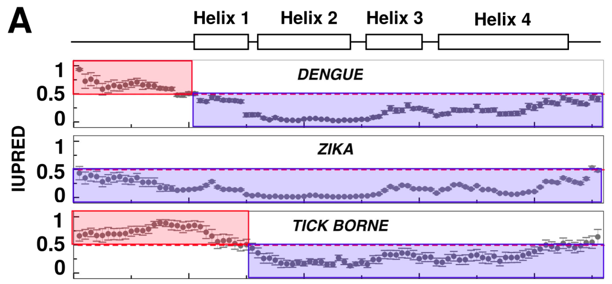

# **TP 9.** Ejercicios integradores.  { markdown data-toc-label = 'TP 9'}

## Materiales
- Los materiales a utilizar son los mismos que en el trabajo práctico anterior. Consulte al docente si necesita algún material que no esté accesible.

## Modo de trabajo
- Tienen dos horas para realizar la resolución del ejercicio.
- Hagan una breve introducción al tema.
- Resuelvan y discutan y preparen una mini presentación.
- En el cierre UNO de los grupos que resolvió el ejercicio presenta la resolución y los grupos restantes deben discutir los resultados que obtuvieron.

## Ejercicio Integrador 1. Analizando regiones de conformación heterogénea: ¿Qué nos dice Alphafold?

Como ya vimos, los flavivirus son virus envueltos y poseen un genoma ARN positivo simple cadena. El género incluye virus como ZIKA, Dengue, West nile virus y el virus de la fiebre amarilla de alta relevancia epidemiológica.

El genoma ARN positivo se traduce como una **poliproteína** que luego es clivada en distintas proteínas, estructurales y no estructurales. Entre las proteínas estructurales se encuentra la proteína de la **Cápside** en el **N-terminal**. Además del rol estructural de encapsidación del ARN viral, la proteína de la cápside interactúa con distintas proteínas del hospedador promoviendo la proliferación viral y por lo tanto, posee un rol importante en el ciclo reproductivo del virus.

En el trabajo práctico de modelado por homología utilizando AlphaFold2 calculamos el modelo de la proteína de cápside de Flavivirus (Capsid) de dengue 2, la cual media la encapsidación del RNA viral que ya ha sido replicado.

1. Corra IUPred para las proteínas de Cápside de DENV, KUNJ y ZIKA.

    * ¿Qué regiones de cada proteína son predichas como desordenadas?
    * ¿Qué tipo de características químicas de esta secuencia producirán una mayor propensión al desorden?

2. Construya un modelo AlphaFold2 de la proteína Cápside de Zika, utilizando el colab. Cargue en chimera los 5 modelos obtenidos y realice un alineamiento de los mismos. Coloree las hélices utilizando el comando `rainbow`. Compare las estructuras y predicción de desorden de las proteínas Cápside de DENV y ZIKA.

    * ¿Qué diferencias se observan?
    * ¿Hay regiones de estructura conservada?
    * ¿Hay regiones de estructura variable?

    En la siguiente figura se analiza la conservación de desorden en la proteína de la cápside para variantes de DENV y ZIKA.

    <p style="text-align:center">
    
    </p>

    Junto con sus datos ¿Diría que el desorden está conservado o no entre la proteína de la cápside de DENV y ZIKA?

    * ¿Existe alguna correlación entre las regiones predichas como desordenadas por IUPred y el comportamiento de los modelos AlphaFold? 

    Abra el PDB correspondiente a la estructura cristalográfica resuelta de la proteína cápside de dengue (PDB: 1R6R).

    Analice la proteína y responda:

    * ¿Encuentra evidencia que respalde la predicción de IUPred?
    * Busque la proteína de dengue en Disprot. ¿Qué evidencia encuentra?

## Ejercicio Integrador 2. Reconociendo casos límites en la predicción de estructura y desorden

### 1. Analizando proteínas de la familia de las Miosinas.

Las miosinas son proteínas esenciales para la contracción muscular, ya que poseen actividades motoras gracias a la actividad ATPasa. Su estructura está formada por dos filamentos regulares bipolares que junto con los filamentos de actina constituyen la unidad contráctil fundamental del músculo esquelético y cardíaco.

1. Analice el perfil de desorden de las miosinas. ¿Coincide con lo esperado?
2. Determine que dominios Pfam se encuentran en esta proteína.
3. Busque en el PDB alguna estructura de la miosina 7 (P12883).

    * ¿Que tipo de estructura forma? ¿La reconoce?

4. Visualice y coloree la estructura en Chimera.
5. Determine las regiones de baja complejidad (trabajo práctico de predicción de desorden, PLaToLoCo).
6. Busque el modelo de AlphaFold2 de la Myosin7 (P12883) en UniProt.

    * ¿Qué observa?
    * ¿Qué concluye de la capacidad predictiva de AF2 en este caso?
    * ¿Se le ocurre como mejorar la predicción?

### 2. Analizando proteínas de la familia del Colágeno.
El colágeno es una proteína que da soporte a muchos tipos de tejidos en el cuerpo. Dos cadenas pro-alpha1(I) de colágeno se combinan con una pro-alpha2(I) formando una molécula de procolágeno tipo I que será procesada por distintas enzimas para formar las fibras interconectadas entre ellas en los espacios alrededor de las células y dando origen a la formación de las fibras de colágeno maduras.

1. Analice el perfil de desorden del colágeno. ¿Coincide con lo esperado?
2. Determine que dominios Pfam se encuentran en esta proteína.
3. Busque en el PDB alguna estructura de una proteína de colágeno (P02452).

    * ¿Que tipo de estructura forma? ¿La reconoce?

4. Visualice y coloree la estructura en Chimera.
5. Determine las regiones de baja complejidad (trabajo práctico de predicción de desorden).
6. Busque el modelo de AlphaFold2 del colágeno (P02452) en UniProt. ¿Qué observa? ¿Qué concluye de la capacidad predictiva de AF2 en este caso? ¿Se le ocurre como mejorar la predicción?

## Ejercicio Integrador 3. Motivos lineales en proteínas virales
La familia viral Adenoviridae (adenovirus) son virus ADNdc desnudos. Los adenovirus que infectan a humanos son responsables de muchas enfermedades respiratorias y de numerosos casos de gastroenteritis en niños. El único género de adenovirus que posee la proteína E1A es el género Mastadenovirus que infecta a **mamíferos**. Hasta la fecha, no existe ningún homólogo reportado en los restantes géneros de esta familia viral. La proteína E1A posee un rol importante en la replicación del genoma viral ya que desregula el ciclo celular induciendo la división celular. Esta estimulación de la progresión de la fase G1 a la fase S, permite que el virus use la maquinaria celular de replicación del ADN para replicar su propio genoma. Una vez expresada la proteína E1A su localización en la célula infectada es **nuclear** y minoritariamente **citosólica**.

1. Busque en ELM (http://elm.eu.org ) en la pestaña Prediction la proteína E1A del virus Human adenovirus 5 (E1A_ADE05). 

    Utilice los siguientes parámetros:

    > * **Cell Compartment:** Not specified
    > * **Motif Probability Cutoff:** 100
    > * **Taxonomic context:** (leave blank)

    * ¿Cuántas clases y cuántas instancias de motivos encuentras?
    * En base a los conocimientos que poseemos de E1A_ADE05 modifique los parámetros Cell Compartment (se puede seleccionar más de un compartimento celular utilizando la tecla ctrl) y taxonomic context. 
    * ¿Cambia el número de motivos encontrados?
    * ¿Qué se puede decir de la estructura de la proteína E1A? ¿Se observa algún dominio? ¿Se observan regiones desordenadas?
    * En cada una de las clases de motivos encontrados, se indica con distintos símbolos (descriptos en la parte superior de la página) si la instancia del motivo es predicha o fue identificada experimentalmente (instancias anotadas o *True Positives*)
        - ¿Cuántas instancias anotadas existen?

    * E1A tiene dos motivos de interacción con la proteína Retinoblastoma, un regulador del ciclo celular (motivo **AB_groove** y motivo **LxCxE**).

        Explore la clase LIG_Rb_LxCxE_1, para esto haga click sobre el nombre de la misma, en la lista de la izquierda. Se abrirá la página correspondiente a esa clase donde se listan todas las instancias reportadas en la literatura que están anotadas en ELM.

        * ¿En qué tipos de proteínas se encuentra el motivo LxCxE?

        Recuerde que existen distintos tipos de instancias. En particular:

        * **True Positives (TP):** Son instancias identificadas por la expresión regular y que la evidencia experimental muestra que es funcional.
        * **False Positives (FP):** Son instancias identificadas por la expresión regular, que la evidencia experimental sugieren que son funcionales, pero cuando fue evaluada se cree que no es realmente funcional.

        * Busque en la lista de instancias de LIG_Rb_LxCxE_1 ejemplos de *False Positives*. Encuentre al menos un ejemplo donde esto ocurre y trate de comprender porqué fue clasificado como False Positive.

2. La proteína Retinoblastoma (Rb) controla la transición en el ciclo celular de la fase G1 a la fase S mediante la interacción con factores de transcripción de la familia E2F.

    * Vaya a ProViz (http://proviz.ucd.ie/) y busque la proteína E2F1_HUMAN (Q01094).
    * ¿Puede identificar el motivo de interacción con Rb?

    ??? hint "Pista"
        Hay una línea a la izquierda que se llama `momap`.

    * El motivo ¿Está en un contexto estructural desordenado? ¿Se encuentra conservado? ¿Es el mismo motivo usado por la proteína E1A para interactuar con Rb?
    * ¿Qué otros motivos identifica? ¿Algunos de estos motivos están involucrados en el ciclo celular?

3. Busque la proteína E1A_ADE05 (P02355) en Disprot.
    * ¿Qué información estructural existe?
    * ¿Qué funciones tienen asignadas las distintas regiones?
 
6. Modele la proteína en AF2.

    * ¿Puede alinearla en alguna región?
    * ¿A qué corresponde esa región?

## Ejercicio Integrador 4. Usando JalView con la proteína CagA aislada de la cepa Helicobacter patogénica
Las proteínas efectoras CagA son secretadas por la cepa patogénica de Helicobacter ingresando directamente al citoplasma de la célula huésped, en parte utilizando un motivo funcional llamado motivo EPIYA. Estas proteínas modulan el citoesqueleto de actina y el estado general de la célula.

### Parte I
1. Cargue el alineamiento de las proteínas CagA.(`CagA_aligned.fasta`) que se encuentra en los materiales adicionales del trabajo práctico anterior.
2. Busque el motivo EPIYA utilizando la expresión regular del motivo: `EP[IL]Y[TAG]`
    * ¿Las secuencias de CagA: tienen un motivo EPIYA o más de uno?
    * ¿Todas las secuencias tienen el mismo número?
    * ¿Cuál es el mayor número de motivos EPIYA en una proteína?
    * ¿Algún motivo EPIYA se superpone con algún motivo SH2?
    * ¿Cree que las proteínas CagA son fosforiladas por tirosin-quinasas?

### Parte II
La infección por H. pylori puede causar gastritis, úlcera péptica o cáncer de estómago. Hay una mayor probabilidad de desarrollar cáncer estomacal si la infección es producida por una cepa del Este asiático (como F32) en comparación a una cepa del Oeste (como NCTC 11637). Estas cepas difieren en el número y contexto de secuencia de los motivos EPIYA (Higashi, H., et al., 2002; Jones, K.R., et al., 2009).

Copie y pegue en ELM las secuencias la proteína CagA de una cepa del Oeste y una cepa del Este asiático, especificando Cytosol como compartimento celular, Homo sapiens como contexto taxonómico y un umbral de corte de la probabilidad del motivo de 0.001.

```
> NCTC11637_CagA
MTNETIDQQPQTEAAFNPQQFINNLQVAFLKVDNAVASYDPDQKPIVDKNDRDN  
RQAFDGISQLREEYSNKAIKNPTKKNQYFSDFINKSNDLINKDNLIDIGSSIKS  
FQKFGTQRYRIFTSWVSHQNDPSKINTRSIRNFMENIIQPPIPDDKEKAEFLKS  
AKQSFAGIIIGNQIRTDQKFMGVFDEFLKERQEAEKNGEPTGGDWLDIFLSFVF  
NKEQSSDVKEAINQEPVPHVQPDIATTTTHIQGLPPESRDLLDERGNFSKFTLG  
DMEMLDVEGVADIDPNYKFNQLLIHNNALSSVLMGSHNGIEPEKVSLLYAGNGG  
FGAKHDWNATVGYKNQQGDNVATLINVHMKNGSGLVIAGGEKGINNPSFCLYKE  
DQLTGSQRALSQEEIRNKIDFMEFLAQNNAKLDNLSEKEKEKFQNEIEDFQKDS  
KAYLDALGNDRIAFVSKKDPKHSALITEFGKGDLSYTLKDYGKKADRALDREKN  
VTLQGNLKHDSVMFVNYSNFKYTNASKSPDKGVGVTNGVSHLDAGFSKVAVFNL  
PDLNNLAITSFVRRNLENKLVTEGLSLQEANKLIKDFLSSNKELVGKALNFNKA  
VADAKNTGNYDEVKKAQKDLEKSLRKREHLEKEVEKKLESKSGNKNKMEAKAQA  
NSQKDKIFALINKEANRDARAIAYSQNLKGIKRELSDKLEKINKDLKDFSKSFD  
EFKNGKNKDFSKAEETLKALKGSVKDLGINPEWISKVENLNAALNEFKNGKNKD  
FSKVTQAKSDLENSVKDVIVNQKITDKVDNLNQAVSMAKATGDFSRVEQALADL  
KNFSKEQLAQQTQKNESFNVGKKSEIYQSVKNGVNGTLVGNGLSGIEATALAKN  
FSDIKKELNEKFKNFNNNNNNGLENEPIYAKVNKKKTGQVASPEEPIYAQVAKK  
VNAKIDRLNQAASGLGGVGQAGFPLKRHDKVDDLSKVGRSVSPEPIYATIDDLG  
GPFPLKRHDKVDDLSKVGRSVSPEPIYATIDDLGGPFPLKRHDKVDDLSKVGRS  
VSPEPIYATIDDLGGPFPLKRHDKVDDLSKVGLSRNQELAQKIDNLSQAVSEAK  
AGFFSNLEQTIDKLKDSTKYNSVNLWVESAKKVPASLSAKLDNYATNSHTRINS  
NIQNGAINEKATGMLTQKNPEWLKLVNDKIVAHNVGSVPLSEYDKIGFNQKNMK  
DYSDSFKFSTKLNNAVKDVKSSFTQFLANAFSTGYYSLARENAEHGIKNVNTKG  
GFQKS
```

```
> F32_CagA
MTNETIDQTTTPDQTGFVPQRFINNLQVAFIKVDNAVASFDPDQKPIVDKNDKD  
NRQAYEKISQLREEYANKAIKNPAKKNQYFSDFINKSNDLINKDNLIAVDSSVE  
SFRKFGDQRYQIFTSWVSLQKDPSKINTQQIRNFMENVIKPPISDDKEKAEFLR  
SAKQSFAGIIIGNQIRSDEKFMGVFDESLKARQEAEKNAEPAGGDWLDIFLSFV  
FNKKQSSDLKETLNQEPRPDFEQNLATTTTDIQGLPPEARDLLDERGNFFKFTL  
GDVEMLDVEGVADKDPNYKFNQLLIHNNALSSMLMGSHSNIEPEKVSLLYGDNG  
GPEARHDWNATVGYKNQQGNNVATLINAHLNNGSGLIIAGNEDGIKNPSFYLYK  
EDQLTGLKQALSQEEIQNKVDFMEFLAQNNAKLDNLSEKEKEKFQTEIENFQKD  
RKAYLDALGNDHIAFVSKKDPKHLALVTEFGNGELSYTLKDYGKKQDKALDGET  
KTTLQGSLKYDGVMFVNYSNFKYTNASKSPNKGLGTTNGVSHLEANFSKVAVFN  
LPNLNNLAITNYIRRDLEDKLWAKGLSPQEANKLIKDFLNSNKEMVGKVSNFNK  
AVAEAKNTGNYDEVKKAQKDLEKSLRKREHLEKEVAKKLESRNDNKNRMEAKAQ  
ANSQKDKIFALISQEASKEARVATFDPYLKGVRSELSDKLENINKNLKDFGKSF  
DELKSGKNNDFSKAEETLKALKDSVKDLGINPEWISKIENLNAALNDFKNGKNK  
DFSKVTQAKSDLENSIKDVIINQKITDKVDNLNQAVSEIKLTGDFSKVEQALAE  
LKNLSLDLGKNSDLQKSVKNGVNGTLVSNGLSKTEATTLTKNFSDIRKELNEKL  
FGNSNNNNNGLKNNTEPIYAQVNKKKTGQATSPEEPIYAQVAKKVSAKIDQLNE  
ATSAINRKIDRINKIASAGKGVGGFSGAGRSASPEPIYATIDFDEANQAGFPLR  
RSAAVNDLSKVGLSREQELTRRIGDLSQAVSEAKTGHFGNLEQKIDELKDSTKK  
NALKLWVESAKQVPTSLQAKLDNYATNSHTRINSNVQSGTINEKATGMLTQKNP  
EWLKLVNDKIVAHNVGSAPLSAYDKIGFNQKNMKDYSDSFKFSTKLNNAVKDIK  
SSFVQFLTNTFSTGSYSLMKANVEHGVKNTNTKGGFQKS
```

* ¿Cuáles son las diferencias en las predicciones del motivo EPIYA?
* ¿Existen diferencias en la asignación por homología?
* En base a los resultados: ¿Cuál diría que es un determinante de la patogénesis de cepas tumorigénicas?
