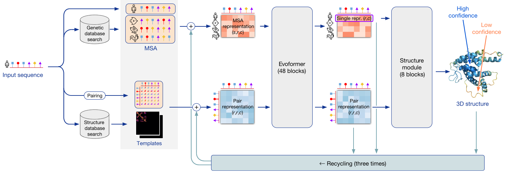
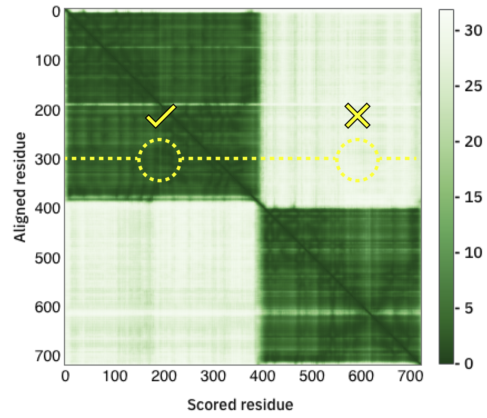
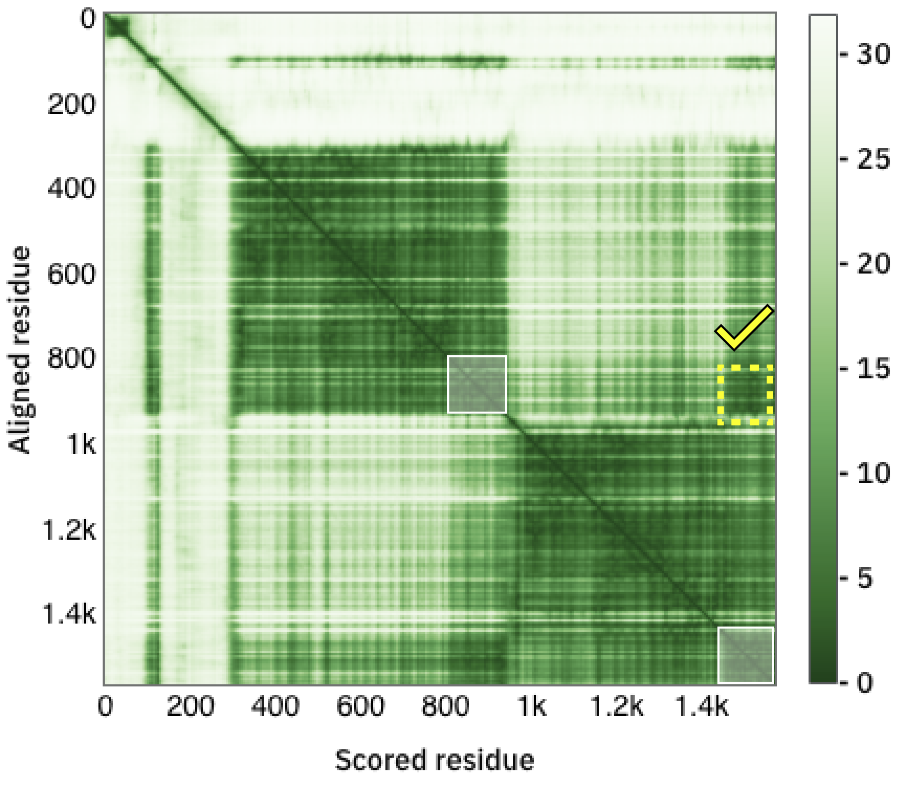

# **TP 3**. Predicción Estructural (A) { markdown data-toc-label = 'TP 3a' }

## Recursos Online

* HHPred: [https://toolkit.tuebingen.mpg.de/tools/hhpred](https://toolkit.tuebingen.mpg.de/tools/hhpred)
* UCLA-DOE LAB: [https://saves.mbi.ucla.edu/](https://saves.mbi.ucla.edu/)
* MolProbity: [http://molprobity.biochem.duke.edu/](http://molprobity.biochem.duke.edu/)
* AlphaFold Server: [https://alphafoldserver.com/](https://alphafoldserver.com/)


## Materiales

[:fontawesome-solid-download: Materiales](https://drive.google.com/file/d/1sKGnMT-WZy7tVDMtUXm_a4D7eWiGb-rG/view?usp=sharing){ .md-button .md-button--primary }  &nbsp;&nbsp; [:fontawesome-solid-download: Slides](https://docs.google.com/presentation/d/1w38cjTQwNr2UgEOMAY8X2Ok2oQUL7XNl/edit?usp=drive_link&ouid=111178905917321759629&rtpof=true&sd=true){ .md-button .md-button--primary }
<!-- 

https://docs.google.com/presentation/d/1w38cjTQwNr2UgEOMAY8X2Ok2oQUL7XNl/edit?usp=drive_link&ouid=111178905917321759629&rtpof=true&sd=true -->

## Objetivos

* Familiarizarse con las técnicas de modelado por homología y predicción estructural
* Analizar la calidad de los modelos obtenidos


## Parte 1 - Modelado por Homología

## Ejercicio 1. Modelado de la Proteína COX17.


La proteína citocromo c oxidasa es un componente terminal de la cadena respiratoria mitocondrial catalizando la transferencia de electrones al oxígeno.

Es un complejo formado por tres subunidades catalíticas codificadas por genes mitocondriales y nucleares.

En humanos, la metalochaperona de cobre citocromo c oxidasa está codificada por el gen COX17, está involucrada en el reclutamiento de cobre a la mitocondria y en el ensamblado del complejo que forma parte de la cadena respiratoria. La proteína humana comparte un 92% de identidad de secuencia con las proteínas homólogas de ratón y rata. 

Si bien se conoce su función, la mecánica de la reacción y las interacciones establecidas en el complejo aún no se conocen en profundidad.

Estudios recientes revelaron que la acumulación de cobre en la mitocondria conduce a la disfunción mitocondrial, apoptosis celular y fibrosis renal, por disrupción de la actividad de la citocromo c oxidasa.

En riñones fibróticos, el gen COX17 se encuentra sobre-expresado.

En ratones, el knockdown de COX17 produce un aumento en la acumulación de cobre mitocondrial, inhibición del complejo c oxidasa, aumento de la disfunción mitocondrial, apoptosis celular y fibrosis renal, mientras que la sobre-expresión permite la descarga del cobre mitocondrial protegiendo la función y aliviando la fibrosis renal.

En este ejercicio modelaremos la estructura de la chaperona de cobre de levaduras (Q12287).

1. Ingrese la secuencia de la proteína COX17 de levaduras en [HHPred](https://toolkit.tuebingen.mpg.de/tools/hhpred)

    ```
    >sp|Q12287|COX17_YEAST Cytochrome c oxidase copper chaperone OS=Saccharomyces cerevisiae (strain ATCC 204508 / S288c) OX=559292 GN=COX17 PE=1 SV=3
    MTETDKKQEQENHAECEDKPKPCCVCKPEKEERDTCILFNGQDSEKCKEFIEKYKECMKG
    YGFEVPSAN
    ```
2.  Haga click en **Submit** en la parte inferior de la página y seleccione el hit que le parezca más conveniente:
    
    * ¿por qué es el más conveniente?
    * ¿Que e-value tiene?
    * ¿que porcentaje de identidad posee con su proteína (en la pate inferior está el alineamiento)?
    
    Luego seleccione en la parte superior **Model using selection**. 

    * ¿Qué se muestra en la nueva ventana? (Mueva la barra inferior para ver que hay en la ventana).

3. Haga click en **Forward to Modeller** y luego en **Submit**.

    !!! warning "Atencion"
    
        De ser necesario ingrese la siguiente key: **MODELIRANJE** en el recuadro que dice **Modeller key** y luego haga click en Submit.

    * ¿Qué aparece en la nueva ventana?

4. Descargue el archivo PDB (**Download PDB File**)

5. La herramienta [MolProbity](http://molprobity.biochem.duke.edu/) permite analizar características esperadas en un modelo de buena calidad.

    * Ingrese el modelo obtenido en el paso anterior donde dice <kbd>Choose file</kbd> y luego haga *click* en <kbd>Upload ></kbd>

    * En la nueva página haga click en <kbd>Continue ></kbd>

    * Luego haga click en *Analyze geometry without all-atom contacts*

    * En la siguiente página asegúrese que las siguientes opciones están seleccionadas:

        En la sección **Charts, plots, and tables** dentro de **Universal**
 
        * Clashes & clashscore

        * Geometry evaluation 

        * Protein

        * Ramachandran plots 

        * Rotamer evaluation 

        * Cβ deviations 

        * Cis-Peptide evaluation 

        * Show cis-nonPro and twisted peptide statistics even if the model has none

        * CaBLAM backbone evaluation 


        Por último en **Other options**
    
        * Create html version of multi-chart

        * List all residues in multi-chart, not just outliers

        * Remove residue rows with ' ' altloc when other alternate(s) present

    * Luego, haga click en <kbd>Run programs to perform these analyses ></kbd>

    * Observe la tabla y responda:

        - ¿Qué métricas se están evaluando?

        - Investigue el gráfico de ramachadran (debe descargar el PDF)... ¿Puede detectar los *outliers*?

        - Vaya a **Multi-criterion visualizations** y haga click en **View**

        - ¿Qué residuos se encuentran en zonas menos favorecidas en el ramachandran?
        
        - En base a los resultados ¿Considera que su modelo es de buena calidad?


    !!! Info "CaBLAM (C $\alpha$ Based Low-resolution Annotation Method)"

        Es un criterio en MolProbity para estructuras de baja resolución (>2 Å) que decta errores en el *backbone* 
 
<!--
Links para acceder a Verify y a Procheck
 https://saves.mbi.ucla.edu/results?job=503042&p=verify
 https://saves.mbi.ucla.edu/results?job=503042&p=procheck
-->

5. La herramienta **Verify3D** permite determinar la compatibilidad de un modelo 3D de una proteína con su secuencia aminoacídica en base a cuál es el ambiente en el cual se encuentra cada residuo y la compatibilidad con la estructura secundaria en la que se encuentra.  

    Vaya a la web de [UCLA-DOE LAB](https://saves.mbi.ucla.edu/), suba el archivo PDB obtenido en <kbd>Choose file</kbd> y clickee en **Run programs**.

    * Seleccione **Verify3D** y espere por los resultados. Haga click en *Results*.

    El gráfico reporta la calidad del modelo por posición y en él se observan tres regiones:  

    !!! Info

        * Posiciones con **score menor a cero** están **mal** modeladas,
        * Posiciones con **score entre cero y 0.1** están **pobremente** modeladas,
        * Posiciones con **score mayor a 0.1** están modeladas con **buena calidad**.

    **Verify 3D** asigna como aceptado a un modelo con más del 80% de las posiciones posiciones con un score promedio en el área **bien modelada**.

    Observe el resultado obtenido (Si tarda haga click en el botón *Check status*) y responda:  
    
    * ¿Cuál es el porcentaje de residuos con un score promedio en el **área de bien modelados**?
    * ¿Qué región está **pobremente modelada** según **Verify 3D**?

6. La herramienta **Procheck** permite analizar la calidad de la geometría de los residuos en una estructura proteica dada en comparación a parámetros estereoquímicos derivados de estructuras tridimensionales de alta resolución ya conocidas.

    En la parte superior de la página de los resultados de **Verify 3D** vaya a **Control Panel**

    Seleccione **Procheck** y espere por los resultados.

    * Investigue el **Ramachandran Plot**. Reconozca las regiones a los distintos elementos de estructura secundaria y responda:
        * ¿Cuántas estructuras se utilizaron para construir este Ramachandran?
        * ¿Qué residuos no están en el área esperada?
        * ¿Qué criterio se utiliza para considerar que el modelo es de buena calidad?
        * ¿Qué porcentaje de residuos en la estructura modelada se encuentran en las regiones más favorecidas?

    * Investigue los gráficos de ramchandran para todos los residuos en **All Ramachandrans** debe elegir el pdf.
        * ¿Cuántas estructuras se utilizaron para construir este Ramachandran?
        * ¿Qué residuos no están en el área esperada?

    * Investigue los gráficos de las longitudes de enlace en la cadena principal (M/c bond lengths) y los ángulos de unión de la cadena principal (M/c bond angles).  
        * ¿Existen aminoácidos que se alejen significativamente de los resultados esperados?

7. En base a los resultados obtenidos por **Verify 3D** y **ProCheck** responda: ¿Es bueno el modelo? ¿Por qué?

8. Abra chimera y cargue su modelo:

    Si no funciona, el pdb se encuentra en su carpeta de datos y puede utilizar:

    *File → Open*

9. Un paso importante para asegurar la calidad del modelo es comparar el **modelo obtenido** contra el **templado utilizado**

    * ¿Qué templado utilizó? Importante: Identifique el PDB y la cadena
    
    * Abra la estructura en chimera, en la misma ventana donde ya tiene su modelo.
   

10. Para tener una noción de cuán similar es la estructura de dos proteínas, podemos realizar un **Alineamiento Estructural**, que consiste en superponer las estructuras de ambas proteínas en el espacio intentando alinear sus cadenas aminoacídicas. Para alinear estructuras en chimera se utililiza el *Matchmaker*.  
  
    Vaya a *Tools → Structure Comparison → MatchMaker*
    
    Se abrirá una nueva ventana.

    * En *Reference structure* (el panel de la izquierda) puede seleccionar una de las estructuras de referencia. Esta estructura es la que se mantendrá fija. (**Ej. El modelo obtenido**)  

    * En *Structure(s) to match* (el panel de la derecha) seleccione la estructura que será superpuesta y alineada con la que se eligió como referencia. (**Ej. el templado**)

    * En *Matching* asegurése que *Iterate by pruning long atom pairs untilo no pair exceeds* está clickeado.

    O bien, ingrese en la command line:

    ```
    mm #0 #1
    ```

    * Observe el resultado del alineamiento: ¿Son parecidas las estructuras? ¿En donde se observan las mayores diferencias?

    Vaya a *Favorites → Reply Log*

    * ¿Cuál es el RMSD reportado?

11. Para ver cómo se corresponde el grado de similitud estructural con el grado de similitud en secuencia podemos realizar un alineamiento de ambas secuencias guiado por el alineamiento estructural. Para esto, vaya a:

    *Tools → Structure comparison → “Match->Align”*

    **Ahora, observando la estructura y el alineamiento responda:**  

    **I.** ¿Qué son las regiones marcadas en rosa en el alineamiento?  

    **II.** ¿Este alineamiento, identifica regiones que no alinean estructuralmente? ¿A qué se debe?

    **III.** En la parte superior de la ventana del alineamiento de secuencia vaya a **Headers** y seleccione RMSD:*ca*

    * ¿Qué regiones poseen mayor RMSD? ¿A qué elementos estructurales corresponden? Para responder esto, seleccione estas regiones con el mouse en el alineamiento y visualícelas en la estructura alineada.

12. Para cuantificar el alineamiento de secuencia obtenido, podemos calcular el % de identidad de secuencia. Para ello, en la ventana del alineamiento de secuencias vaya a:

    *Info → Percent identity*.

    Seleccione una estructura en *Compare* y la otra estructura en *with*. En *Divide by* seleccione *longer sequence length*. Presiona en Ok.  

    * ¿Qué valor de identidad de secuencia obtiene? ¿Porque cree que difiere del reportado anteriormente?

    * En la parte superior de la ventana del alineamiento de secuencia vaya a Headers y seleccione *Conservation* ¿Las sustituciones observadas en las secuencias son conservativas?  

13. En base a los resultados obtenidos. ¿Intentaría obtener experimentalmente la estructura de la proteína, o confiaría en el modelo?


## Parte 2 - AlphaFold

## AlphaFold

En los últimos años, hubo un crecimiento continuo en el número de estructuras de proteínas determinadas experimentalmente depositadas en el PDB (actualmente >250.000). Esto, junto con la explosión de la secuenciación (millones de secuencias) y el desarrollo de técnicas de deep learning benefició el desarrollo de algoritmos de predicción de estructura tridimensional de proteínas.

Hasta el 2021, los algoritmos de predicción de estructura tridimensional de proteínas se basan en dos aspectos complementarios: las interacciones físicas (o contactos) o la historia evolutiva de la proteína (homología). Sin embargo, y a pesar de los avances, la mayoría de los algoritmos de predicción no son muy precisos si se carece de un homólogo cercano con una estructura tridimensional resuelta experimentalmente.

A partir de la secuencia primaria de una proteína (Fig 1), AlphaFold utiliza una red neuronal para la predicción estructural de alta precisión (en la mayoría de los casos), la cual aumenta con el uso de estructuras homólogas. AlphaFold puede incluso predecir con alta precisión las cadenas laterales si el backbone es preciso.

<p style="text-align:center">

</p>
<figcaption style="text-align:center;max-width:70%"> Figura 1. Algoritmo de predicción de estructuras AlphaFold. </figcaption>


### Arquitectura

AlphaFold3 utiliza una arquitectura de red similar a la de AlphaFold2, que utiliza como inputs el alineamiento de secuencias (MSAs) y una representación de todos los pares de residuos de la secuencia que luego es utilizado por un módulo estructural para generar la estructura. AlphaFold2 utiliza un algoritmo iterativo que se basa en la arquitectura Evoformer para procesar los inputs y junto con el módulo estructural generar una representación tridimensional de la proteína query. AlphaFold3 para reducir la cantidad del procesamiento del MSA, reemplaza el algoritmo Evoformer con el módulo Pairformer que utiliza un bloque más pequeño de *embedding* para el MSA. Algunas de las mejoras en la *performance* en la predicción están directamente relacionadas con la reducción en la dependencia de la señal del MSA. De todas maneras, para la predicción de estructura de proteínas, AlphaFold3 se basa fuertemente al igual que AlphaFold2 en la co-evolución de residuos observada en el MSA.

A diferencia de AlphaFold2 que predice las posiciones de aminoácidos y sus cadenas laterales, AlphaFold3 predice las coordenadas de los átomos individuales en el complejo, lo cual facilita la predicción de distintos tipos de moléculas.

Tanto AlphaFold2 como AlphaFold3 dividen al complejo en *tokens*. En AlphaFold2 los *tokens* corresponden directamente a aminoácidos. En AlphaFold3, el enfoque de un token por átomo para toda la estructura, permitiría una mayor flexibilidad para modelar distintas moléculas, sin embargo, pone en compromiso restricciones de memoria. Por lo tanto, intenta una estrategia que permita cierto equilibrio. Un token puede ser un aminoácido, un nucléotido, un átomo de un ligando, un ión o por ejemplo, un átomo de un aminoácido o nucleótido modificado químicamente.

Por ejemplo, una estructura de 100 aminoácidos y un ligando de 20 átomos, requiere 120 *tokens*.

A diferencia de AlphaFold2, las métricas de confianza son calculadas por *tokens* y no por aminoácidos.


AlpaFold2 era un modelo no-generativo que identifica patrones en los datos. AlphaFold3 es usa un modelo *generativo* de machine learning. Los modelos generativos crean nuevos datos similares a los ejemplos que aprendieron.


### Métricas de confianza

AlphaFold incorpora métricas de confianza de la predicción.

* La principal métrica de confianza es el test **pLDDT** (predicted local-distance difference test) el cual es un predictor confiable del test de diferencias en las distancias Cα (LDDT-Cα) y evalúa principalmente la correctitud del modelo a nivel local (estimando el error en distancias de un Cα con Cα vecinos en un rango de 15Å).

* La segunda métrica se denomina **PAE** (por Predicted Aligned error) y compara el error en la predicción de pares de residuos, esto es el error sobre el residuo y cuando las estructuras real y predicha son alineadas sobre el residuo x. Esta medida permite la identificación global de unidades de plegamiento (dominios) y permite predecir si dos dominios guardan relaciones espaciales definidas, o si tienen variabilidad (por ejemplo, si están conectadas por un linker flexible).

<p style="text-align:center">



</p>
<figcaption style="text-align:center;max-width:60%"> Figura 2. Arriba. Se pueden observar dos dominios globulares, pero se desconoce la disposición espacial relativa entre ellos. Abajo. Se puede observar que además de identificar los dominios globulares, se predien correctamente pares de residuos interdominios. </figcaption>

### Costo computacional

AlphaFold consume muchísimos recursos. Por lo tanto, muchas proteínas de organismos modelos están siendo modeladas y puestas a disposición de la comunidad científica en una base de datos: [https://alphafold.ebi.ac.uk/](https://alphafold.ebi.ac.uk/), como ya pudo observar en UniProt. Por el momento, no se están construyendo modelos de proteínas virales, proteínas grandes y solo se construyeron monómeros (aunque recientemente anunciaron la futura deposición de multímeros).

Si bien el código no fue liberado, [AlphaFold](https://alphafoldserver.com/) fue implementado en un servidor y se puso a disponibilidad de la comunidad.


## Ejercicio 2. Predicción estructural de retinoblastoma.

La proteína del retinoblastoma (Rb) es una proteína supresora de tumores que actúa como regulador del ciclo celular en la transición G1-S.

Está formada por un dominio N-terminal, un dominio "pocket", formado por dos subdominios A y B, y un dominio C-terminal.

Al inicio del ciclo, Rb se encuentra unida a los factores de transcripción E2F y remodeladores de la cromatina. A medida que progresa el ciclo Rb es fosforilada y se libera. Permitiendo que se active la transcripción de genes dependientes de E2F necesarios para el progreso del ciclo celular.

Dada las funciones de Rb, es de alta relevancia clínica. Mutaciones en Rb o interacciones con proteínas virales que impidan su interacción con E2F llevan al crecimiento celular y tumores.

1. Ingrese al servidor de [AlphaFold](https://alphafoldserver.com/) y copie la secuencia de la proteína Rb. En Entity asegúrese que dice **Protein**.

```
>sp|P06400|RB_HUMAN Retinoblastoma-associated protein OS=Homo sapiens OX=9606 GN=RB1 PE=1 SV=2
MPPKTPRKTAATAAAAAAEPPAPPPPPPPEEDPEQDSGPEDLPLVRLEFEETEEPDFTAL
CQKLKIPDHVRERAWLTWEKVSSVDGVLGGYIQKKKELWGICIFIAAVDLDEMSFTFTEL
QKNIEISVHKFFNLLKEIDTSTKVDNAMSRLLKKYDVLFALFSKLERTCELIYLTQPSSS
ISTEINSALVLKVSWITFLLAKGEVLQMEDDLVISFQLMLCVLDYFIKLSPPMLLKEPYK
TAVIPINGSPRTPRRGQNRSARIAKQLENDTRIIEVLCKEHECNIDEVKNVYFKNFIPFM
NSLGLVTSNGLPEVENLSKRYEEIYLKNKDLDARLFLDHDKTLQTDSIDSFETQRTPRKS
NLDEEVNVIPPHTPVRTVMNTIQQLMMILNSASDQPSENLISYFNNCTVNPKESILKRVK
DIGYIFKEKFAKAVGQGCVEIGSQRYKLGVRLYYRVMESMLKSEEERLSIQNFSKLLNDN
IFHMSLLACALEVVMATYSRSTSQNLDSGTDLSFPWILNVLNLKAFDFYKVIESFIKAEG
NLTREMIKHLERCEHRIMESLAWLSDSPLFDLIKQSKDREGPTDHLESACPLNLPLQNNH
TAADMYLSPVRSPKKKGSTTRVNSTANAETQATSAFQTQKPLKSTSLSLFYKKVYRLAYL
RLNTLCERLLSEHPELEHIIWTLFQHTLQNEYELMRDRHLDQIMMCSMYGICKVKNIDLK
FKIIVTAYKDLPHAVQETFKRVLIKEEEYDSIIVFYNSVFMQRLKTNILQYASTRPPTLS
PIPHIPRSPYKFPSSPLRIPGGNIYISPLKSPYKISEGLPTPTKMTPRSRILVSIGESFG
TSEKFQKINQMVCNSDRVLKRSAEGSNPPKPLKKLRFDIEGSDEADGSKHLPGESKFQQK
LAEMTSTRTRMQKQKMNDSMDTSNKEEK
```

2. Haga click en **save job**.

    * Ingrese un nombre para su trabajo en el primer campo.
    
    * Habilite el uso de *seed*. Y elija un número. Esto permitirá que su trabajo sea reproducible.

    * Verifique que en la parte inferior debe aparecer su trabajo.

    * Haga click en su trabajo y luego en *Continue and preview job*

    * Haga click en *Confirm and submit job*

    * El modelo estará listo en unos 5 minutos

2. Observe los resultados obtenidos en el servidor, 
    * ¿Qué puede decir de la estructura de la proteína?
    * ¿Cuántos dominios posee? ¿ordenados o desordenados?
    * ¿Puede decir aproximadamente los límites?

2. Observe el gráfico de PAE.
    * ¿Qué interpreta?

2.  Descargue los resultados haciendo *click* en los tres puntitos y en *Download*. Se descargará un archivo zip con el nombre que usted utilizó para su trabajo. Descomprima el archivo.

    Encontrará 13 archivos que contienen el nombre de su trabajo:
    
    * `*_job-request.json` Tiene los parámetros utilizado en el trabajo.

        * ptm: rango 0-1 indicando el valor predicho de TM (*template modelling score*) para la estructura completa.

        * iptm: rango 0-1 indicando el valor predicho de TM en la interfaz para todas las interfaces en la estructura.

        *  fraction_disordered: rango 0-1 indicando que fracción de la estructura predicha es desordenada medido como el area de superficie accesible. (Abramson et al, 2024)

        * has_clash: Booleano (valor yes/no) indicando si la estructura tiene un número significativo de átomos que se superpongan (más del 50% de una cadena o una cadena con más de 100 átomos que se superpongan).

        * ranking_score: rango de -100 a 1.5 que se puede utilizar para clasificar las predicciones. Combina ptm, iptm, fraction_disordered y has_clash en un único número según:
                
        $$
        0.8 \times \mathrm{ipTM} + 0.2 \times \mathrm{pTM} + 0.5 \times \mathrm{disorder} - 100 \times \mathrm{has\_clash}
        $$

        * chain_pair_pae_min: Una matriz $m x m$ donde m es el número de cadenas. Cada elemento (i,j) contiene el mínimo valor de PAE para las filas restringidas a la cadena i y columnas restringidas a la cadena j.
        
        * chain_pair_iptm: Una matriz $m x m$ donde m es el número de cadenas. Cada elemento (i,j) que no está en la diagonal contiene el valor de ipTM restringido a las cadenas i y j. Cada elemento (i,i) en la diagonal contiene el valor de pTM restringido a la cadenas i. 

        * chain_ptm: Una lista de largo *m*, donde m es el número de cadenas. El elemento i contiene el valor de pTM de la cadena i.

        * chain_iptm: Una lista Una lista de largo *m*, donde m es el número de cadenas. Da el valor promedio de (ipTM) en la interfaz entre cada cadena y todas las otras cadenas.

    * `*_summary_confidences_0-4.json` Tiene un resumen de las métricas de confianza de los modelos 0 a 4.

    * `*_full_data_0-4.json` Para cada uno de los modelos 0 a 4 contiene el PAE, pLDDT, probabilidad de contacto predicha donde contacto se define como una distancia máxima de 8Å (Abramson et al, 2024), entre otros.

    * `*_model_0-4.cif` Son los modelos 0 a 4.

6. Abra Chimera y cargue los modelos (si no recuerda *File* → *Open …*) y con el mouse seleccione los modelos manteniendo la tecla ctrl presionada para seleccionar más de uno.

11. Alinee los 5 modelos,

    * ¿cuál es el RMSD global?

12. Utilice **Match Align** para ver el alineamiento.

    * ¿Qué observa?

    * ¿Porque si las secuencias son todas iguales no aparece el n-terminal alineado?

13. Los valores de pLDDT están almacenados en la columna del pdb que corresponde a los *b*-factors. Coloree los modelos según este atributo ingresando en la command line:

    ```
    rangecolor bfactor 0 orange red 50 white 100 dodger blue
    ```

    * ¿Qué observa?

    Ahora cambie los valores para que el programa elija estos valores automaticamente:

    ```
    rangecolor bfactor min orange red mid white max dodger blue
    ```

    En el reply log se reportan los valores minimo, medio y máximo encontrados en la columna de b-factors.

    *  ¿Cuáles son el mínimo y el máximo?
    
    Ahora cambie el valor intermedio (antes puesto automáticamente) a 80 y el máximo a 100:

    ```
    rangecolor bfactor min orange red 80 white 100 dodger blue
    ```

    * ¿Observa diferencias con lo anterior? ¿Cuáles?
    
    Ahora corra:

    ```
    rangecolor bfactor 50 orange red 80 white 100 dodger blue
    ```
    
    * ¿Observa diferencias con lo anterior? ¿Cuáles?
    * ¿Porqué considera que elegimos 50 como valor mínimo?
    * ¿De qué posición a qué posición consideraría que el modelo es de confianza?

14. Para analizar los valores de pLDDT graficaremos los valores de pLDDT por posición para cada uno de los modelos.

    * Abra R Studio.

    ``` R
    # SCRIPT CORREGIDO
    install.packages("bio3d")
    library(bio3d)

    directorio <- "/directorio/donde/estan/los/modelos"

    archivos <- list.files(path = directorio,pattern = "_unrelaxed_",)

    # Creo la ruta completa para mi archivo 1
    miarchivo <- paste(directorio,archivos[1],sep="")

    # Leo el pdb usando la función read.pdb de la libraría bio3d
    mipdb <- read.pdb(file = miarchivo)

    # Creo una tabla con los datos de interés: el nro de residuo y el valor de plddt almacenado en el campo de b-factors y correspondiendo únicamente a los carbonos alpha.
    datos <- data.frame(Residue = mipdb$atom[mipdb$calpha,"resno"],
                        Rank_1 = mipdb$atom[mipdb$calpha,"b"])

    # uso un ciclo for para iterar sobre mi vector donde están guardados los nombres de los archivos y los guardo en distintas columnas de mi tabla datos.
    for (i in 2:length(archivos)){
        miarchivo2 <- paste(directorio,archivos[i],sep="")
        mipdb2 <- read.pdb(miarchivo2)
        nuevaColumna <- paste("Rank",i,sep="_")
        datos[nuevaColumna] <- mipdb2$atom[mipdb2$calpha,"b"]
    }

    # creo un vector de colores para utilizar en el plot
    colores <- c("red","blue","purple","green","orange")
    
    # creo el nombre del archivo que va a guardar mi plot.
    fileOUT <- paste(directorio,"E7_Monomero.png",sep="")

    # creo el dispositivo png
    png(filename = fileOUT, width=20,height=10,units = "cm",res=150)
    # empiezo un plot
    plot.new()
    # ploteo los valores del modelo 1
    plot(x = datos$Residue,
        y = datos$Rank_1,
        type = "l",
        xlab = "E7 Residue",
        ylab = "pLDDT",
        xlim = c(0,100),
        ylim = c(0,101),
        col = colores[1],
        xaxt='n',yaxt='n')

    # modifico los ejes x (1) e y (2)
    axis(side = 1, at = c(1,seq(5,100,by=5)),lwd=0,lwd.ticks = 1)
    axis(side = 2, at = seq(5,100,by=5),lwd=0,lwd.ticks = 1)

    # ploteo los valores de los otros modelos que están guardados en las columnas: 3,4,5,6
    for (i in 3:ncol(datos)){
        lines(x = datos$Residue,
                y = datos[,i],
                col = colores[i-1])
        }

    # creo la leyenda del plot
    legend(x = 60,y = 40,legend = paste(rep("rank",5),1:5,sep="-"),col = colores,lty = 1,ncol = 2)

    box(lwd=3) # creo un box en el plot

    dev.off() # cierro el dispositivo png
    ```


    * ¿Qué observa?

    * ¿Puede identificar las regiones con un pLDDT mayor a 70?

    * ¿Puede identificar las regiones con un pLDDT entre 50 a 70?


7. Comparando con otras estructuras

    * Abra el pdb: 1n4m.

    * ¿Por qué método fue determinada?

    * ¿A qué proteína corresponde? ¿De qué organismo?


8. Alinee las estructuras utilizando Matchmaker (si no recuerda, *Tools* → *Structure comparison* → *Matchmaker*)

    * ¿Cuál es el RMSD global?

    Si quieren ver el RMSD por posición sobre la estructura

    *Structure Comparison* → *Match align*
    
    Seleccione el par de modelos adecuado. *En residue-residue distance cutoff* seleccione el mismo umbral que utilizó en *Matchmaker* para *pruned atoms* (Por defecto es 2)
    
    Para colorear la estructura por RMSD (después de haber hecho *Match align*) vaya a: *Tools* → *Depiction* → *Render by Attribute*
    
    En **attributes** of asegúrese que esté seleccionado residues
    
    En el **recuadro de Models** asegúrese que estén ambos modelos seleccionados.
    
    En la pestaña **Render** seleccione **mavRMSDca** y luego haga clic en `Ok`.

9. Cierre el modelo correspondiente al pdb 1n4m. Via terminal tiene que ingresar el comando close seguido del número del modelo, por ejemplo:

    ```
    close #0
    ```

    cierra el modelo 0.

    O bien, en el **model panel**, seleccione el modelo correspondiente y haga clic en close.


17. Guarde la sesión y cierre chimera.


5. El algoritmo IUPred será estudiado en mayor profundidad en las próximas clases, por lo tanto, responda brevemete.

    IUPred es un predictor de desorden. El score de IUPred varía entre 0 y 1. Un umbral muy utilizado es 0.5. Un score de IUPred mayor a 0.5 se considera una región predicha desordenada o flexible y un score de IUPred menor a 0.5 se considera una región predicha globular u ordenada.

    En el gráfico, el eje x son las posiciones de la secuencia y en el eje y el *score* de IUPred que va de 0 a 1.

    Ingrese la secuencia de Rb en [IUPRED (actualizada)](https://iupred2a.elte.hu/)

    * ¿Qué relación encuentra con lo obtenido por Verify3D? 

6. En base a los resultados de su análisis, responda:

    * ¿Pudo explicar todas las regiones de menor calidad reportadas por **Verify3D**?

7. Ud. Se sacó un nuevo subsidio donde tiene plata para seguir haciendo estudios estructurales de esta proteína: 

    * ¿le daría alguna indicación a su nuevo becario, para que tenga más suerte al intentar cristalizarla?


<!--
Luego de dos años y numerosos intentos fallidos, usted logra determinar por resonancia magnética nuclear una región de una proteína misteriosa y deposita la estructura en la base de datos de proteínas PDB (PDB: 1F46).

Años después ocurre una pandemia de una enfermedad respiratoria causada por *Actinobacillus pleuropneumoniae* que está causando un rápido aumento en la mortalidad de la población porcina, trayendo terribles consecuencias en la actividad económica mundial. Una vez que se logró aislar la cepa responsable, se cree que una proteína que comparte casi el 25 % de identidad con su proteína misteriosa es un posible blanco para el diseño de una droga. Sin embargo, se desconoce la estructura de la misma. Como usted es el único experto en esa proteína en el mundo, la Asociación del Centro Médico Epidemiológico (ACME) se pone en contacto con usted en busca de una solución. Para solucionar el problema, Ud. decide primero intentar un modelado por homología de la nueva proteína.

1. Ingrese la secuencia de la proteína misteriosa patogénica en [HHPred](https://toolkit.tuebingen.mpg.de/tools/hhpred)

    ```
    >Pathogenic Mistery Protein
    MELHILFFILAGLLIAVLISFSLWSARREKSRIFSNTFSTRPPSTPINNIVSDVPPSLNPQSYAQT
    TGQHGETEADNPVQIQQEVESSLREIKINLPGQDSAAYQSKVEETPIYSGQPVLPVQPQYQTQVQY
    QTQPQHIEPAFTQAPQSPIAEATSVLEQSVEELERQAAQGDVDIYSDASVRVELAKNSMQADSVAE
    QKPVAENNMLTLYVVAPEGQQFRGDYVVQSLEALGFQYGEYQIFHRHQHMGNSASPVIFSVANMMQ
    PGIFDLTKIEHFSTVGLVLFMHLPSEGNDVVNFKLLLKTTENLAQALGGFVLNEHREIFDENSRQS
    YLARVS
    ```

2.  Haga click en **Submit** en la parte inferior de la página y seleccione el hit que le parezca más conveniente:
    
    * ¿por qué es el más conveniente?
    * ¿Que e-value tiene?
    * ¿que porcentaje de identidad posee con su proteína misteriosa (en la pate inferior está el alineamiento)?
    
    Luego seleccione en la parte superior **Model using selection**. 

    * ¿Qué se muestra en la nueva ventana? (Mueva la barra inferior para ver que hay en la ventana).

3. Haga click en **Forward to Modeller** y luego en **Submit**.

    !!! warning "Atencion"
    
        De ser necesario ingrese la siguiente key: **MODELIRANJE** en el recuadro que dice **Modeller key** y luego haga click en Submit.

    * ¿Qué aparece en la nueva ventana?

4. Descargue el archivo PDB (**Download PDB File**)

5. La herramienta **Verify3D** permite determinar la compatibilidad de un modelo 3D de una proteína con su secuencia aminoacídica en base a cuál es el ambiente en el cual se encuentra cada residuo y la compatibilidad con la estructura secundaria en la que se encuentra.  

    Vaya a la web de [UCLA-DOE LAB](https://saves.mbi.ucla.edu/), suba el archivo PDB obtenido en el paso anterior y clickee en **Run programs**.

    * Seleccione **Verify3D** y espere por los resultados.

    El gráfico reporta la calidad del modelo por posición y en él se observan tres regiones:  

    !!! Info

        * Posiciones con **score menor a cero** están **mal** modeladas,
        * Posiciones con **score entre cero y 0.1** están **pobremente** modeladas,
        * Posiciones con **score mayor a 0.1** están modeladas con **buena calidad**.

    **Verify 3D** asigna como aceptado a un modelo con más del 80% de las posiciones posiciones con un score promedio en el área **bien modelada**.

    Observe el resultado obtenido (Si tarda haga click en el botón *Check status*) y responda:  
    
    * ¿Cuál es el porcentaje de residuos con un score promedio en el **área de bien modelados**?
    * ¿Qué región está **pobremente modelada** según **Verify 3D**?

6. La herramienta **Procheck** permite analizar la calidad de la geometría de los residuos en una estructura proteica dada en comparación a parámetros estereoquímicos derivados de estructuras tridimensionales de alta resolución ya conocidas.

    En la parte superior de la página de los resultados de **Verify 3D** vaya a **Control Panel**

    Seleccione **Procheck** y espere por los resultados.

    * Investigue el **Ramachandran Plot**. Reconozca las regiones a los distintos elementos de estructura secundaria y responda:
        * ¿Cuántas estructuras se utilizaron para construir este Ramachandran?
        * ¿Qué residuos no están en el área esperada?
        * ¿Qué criterio se utiliza para considerar que el modelo es de buena calidad?
        * ¿Qué porcentaje de residuos en la estructura modelada se encuentran en las regiones más favorecidas?

    * Investigue los gráficos de ramchandran para todos los residuos en **All Ramachandrans** debe elegir el pdf.
        * ¿Cuántas estructuras se utilizaron para construir este Ramachandran?
        * ¿Qué residuos no están en el área esperada?

    * Investigue los gráficos de las longitudes de enlace en la cadena principal (M/c bond lengths) y los ángulos de unión de la cadena principal (M/c bond angles).  
        * ¿Existen aminoácidos que se alejen significativamente de los resultados esperados?

7. En base a los resultados obtenidos por **Verify 3D** y **ProCheck** responda: ¿Es bueno el modelo? ¿Por qué?

8. Abra chimera y busque el modelo que determinó usted años atrás:

    *File* → *Fetch by ID* → 1F46

    (¿Recuerda cómo hacerlo por la línea de comandos?)

    Si no funciona, el pdb se encuentra en su carpeta de datos y puede utilizar:

    *File → Open*

9. Luego, cargue en la misma ventana de Chimera la estructura de la proteína misteriosa patogénica

    *File → Open*

10. Para tener una noción de cuán similar es la estructura de dos proteínas, podemos realizar un **Alineamiento Estructural**, que consiste en superponer las estructuras de ambas proteínas en el espacio intentando alinear sus cadenas aminoacídicas. Alinear estructuras en chimera es muy fácil, sólo requiere un comando.  
  
    Vaya a *Tools → Structure Comparison → MatchMaker*
    
    Se abrirá una nueva ventana.

    * En *Reference structure* (el panel de la izquierda) puede seleccionar una de las estructuras de referencia. Esta estructura es la que se mantendrá fija. (**Ej. 1F46**)  

    * En *Structure(s) to match* (el panel de la derecha) seleccione la estructura que será superpuesta y alineada con la que se eligió como referencia. (Ej. el modelo)

    * En *Matching* asegurése que *Iterate by pruning long atom pairs untilo no pair exceeds* está clickeado.

    O bien, ingrese en la command line:

    ```
    mm #0 #1
    ```

    * Piense, ¿Porqué está utilizando el PDB:1F46?

    * Observe el resultado del alineamiento: ¿Son parecidas las estructuras? ¿En donde se observan las mayores diferencias?

    Vaya a *Favorites → Reply Log*

    * ¿Cuál es el RMSD global reportado?

11. Para ver cómo se corresponde el grado de similitud estructural con el grado de similitud en secuencia podemos realizar un alineamiento de ambas secuencias guiado por el alineamiento estructural. Para esto, vaya a:

    *Tools → Structure comparison → “Match->Align”*

    **Ahora, observando la estructura y el alineamiento responda:**  

    **I.** ¿Qué son las regiones marcadas en rosa en el alineamiento?  

    **II.** ¿Este alineamiento, identifica regiones que no alinean estructuralmente? ¿A qué se debe?

    **III.** En la parte superior de la ventana del alineamiento de secuencia vaya a **Headers** y seleccione RMSD:*ca*

    * ¿Qué regiones poseen mayor RMSD? ¿A qué elementos estructurales corresponden? Para responder esto, seleccione estas regiones con el mouse en el alineamiento y visualícelas en la estructura alineada.

12. Para cuantificar el alineamiento de secuencia obtenido, podemos calcular el % de identidad de secuencia. Para ello, en la ventana del alineamiento de secuencias vaya a:

    *Info → Percent identity*.

    Seleccione una estructura en *Compare* y la otra estructura en *with*. En *Divide by* seleccione *longer sequence length*. Presiona en Ok.  

    * ¿Qué valor de identidad de secuencia obtiene? ¿Porque cree que difiere del reportado anteriormente?

    * En la parte superior de la ventana del alineamiento de secuencia vaya a Headers y seleccione *Conservation* ¿Las sustituciones observadas en las secuencias son conservativas?  

    * En base a los resultados obtenidos. ¿Intentaría obtener experimentalmente la estructura de la nueva proteína, o confiaría en el modelo?  

## Ejercicio 2. Modelado por homología de una proteína de Rana.
Usted es un famoso ecólogo que desde siempre sintió un especial interés por las ranas. Durante un viaje de campaña se encontró con unas ranas muy inusuales que poseían una fascinante coloración azul. Luego de años de investigación y muchos subsidios invertidos, su becario descubrió que esta coloración se debe a la existencia de una proteína en la linfa de las ranas que es capaz de conjugar biliverdina. Luego de aislar la proteína, obtiene su secuencia:

```
>Hypsiboas_punctatus_BP
MRVLLILGVVVLSTLAFAHHEEGHHDDEDLKDDHDPFLPEDHKKALFVYQKPALNNINFA
FKMYRQLARDHPTENIVISPVSISSALALLSLGAKGHTHSQIVERLGYNTSEIPEQQIHE
SFHKQLDVVDDKDRDLEFEHGNALFTCKEHKIHQTFLDDAKKFYHSEVIPTDFKNTEEAK
NQINSYVEKSTHGKITNILDSVDQDAMIALINFIYLRANWQHPFDEKLTKEGDFHVDKDT
TVKVPFMRRRGIYKMAYTDDIIMVTIPYNGSVEMFLAMTKMGKLSELEQNLNRERSLKWR
EIMQYQLIDLSLPKLSVSGILNLKETLSKLGIVDVFSNHADLSGITDESHLKVSKAIHKA
MMSFDEHGTEAAPATAAEADPLMLPPHFKFDYPFIFRVQDLKTKNPLLVGRIANPQK
```

Utilizando la secuencia, el becario busca en las bases de datos y descubre que su proteína es homóloga a una superfamilia de proteínas conocidas como *serpinas* compartiendo un 43% de identidad de secuencia con la proteína de humanos.  

Para entender las diferencias con la proteína de humanos, estuvo muy interesado en obtener la estructura tridimensional de la proteína de rana. Sin embargo, todos los intentos de cristalización fallaron rotundamente. Su subsidio se está terminando rápidamente pero afortunadamente, un becario muy interesado en bioinformática y el modelado por homología lo salva de su desesperación.  

Utilizando la herramienta **HHPred** el becario encontró que el mejor template era: 3NE4, Chain A, correspondiente al inhibidor de tripsina humano (Alpha-1-antitrypsin, P01009). Utilizando herramientas de modelado desarrolla un modelo 3D y le asegura que el modelo es de muy buena calidad.  

Desconfiando de los resultados de su becario, Ud. decide analizar la calidad del modelo obtenido. Para esto utiliza todas las herramientas que conoce:

1. Utilice el modelo creado por su becario (`Hypsiboas_punctatus_BP.pdb`) que se encuentra en los materiales. Utilice las herramientas aprendidas en el punto anterior ([Verify3D](https://saves.mbi.ucla.edu/)) e investigue los resultados obtenidos.

    * ¿Le parece que su becario estaba en lo cierto, o equivocado?  

2. Para explicar las diferencias obtenidas analizaremos las estructuras como se indica en los puntos siguientes usando **Chimera** 

3. Utilizando el modelo generado y el PDB (3NE4) utilizado como molde realice un alineamiento estructural en Chimera (*Tools → Structure Comparison → MatchMaker* o bien en la terminal `mm #0 #1`).

    * ¿Cuál es el RMSD global?
    * ¿Qué diferencias observa en las estructuras alineadas?
    * ¿Tiene relación con lo obtenido por **Verify3D**?

4. En Chimera observe el alineamiento de secuencia (*Tools → Structure Comparison Match -> Align*).

    * ¿En qué regiones hay mayor número de Gaps?
    * Observe el RMSD por posición utilizando el RMSD:ca. ¿En qué regiones se observan las mayores diferencias? ¿A qué estructura corresponde? ¿Por qué cree que ocurre esto?

5. El algoritmo IUPred será estudiado en mayor profundidad en las próximas clases, por lo tanto, responda brevemete.

    IUPred es un predictor de desorden. El score de IUPred varía entre 0 y 1. Un umbral muy utilizado es 0.5. Un score de IUPred mayor a 0.5 se considera una región predicha desordenada o flexible y un score de IUPred menor a 0.5 se considera una región predicha globular u ordenada.

    En el gráfico, el eje x son las posiciones de la secuencia y en el eje y el *score* de IUPred que va de 0 a 1.

    Ingrese la secuencia de la rana en [IUPRED (actualizada)](https://iupred2a.elte.hu/)

    * ¿Qué relación encuentra con lo obtenido por Verify3D? 

6. En base a los resultados de su análisis, responda:

    * ¿Pudo explicar todas las regiones de menor calidad reportadas por **Verify3D**?

7. Ud. Se sacó un nuevo subsidio donde tiene plata para seguir haciendo estudios estructurales de esta proteína: 

    * ¿le daría alguna indicación a su nuevo becario, para que tenga más suerte al intentar cristalizarla?

-->