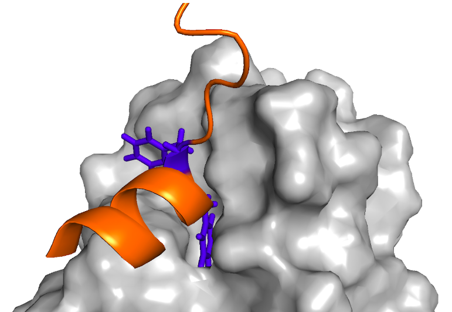
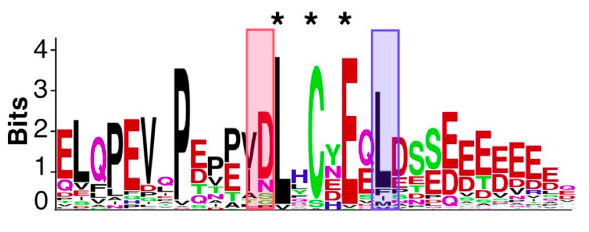
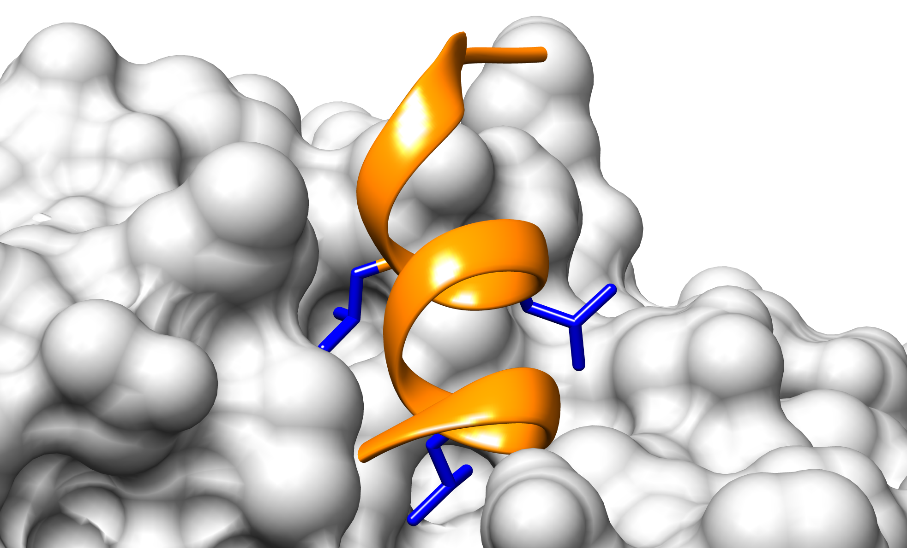

# **TP 7**. Motivos Lineales - Parte I { markdown data-toc-label = 'TP 7'}

[:fontawesome-solid-download: Materiales](https://drive.google.com/file/d/1exSLrfnSGEXjslwhCx4p3VBcTXcJ12Wq/view?usp=sharing){ .md-button .md-button--primary }


## Recursos a utilizar
* Regex101: [https://regex101.com](https://regex101.com)
* WebLogo: [https://weblogo.threeplusone.com/create.cgi](https://weblogo.threeplusone.com/create.cgi)
* MEME: [https://meme-suite.org/meme/tools/meme](https://meme-suite.org/meme/tools/meme)
* SLiMSearch: [http://slim.icr.ac.uk/slimsearch/](https://slim-tools.org/tools/slimsearch/input)
* ELM: [http://elm.eu.org](http://elm.eu.org)
* Consurf: [https://consurf.tau.ac.il/](https://consurf.tau.ac.il/)

 
## Objetivos
* Familiarizarse con la simbología utilizada en expresiones regulares
* Utilizar la simbología para poder realizar búsquedas basadas en texto
* Familiarizarse con la creación e interpretación de logos de secuencia.
* Familiarizarse con el análisis de enriquecimiento de motivos en un set de secuencias
* Identificar candidatos a nuevos motivos.
* Familiarizarse con la base de datos ELM.


## Introducción
La simbología comúnmente utilizada en expresiones regulares es:


| Sı́mbolo | Definición  |
|:-------:|:-----------:|
| `.`   | Cualquier aminoácido es permitido |
| `[XY]` | Solo los aminoácidos X e Y son permitidos |
| `[^XY]` | Los aminoácidos X e Y están prohibidos | 
| `{min,max}` | Número mı́nimo y máximo de veces que se puede repetir una posición |
| `^X` | El aminoácido X se encuentra en el extremo N-terminal | 
| `X$` | El aminoácido X se encuentra en el extremo C-terminal |
| `A|B` | Se encuentra, o bien el aminoácido A, o bien el aminoácido B |
| `(AB)|(CD)` | Se encuentran, o bien, la secuencia de aminoácidos AB, o bien, la secuencia de aminoácidos CD |

Las expresiones regulares admiten otros símbolos especiales con funciones más avanzadas.

Estos símbolos nos permiten definir patrones que son observados en proteínas naturales para luego identificarlos en otras proteínas y ser puestos a prueba experimentalmente.

Esta forma de escribir las expresiones regulares es una convención. Es muy utilizada para la búsqueda de motivos y también en lenguajes de programación, como por ejemplo Python. Existen otras, así que debemos conocer la sintaxis correcta de la aplicación o sistema que estemos usando.


## Ejercicios

### Ejercicio 1. Familiarizándonos con expresiones regulares

La reparación del ADN durante la replicación ocurre por un proceso llamado Translesion synthesis (TLS). En este proceso, una polimerasa TLS, inserta un nucleótido en la lesión del ADN y luego, una polimerasa de la familia B extiende el templado. La acción coordinada de estas polimerasas se logra por la interacción de proteínas de andamiaje como PCNA (Proliferating Cell Nuclear Antigen) y la polimerasa TLS Rev1.

Existen estructuras cristalográficas de distintos péptidos unidos a Rev1 (PDBs: 2N1G, 2LSK, 2LSJ, 4FJO, 2LSI y 4GK5) que permiten entender algunas características de la interacción.

La evidencia experimental recolectada de la literatura indica:

* La interacción está mediada principalmente por dos residuos consecutivos de fenilalanina (Ohashi,2009).
* Estas dos fenilaninas interactúan con un bolsillo hidrofóbico en la superficie de Rev1 (Pozhidaeva, 2012; Zhao,2017).
* Las fenilalaninas se encuentran en el primer giro de una hélice α.
* Se requieren al menos 4 residuos posteriores a las fenilalaninas que formen parte de una hélice (Ohashi, 2009).
* El resto de la región de interacción se pliega formando hélices α de longitud variable (Pustovalova, 2016)
* Se observan uno o dos residuos cargados positivamente en la 2da y/o 3ra posición luego de las fenilalaninas, que median interacciones electrostáticas con una superficie acídica de Rev1. Sin embargo, se observó que la posición de estos residuos es variable: también pueden encontrarse inmediatamente después de las fenilalaninas.
 
<p style="text-align:center">

</p>

<figcaption style = "text-align:left;max-width:70%">
Figura 1. Fragmento de la polimerasa TLS Rev1 unido al motivo lineal de la polimerasa η (pol eta) humana. Se muestra en naranja el backbone del segmento de polimerasa η representado en Cartoon y en azul las dos fenilalaninas conservadas que median la interacción representadas en Sticks (PDB: 2LSK) y que conforman el motivo lineal.
</figcaption>

Los siguientes fragmentos de secuencia corresponden a regiones de distintas proteínas que participan en la reparación del ADN y que se unen a la proteína Rev1. La interacción de estos fragmentos con la proteína Rev1 se verificó de manera experimental por distintos métodos.

```
>sp|Q03834|MSH6_YEAST|31-38
SQKKMKQSSLLSFFSKQVPSGTPSKKVQ
>sp|Q60596|XRCC1_MOUSE|191-200
DDSANSLKPGALFFSRINKTSSASTSDPAG
>sp|Q9H040|SPRTN_HUMAN|418-428
RPRLEDKTVFDNFFIKKEQIKSSGNDPKYST
>sp|Q15054|DPOD3_HUMAN|236-245
NKAPGKGNMMSNFFGKAAMNKFKVNLDSEQ
>sp|Q9UNA4|POLI_HUMAN|569-579
SCPLHASRGVLSFFSKKQMQDIPINPRDHLS
>sp|Q9Y253|POLH_HUMAN|481-490
TATKKATTSLESFFQKAAERQKVKEASLSS 
>sp|Q9Y253|POLH_HUMAN_2|529-539
PFQTSQSTGTEPFFKQKSLLLKQKQLNNSSV
>sp|Q9QUG2|POLK_MOUSE|564-575
LAKPLEMSHKKSFFDKKRSERISNCQDTSRCK
>sp|Q9UBT6|POLK_HUMAN|565-576
FVKPLEMSHKKSFFDKKRSERKWSHQDTFKCE
```

1. Copie y pegue las secuencias en el recuadro Test String en regex101 (https://regex101.com).
    Escribiendo en el campo Regular Expression, intente definir una expresión regular que permita identificar el motivo que media la interacción de estas proteínas con Rev1 y que cumpla con la evidencia experimental observada.

2. Evalúe si la siguiente secuencia cumple o no con la expresión regular:

```
>sp|Q04049|POLH_YEAST|625-632
KKQVTSSKNILSFFTRKK
```

3. Copie y pegue las secuencias del punto 1 y punto 2 en un archivo de texto plano. 

4. Abra el archivo en Jalview y realice un alineamiento con Clustal. Explore el alineamiento. ¿Quedaron alineadas las posiciones invariables del motivo?

5. Suba el alineamiento obtenido en la página web de [weblogo](https://weblogo.threeplusone.com/create.cgi) para construir un logo de secuencia. 

    !!! info "Logos de Secuencia"

        Un **logo de secuencia** consiste en un gráfico que muestra un apilamiento de símbolos (las letras que denominan a cada aminoácido o nucleótido) por cada posición del alineamiento. La altura total es proporcional a la conservación de la secuencia en dicha posición; la altura de cada símbolo indica la frecuencia relativa de cada símbolo en esa posición. De esta forma, un logo provee una descripción más precisa de la conservación secuencial que una secuencia consenso, y provee una medida del contenido de información de cada posición. 
 
    No trabajaremos en profundidad el contenido de información, pero podemos conocer su forma matemática.
    
    El contenido de información (IC) de una posición L del alineamiento es la diferencia entre la incerteza esperada (H previa, corresponde a todos los estados posibles) y la incerteza observada en la posición del alineamiento (H posterior, todos los estados observados), según surge de su definición:
    
    <p style="text-align:center">
    
    </p>

    donde para proteínas:

    <p style="text-align:center">
    
    </p>

    <p style="text-align:center">
    
    </p>
 
    Para secuencias nucleotídicas La incerteza previa tiene un valor máximo de 2 bits (log<sub>2</sub> 4) correspondiente al caso en que todos los símbolos (o nucleótidos) sean igualmente probables. 
 
    Por lo tanto, el contenido de información de una posición del alineamiento será máximo cuando todos los símbolos de dicha posición sean iguales (y por lo tanto, se verifique que *H<sub>posterior</sub>* = 0).
 
    De esta manera, el contenido de información está directamente relacionado con el **grado de conservación**.
 
    Puede utilizar las siguientes opciones (o probar las variantes que crea convenientes) al construir el logo:
    
    * *Output Format.* PNG
    * *Sequence type:* Protein
    * *Scale stack widths:* Pruebe con y sin tildar
    * *Composition:* No adjustment for composition
    * *Error bars:* No tiene que estar tildado
    * *Show Sequence Ends labels:* No tiene que estar tildado
    * *Version fineprint:* No tiene que estar tildado
    * *X-axis Label:* Position
    * *Y-axis Label:* Information Content
    * *Y-axis scale:* 4.5
    * *Y-axis tic spacing:* 0.5
    * *Color scheme:* Chemistry (AA)
 
5. Analice el logo de secuencia obtenido. 
    * Recuerde, ¿qué indican la altura y el color de cada letra?
    * ¿Qué posiciones de este logo tienen mayor y menor contenido de información? ¿Se relacionan con las posiciones del motivo?
    * ¿Con qué cree que está relacionado el ancho de la pila de letras?
    * ¿Puede identificar posiciones definidas y variables del motivo a través del logo de secuencia?
    * ¿Puede relacionar el logo de secuencia con la expresión regular que describe al motivo? 
 

### Ejercicio 2. Identificando sobre-representación de motivos en un conjunto de secuencias
 
El algoritmo MEME (*Multiple EM for Motif Elicitation*) permite la identificación de motivos novedosos y sin gaps, es decir, identifica patrones de longitud fija y recurrentes en un conjunto de secuencias, sin necesidad de tener información previa sobre el motivo, y sin necesidad de alinear los motivos! 
 
MEME se utiliza mucho para motivos lineales en proteínas y también para identificar sitios funcionales a nivel genómico, como sitios de unión al ADN de factores de transcripción o maquinaria transcripcional, por ejemplo los TATA box y otros elementos vinculados.
 
MEME divide patrones de longitud variable en dos o más motivos separados. 
 
1. Ingrese a la web de [MEME](https://meme-suite.org/meme/tools/meme).

2. En la sección: **Input the primary sequences** ingrese las secuencias del ejercicio anterior sin alinear en MEME. (Puede subir un archivo con las secuencias, o seleccionar la opción **Type in sequences** en el menú desplegable para habilitar un cuadro de texto donde pegarlas).

    Puede utilizar las siguientes opciones (o puede probar las variantes que crea convenientes):

    * *Select the site distribution:*

        Esta opción se relaciona con el número de veces que aparece un motivo en la secuencia.

        * Seleccione: *Zero or One Occurrence Per Sequence (zoops)* 

    * *Select the number of motifs:*

        Esta opción se relaciona con el número de motivos que MEME va a buscar.
        * Ingrese: 10.

    En las opciones **avanzadas**:

    * *What should be used as the background model?*

        Esta opción se relaciona con la distribución esperada de aminoácidos o nucleótidos que debe usar MEME.
        
        Por default, (0-order) MEME calcula una distribución background a partir de las secuencias primarias ingresadas por el usuario.

        * Seleccione: *0-order model of sequences*

    * *How wide can motifs be?*

        Esta opción se refiere a la longitud mínima y máxima del motivo. 

        Ingrese:

        * *Minimum width:* 4
        * *Maximum width:* 12

        * ¿Por qué cree que elegimos estos parámetros?

    * *How many sites must each motif have?*

        Ingrese:

        * *Minimum sites:*  2
        * *Maximum sites:*  10

        * ¿Con qué se relaciona este parámetro?

2. Repita la búsqueda pero ahora, en las opciones avanzadas, habilite una opción más. 

    * *Should MEME shuffle the sequences?* Esta opción reescribe las secuencias en orden aleatorio.

    Seleccione: *Shuffle the sequences*

    * Observe el resultado obtenido. ¿Recupera MEME el logo de secuencia esperado?
    * Compare los resultados con los de la búsqueda anterior. ¿Cómo podría explicar las diferencias observadas?
 
### Ejercicio 3. Utilizando una expresión regular obtenida de instancias experimentales para identificar motivos nuevos
 
La expresión regular del motivo de unión a Rev1 está definida en la base de datos ELM (que veremos más adelante) como: `FF[^P]{0,2}[KR]{1,2}[^P]{0,4}`

* ¿Usted llegó a algo similar? 

    !!! Danger "Atencion!"

        Si no entiende esta expresión regular, o no llegó a algo parecido ¡consulte a sus docentes!

SLiMSearch es una herramienta que, utilizando expresiones regulares, permite buscar la presencia de motivos conocidos en las proteínas almacenadas en UniProt y priorizarlos según datos adicionales. Por ejemplo, SLiMSearch informa las características de la arquitectura de regiones y dominios de la secuencia portadora del motivo, sus variantes secuenciales y modificaciones postraduccionales, su estructura (en caso de ser conocida), medidas de conservación evolutiva y accesibilidad de los motivos, y el enriquecimiento del posible motivo en funciones conocidas.

1. Busque en [UniProt](https://www.uniprot.org/) a Rev1 (Q9UBZ9). 

      * ¿Cuál es la localización celular de Rev1?
 
2. Vaya a la web de [SLiMSearch](https://slim-tools.org/tools/slimsearch/input)

      * En el campo *Motif* ingrese la expresión regular del motivo indicada en este ejercicio.
      
      * En el campo *Choose species* puede elegir sobre qué proteoma buscar; por default se buscará en *Homo sapiens*.

      * En el campo de *Disorder Cut-off* puede elegir un umbral de corte para realizar la búsqueda en regiones desordenadas. ¿Puede identificar en base a qué algoritmo?


	??? info "Help! This thing is taking too long"

		[Go to Results](https://slim-tools.org/tools/slimsearch/results/annotations?jobId=0d9a3f9ed74d77835701a0c36f08c50e)


2. ¿Cuántos motivos (hits) y cuántas proteínas obtuvo?

3. En la parte superior derecha de la tabla haga click en *expand*.

    Las últimas columnas que están resumidas van a mostrar más información.

    * ¿Cuáles de estos campos le parecen más interesantes para intentar reconocer verdaderos motivos?

4. Ordene la tabla por el score de conservación (a menor score, mayor conservación) en *Mammalia* (aprete la flechita hacia abajo en la columna).

2. Explore la lista.

      * ¿Encuentra algunas de las proteínas o proteínas homólogas a partir de las cuáles determinó la expresión regular?
      
5. Observe las coloreadas en amarillo. Tienen un *Warning* :fontawesome-solid-triangle-exclamation: al lado del nombre de la proteína en la primera columna de la tabla.

	* ¿Qué warning observa?

    * ¿A qué se debe el warning de la **BTB/POZ domain-containing protein KCTD8**? ¿Por qué cree que es útil?

    * Observe la **DNA polymerase delta subunit 3 (POLD3)**.
        * ¿Cuántas veces aparece en la hoja 1?
        * ¿Se corresponde con la región de la POLD3 en su conjunto de secuencias?

6. Busque en la lista la proteína **Kinesin-like protein KIF11 (KIF11)**, y averigüe su localización.

    * ¿Tiene sentido tener esta proteína como candidata para evaluar su interacción con Rev1?

7. SLiMSearch permite utilizar filtros para mejorar la búsqueda.

    Para eso vaya a la pestaña *Filters*.
    
    Haga click en *Localisation* en el menú de la izquierda.
    
    Luego, en la tabla busque los términos relacionados al núcleo (nuclear part, nucleus, etc serían aproximadamente doce términos que están primeros y últimos al escribir “nucl” en la búsqueda) y selecciónelos para realizar un *Filter In* (es decir, quedarse con las instancias que poseen dicha localización, asegúrese que Nucleus y nucleus estén seleccionados).

    Luego, haga click en **Add** y vaya a la pestaña de **Instances** en la parte superior de la página.

8. Encuentre en la lista de proteínas filtradas la proteína: **Chromosome transmission fidelity protein 18 homolog (CHTF18)** (Q8WVB6). Puede ordenar alfabéticamente para encontrarla más fácil.

    * Búsquela en ProViz.
    
    * Ubique la región donde se encuentra el posible motivo sugerido por SLiMSearch.

    * Evalúe el contexto estructural. ¿Es favorable?

    * Evalúe el grado de conservación. ¿Está conservado?

    * ¿Le parece que es un buen candidato para evaluar?

9. Vaya a *Functions*.

    * ¿Qué funciones están enriquecidas en su lista de proteínas filtradas?

    Según los conocimientos que posee sobre este motivo, elija las funciones correspondientes para filtrar los datos.

    * ¿Cuántos *Hits* y cuántas proteínas obtiene ahora?

    * Encuentre en la lista de proteínas filtradas la proteína: **Chromosome transmission fidelity protein 18 homolog (CHTF18)** (Q8WVB6). ¿Le sigue pareciendo que es un buen candidato para evaluar?

<!--
### Ejercicio 5. Utilice un conjunto de secuencias relacionadas para identificar motivos de novo 
 
La longitud y variabilidad de los motivos lineales hace difícil distinguir patrones que ocurren al azar de aquellos que constituyen verdaderos motivos en proteínas naturales. La herramienta SLiMFinder permite identificar motivos estadísticamente sobrerrepresentados en un conjunto de secuencias relacionadas. A diferencia de MEME, SLiMFinder permite identificar motivos con segmentos de secuencia y longitud variable. Incorpora filtros para concentrar la búsqueda en regiones desordenadas o de mayor conservación relativa, para aumentar así la confiabilidad en la predicción. Los resultados se presentan con un valor de significancia estadística que estima la probabilidad de que el motivo se hubiera encontrado por azar, adaptado al tamaño y composición de las secuencias provistas por el usuario. De esta forma, SLiMFinder otorga un método eficiente y con baja tasa de falsos positivos para descubrir nuevos motivos.

1. Vaya a la web de [SLiMFinder](http://www.slimsuite.unsw.edu.au/servers/slimfinder.php) y pegue las secuencias de unión a Rev1 del ejercicio 2 en el campo de la derecha (Alternative fasta input). 
 
2. En la opción *Masking Options* puede decidir que sólo se consideren motivos predichos en regiones desordenadas (*Disorder masking*) y/o conservadas evolutivamente (*Conservation masking*). Sobre la base de lo que conoce de este motivo, ¿qué filtros activaría?

3. Revise los resultados. En la pestaña *main* encontrará los resultados generales de la predicción de motivos, mientras que la pestaña *occ* detallará en qué proteínas ocurren. ¿Qué motivos se predicen? ¿Coinciden con lo esperado?
-->

### Ejercicio 4. Identificación de motivos cortos de interacción en p53 en un alineamiento propio.
La región amino terminal de p53 posee un motivo de unión a la E3 ligasa MDM2, el cual está caracterizado por una secuencia conservada que puede representarse por la expresión regular: `F[^P]{3}W[^P]{2,3}[VIL]`.

1. Busque las ocurrencias de esta expresión regular en las secuencias de p53.

      Para ello, abra en Jalview el alineamiento de p53 con el cuál estuvo trabajando en las clases anteriores. Jalview permite la búsqueda de motivos por expresiones regulares. Para hacerlo, utilice la función:

      *Select → Find*

      En la ventana tipee la expresión regular.
   
!!! Info "Dato útil"

      Si este procedimiento falla, y tiene ventanas con otras secuencias o alineamientos abiertas, ciérrelas. Si aún así falla, asegúrese de no tener ninguna secuencica seleccionada *Select → Deselect All*.

      Si aún así falla, identifique el motivo utilizando el filtro de conservación.

   * ¿Todas las secuencias de p53 tienen el motivo de interacción con MDM2?
   * ¿Todos los motivos MDM2 tienen la misma longitud de secuencia?
   * ¿Qué nivel de identidad de secuencia observa en esta región? ¿A qué puede deberse?

2. Si pudo encontrar, en la ventana donde ingresó la secuencia regular, con el botón *New Feature* puede crear una *feature*.

      Se abrirá una ventana:

      * En *Name* deje la expresión regular que figura.
      * En *Group* y *Description* escriba MDM2. 
      * Elija el color deseado.

      De esta manera, si desea buscar más de un motivo podrá marcarlos de distintos colores en el alineamiento, también podrá exportar los datos y volverlos a cargar en el alineamiento.

      Si desea cambiar los colores:

      *View → Sequence features settings*

      Ahí encontrará todas las features creadas.

      Para exportar las features:

      *File → Export Features*

      El círculo al lado de *Jalview* debe estar tildado y elija *to textbox*.

      Se abrirá una nueva ventana donde se indica para cada secuencia el inicio y final de la feature
      
      * ¿Puede encontrarlos?
      * ¿Es el mismo para todas las secuencias?.

      En esa ventana vaya a:
      
      *File → Save*

      Y guarde el archivo donde desee.

      Si en futuras ocasiones desea usar estas *features* con estas secuencias, debe abrir en Jalview el alineamiento utilizando, luego ir a *File → Load features/annotations*.
      

### Ejercicio 5. Base de datos de motivos lineales en Eucariotas (ELMdb)
La base de datos ELM (*Eukaryotic Linear Motifs*) es una base de datos que se enfoca principalmente en la anotación y detección de motivos lineales (SLiMs). Para ello cuenta con un repositorio de motivos manualmente anotados, por lo cual está altamente curada, y también cuenta con una herramienta de predicción de motivos. Esta predicción de motivos se realiza mediante una búsqueda de patrones de secuencia basada en texto utilizando expresiones regulares (en particular, todas las expresiones regulares definidas dentro de la base de datos).

1. Ingresa a la base de datos [ELMdb](http://elm.eu.org/)

2. Copie y pegue secuencia de P53_HUMAN en ELM y utilice los parámetros que se indican a continuación.

      ```
      >P53_HUMAN
      MEEPQSDPSVEPPLSQETFSDLWKLLPENNVLSPLPSQAMDDLMLSPDDI  
      EQWFTEDPGPDEAPRMPEAAPPVAPAPAAPTPAAPAPAPSWPLSSSVPSQ  
      KTYQGSYGFRLGFLHSGTAKSVTCTYSPALNKMFCQLAKTCPVQLWVDST  
      PPPGTRVRAMAIYKQSQHMTEVVRRCPHHERCSDSDGLAPPQHLIRVEGN  
      LRVEYLDDRNTFRHSVVVPYEPPEVGSDCTTIHYNYMCNSSCMGGMNRRP  
      ILTIITLEDSSGNLLGRNSFEVRVCACPGRDRRTEEENLRKKGEPHHELP  
      PGSTKRALPNNTSSSPQPKKKPLDGEYFTLQIRGRERFEMFRELNEALEL  
      KDAQAGKEPGGSRAHSSHLKSKKGQSTSRHKKLMFKTEGPDSD
      ```

      Modifique los valores de los distintos parámetros de la siguiente manera:

      > * **Cell Compartment:** Not specified
      > * **Motif Probability Cutoff:** 100
      > * **Taxonomic context:** (leave blank) 


      * ¿Cuántas instancias predichas de motivos se encuentran? Para verlo investigue la tabla llamada *Filtering Summary*.
      * ¿Cuántas son retenidas luego del filtro?
      * ¿Qué se puede decir sobre la estructura de la proteína? ¿Se observa algún dominio?
      * ¿Se observan regiones desordenadas?
      * ¿Los predictores estructurales y filtros (SMART, GlobPlot, IUPRED, Secondary Structure) coinciden sobre qué regiones son estructuradas/desordenadas?

3. Averigüe en Uniprot la localización celular de p53 de humanos.

	  * Seleccione en *Cell compartment* los mismos
	  * En *Taxonomic context* ingrese Homo sapiens

4. Realice la predicción y conteste:
      
      * ¿Cuántas instancias de motivos se encuentran ahora?
      * ¿Cuántas instancias de motivos son retenidas luego del filtro?
      * ¿A qué se debe esta diferencia con el punto anterior?

5. Observe las distintas instancias predichas:

      * ¿Cuántas instancias anotadas como *true positive* posee esta proteína?
      * Compare la ubicación de dichas instancias con la información estructural proveniente de IUPred. ¿Qué observa?
      * ¿Cuántas instancias de la clase `MOD_CK1_1` se encontraron? ¿Cuál es la diferencia entre estas instancias?
      * ¿Cuántos degrons anotados hay en p53? ¿Cuál es la función de estos motivos?
      * ¿Existe algún sitio anotado CDK en p53?
      * ¿Existe algún sitio anotado `DOC_CYCLIN_RXL_1`? ¿Qué relación funcional existe entre este sitio y el sitio CDK?

6. Abra una nueva pestaña y vaya de nuevo a la pestaña de predicción en [ELMdb](http://elm.eu.org/).  
   
      * Limpie el formulario con el botón Reset Form.  
      
      * Ingrese el UniProt ID (P53_HUMAN) y modifique el parámetro:  

      > **Motif Probability Cutoff:** 0.01 (Recuerde que en el punto anterior este parámetro era de 100)

      * ¿Cuántas instancias predichas de motivos se encuentran ahora?
      * ¿Cuántas instancias de motivos son retenidas luego del filtro?
      * ¿Por qué cree que es útil usar la localización celular, el contexto taxonómico y el umbral de probabilidad del motivo?

### Ejercicio 6. Identificando interacciones entre motivos lineales y proteínas globulares

La proteína Retinoblastoma participa en la regulación del ciclo celular. Rb está conformada por tres módulos. El dominio N, el dominio pocket y el dominio C.

El dominio pocket está conformado por dos sub-dominios A y B. Este dominio interactúa con numerosas proteínas celulares, incluyendo los factores de transcripción E2F, HDAC y otras proteínas reguladoras del ciclo celular como también proteínas virales.

Hasta la fecha, se identificaron dos dominios que interactúan con el dominio pocket. El motivo LxCxE que se une al sub-dominio B y el motivo LxxLFD que se une en un bolsillo conservado entre los subdominios A y B. El motivo LxCxE se encuentra en kinasas, histonas desacetilasas entre otras. El motivo LxxLFD se encuentra en el dominio de transactivación de los factores de transcripción E2F.

Numerosas proteínas virales interactúan con Rb, vía estos motivos de manera tal que desregulan la interacción de Rb con E2F y otros reguladores del ciclo celular forzando la progresión del ciclo celular.

El core del motivo LxCxE es: consiste en 3 posiciones fijas que median la interacción con Rb: L, C, y E.

1. Abra en Chimera el PDB: 1GUX.

   * Identifique qué proteínas forman parte del complejo.

   ```
   sel #0:.A #0:.B; namesel Rb_1gux
   sel #0:.E;namesel LxCxE
   ```

   * Elimine las aguas y oculte los residuos que se ven

   ```
   delete :HOH
   ~display
   ```
   
   * Por último, visualice el motivo:

   ```
   ribbon LxCxE
   ribscale licorice LxCxE
   display LxCxE
   color byhet,a LxCxE
   ```

!!! info "ribscale licorice"

   Lo único que hace esto es ocultar el modelo de cintas (la representación de flechas para las láminas beta y búcles para las hélices) y mostrar todo como un "tubito"


   * ¿Puede identificar las posiciones core del motivo?

2. Identifique si existe formación de puentes de hidrógeno entre el péptido que contiene el motivo y Rb.

!!! Info "Importante"

      Debe tener el motivo seleccionado (sel LxCxE)


   En FindHBonds debe seleccionar *Only Find H-bonds* with at least one end selected.
   
   Seleccione *if endpoint atom hidden, show endpoint residue*

   * ¿Qué puentes de hidrógeno puede observar? ¿Se dan entre residuos de la cadena principal del péptido/dominio, o entre residuos de la cadena lateral?
   * ¿Cuáles de estos tipos de puentes de hidrógeno diría que contribuyen a la afinidad del motivo y cuáles a la especificidad?

!!! Info "Esconder los h-bonds"

      Eso se hace con el comando: `~hbonds`

      Si los desea volver a ver, tiene que volver a utilizar FindHBonds.

3. Seleccione los residuos de Rb que interactúan con los residuos del core del motivo. 

   * Pensar: ¿Cómo haría esto? ¿Cómo se define una interacción o contacto?
      
!!! hint "Chimera Index"
      
      Puede encontrar una lista de comandos en el [Chimera Index](https://www.cgl.ucsf.edu/chimera/current/docs/UsersGuide/framecommand.html)

      Utilizando el comando `select` va a definir una "Zona"

      Puede encontrar ayuda [aquí](https://www.cgl.ucsf.edu/chimera/current/docs/UsersGuide/midas/atom_spec.html#zones)

      Necesita utilizar:

      `select #0:2.e zr<6 & #0:.b`

      Esto va a seleccionar todos los residuos de la cadena B que estén en un radio de 6 angstrom del residuo 2 de la cadena E.

       
   * ¿Qué carácter químico tienen los residuos identificados?

   * Detecta visualmente otras interacciones que puedan contribuir a la estabilidad o afinidad de este complejo?
      
El core del motivo LxxLFD que se encuentra en los factores de transcripcion E2F consiste en 4 posiciones fijas que median la interacción con Rb: L, L, F y D.

4. Abra en chimera el PDB: 1N4M

5. Alinee contra la proteína 1GUX
    
6. Para facilitar el trabajo, eliminaremos la cadena que no alineó con 1GUX y el ligando asociado:

   ```
    delete #1:.B #1:.D #1:.E
   ```

   * ¿Qué observa en la nueva estructura? ¿De qué complejo se trata?

   ```
   sel #1:.A; namesel Rb_1n4m
   sel #1:.C;namesel E2F
   ```

   Elimine las aguas, y visualice el motivo:

   ```
   delete :HOH
   ribbon E2F
   ribscale licorice E2F
   display E2F
   color byhet,a E2F
   ```

7. Identifique los residuos “core” del motivo (que en esta proteína es IxxLFD).

8. Identifique si existe formación de puentes de hidrógeno entre el péptido que contiene este segundo motivo y Rb

!!! Info "Recuerde !!!"
      Debe tener el motivo seleccionado (sel E2F)
      En FindHBonds debe seleccionar *Only Find H-bonds with at least one end selected*.
      Seleccione *if endpoint atom hidden, show endpoint residue*

!!! Info "Importante !!"
      Si tiene más de un modelo abierto en su sesión de chimera, asegúrese que en **Find these bonds** esté seleccionado  **Intra-model**

9. Seleccione los residuos de Rb que interactúan con dichas posiciones.

   * ¿Qué carácter químico tienen estos residuos?

   No cierre la sesión ya que seguiremos analizando este complejo en el siguiente ejercicio.

### Ejercicio 7. Analizando superficies de interacción entre motivos lineales y proteínas globulares

#### 1. Análisis de superficies hidrofóbicas. 

Represente la superficie de Rb y coloréela por hidrofobicidad.

A partir de ahora nos manejaremos con la superficie de 1gux, por lo que oculte Rb_1n4m:

```
~ribbon Rb_1n4m
```

Enmarque la región de la cual queremos renderizar la superficie:

```
sel Rb_1gux; surfcat RbSurf sel; surface RbSurf
rangecolor kdHydrophobicity,s -4.5 dodger blue 0 white 4.5 orange red Rb_1gux
```

* ¿Observa bolsillos hidrofóbicos en la región de interacción de los motivos?
* ¿Qué residuos del “core” de cada motivo se encuentran en ellos?

* Grabe la sesión de Chimera: *File → Save Session*
* Elija el nombre: RbHydro

#### 2. Análisis de superficies electrostáticas

En este punto, analizaremos la complementariedad de cargas:

*Tools* → *Surface/Binding Analysis* → *Coulombic Surface Coloring*

Se abrirá una ventana, seleccione la superficie correspondiente (RbSurf) y haga click en *Apply*.

* ¿Qué tipo de residuos cargados observa en la cercanía del cleft de unión al motivo? ¿Postivos o negativos?

* Grabe la sesión de Chimera: *File → Save Session*
* Elija el nombre: RbElectrostatica

El dominio Rb tiene un PI (punto isoeléctrico) de 8.9.

* ¿Qué le dice esto sobre el carácter químico de Rb?
* Investigue los residuos con carga positiva en el entorno del motivo LxCxE

```
color white Rb_1gux
sel #0:arg.A,lys.A,arg.B,lys.B; namesel resPositivos
```

En model panel deseleccione la columna de la s en la superficie (que no esté tildada)

```
color blue,a,s resPositivos
display resPositivos
color orange LxCxE
color byhet,a LxCxE
```

* ¿Que argininas y lisinas están en el entorno del motivo LxCxE? En model panel seleccione la columna de la s en la superficie (que esté tildada), y observe las regiones con carga positiva en el entorno del motivo LxCxE

* Grabe la sesión de Chimera: File → Save Session
* Elija el nombre: RbSuperficiePositiva

Considerando que en la proteína E7, el logo de secuencia es el siguiente. 

<p style="text-align:center">

</p>

* ¿Guarda alguna relación lo observado en los puntos anteriores con el logo del péptido LxCxE de E7?

#### 3. Análisis de conservación en superficie.

Consurf permite estimar la conservación evolutiva de las posiciones en una molécula de proteína/ADN/ARN según las relaciones filogenéticas entre secuencias homólogas. El grado de conservación de una posición depende de la importancia estructural y funcional. Así, evaluar la conservación entre los miembros de la misma familia, puede revelar la importancia de cada posición para la estructura o función.

??? Info "Si quiere saber cómo se generaron los materiales que utilizaremos puede hacer click acá"

      Preparando los datos:

      Sin cerrar la sesión de chimera anterior.

      Abra una nueva sesión.

      Cargue el pdb 1gux y elimine la cadena E y las aguas

      `delete :.E; delete :HOH`

      Ahora renombraremos las cadenas A y B para que pasen a ser una única cadena A utilizando el siguiente comando:

      `changechains B A :645-785.B`

      IMPORTANTE: Si usted planea realizar esto en otras estructuras, proceda con precaución ya que generará conflictos si hay dos residuos con la misma numeración, probablemente Chimera arroje un Warning si esto sucede y no lo dejará avanzar.

      Grabe el pdb:
      
      `File → Save PDB` con el nombre: `PocketDomain.pdb`

      Abra el visualizador de secuencia:

      `Tools → Sequence`

      Grabe la secuencia en formato fasta con el nombre: `PocketDomain.fasta`

      `File → Save As…`

      Vaya a ProViz, busque la proteína Rb utilizando el accession number: `P06400`, elija la primera.
      
      En alineamiento elija `Metazoa`, pida que muestre todas las secuencias. Luego, pida que muestra las secuencias con gaps.

      A la izquierda, en la pestaña de Options, vaya a la sección `Download → Export all to fasta`

      Guarde el alineamiento como `Rb_Metazoa.fasta`

      Abra el alineamiento en Jalview, vaya a:

      `File → Add sequences → From File` y abra: `PocketDomain.fasta`

      Seleccione la secuencia y muevala utilizando las flechas hacia la parte superior del alineamiento.

      Alinee manualmente la secuencia con `P06400`.

      Recuerde: debe deseleccionar todo: (`Select → deselect all`), con `F2` activa el cursor para editar, y con la barra espaciadora agrega gaps, aseguree que este completo con gaps hasta el final.

      Elimine `P06400` (Seleccione la secuencia y vaya a `Edit → delete`)

      Guarde el alineamiento como `Rb_Metazoa_1gux.fasta`
   

1. Vaya al servidor de [Consurf](https://consurf.tau.ac.il/) y complete los parámetros según lo siguiente:

   > * **Analyze Nucleotides or Amino Acids?** Amino acids
   > * **Is there a known protein structure?** YES
   > * Suba el pdb: PocketDomain.pdb y haga click en *next*
   > * **Do you have a Multiple Sequence Alignment (MSA) to upload? (If not, ConSurf will make an MSA for you.)** YES
   > * Suba el alineamiento: Rb_Metazoa_1gux.fasta
   > **And indicate the Query Sequence Name** Busque 1GUX y haga click en *Update selection*
   > * **Do you have a Tree file to upload?** NO
   > Deje los parámetros por defecto
   > Ingrese el nombre del trabajo: Rb_Metazoa_1gux
   > Ingrese su email
   > y haga click en *submit*

2. Descargue los resultados de Consurf haciendo click en *Download all ConSurf outputs in a click!*
3. En la sesión de chimera que tiene con los motivos, abra el pdb que se encuentra entre los archivos descargados de consurf que se llama: `PocketDomain_pdb_ATOMS_section_With_ConSurf.pdb`
4. Deseleccione la superficie en model panel (recuerde que debe destildar la S)
5. Asegúrese que este modelo está alineado con su estructura y que se abrió como el modelo `#2`.

!!! danger "Importante! Si el modelo se cargó con otro número, consulte a sus docentes."

6. Ahora vamos a colorear utilizando los mismos colores que usa consurf utilizando el script que se encuentra en los materiales descargados, para eso:

   *File → Open*

   En *File Type* seleccione *Chimera commands [.com,.cmd]* y abra el archivo descargado en los materiales `coloringChimera.cmd`.

7. Muestre la surperficie

   ```
   surface #2
   ```

   * ¿Puede observar parches de conservación en la superficie?
   * ¿Se correlacionan con los sitios de unión de los motivos?

   * Grabe la sesión y cierre Chimera.


## Ejercicios Adicionales

### Ejercicio Adicional 1. Usando JalView con la proteína TIR aislada de E. coli patogénica
Las proteínas TIR son secretadas por la cepa patogénica de E. coli y se asocian a ciertas células de mamíferos, proyectando sus extremos N- y C-terminal a través de la membrana plasmática hacia la parte interior de la célula huésped tomando el control de la regulación celular local, por ejemplo induciendo junto con otras proteínas la formación de un pedestal de actina esencial para el ciclo patogénico de esta bacteria. La porción central de la proteína TIR permanece en el compartimiento extracelular y se asocia a la bacteria. Existen numerosas secuencias de TIR obtenidas de diferentes aislamientos de E. coli patogénica almacenadas en la base de datos UNIPROT.

1. Cargue el alineamiento de proteínas TIR que se encuentra en la carpeta MSA del TP de la materia (tir_aligned.fasta) en la ventana de JalView.
2. La expresión regular del motivo de unión a Ciclina es: `[RK].L.{0,1}[FLMP]`

   La expresión regular del motivo de fosforilación por CDK (quinasa dependiente de ciclina) es: `[ST]P.{0,2}[RK]`

   La fosforilación de proteínas durante el ciclo celular es realizada por complejos Ciclina-CDK, y requiere la presencia de ambos motivos en la proteína a ser fosforilada.

   Utilice las expresiones regulares para encontrar estos motivos en las secuencias. Para poder resaltarlas, en la ventana donde ingresó la expresión regular cliquee en New Feature. Ahí puede crear un grupo y seleccionar un color para el mismo.

   * ¿Todas las secuencias tienen ambos motivos?
   * ¿Los distintos ejemplos de motivos están alineados o se encuentran en lugares diferentes de la secuencia?
   * Algunos motivos están yuxtapuestos ¿considera que pueden ser los dos funcionales al mismo tiempo?

3. Existe evidencia que el ciclo celular puede ser interrumpido por la cepa patogénica de E. coli (PMID: 11598051).

   El dominio SH2 une un motivo que posee una tirosina fosforilada. Busque el motivo SH2 utilizando la expresión regular del motivo SH2: `Y..[IVLM]`

   * ¿Todas las secuencias tienen motivos SH2?
   * ¿En base a tu respuesta anterior, espera que las proteínas TIR sean o no fosforiladas por tirosin quinasas dentro de la célula?
 

### Ejercicio Adicional 2. Familiarizándose con la base de datos ELM.
1. Realice la búsqueda de la secuencia de la proteína Paxillina (P49023) en ELM, utilizando los parámetros por defecto. Compare los resultados con una búsqueda de la misma secuencia pero modificando el parámetro cellular compartment plasma membrane.
2. Busque la proteína SRC_MOUSE (P05480) en ELM.

   * ¿Existen instancias anotadas?
   * Si no, ¿cuál es la instancia anotada más cercana que se puede encontrar?. Investigue de dónde proviene esta información.
3. Busque en ELM la proteína MDM4_HUMAN y encuentre el motivo de unión a USP (DOC_USP7_MATH_1).

   * ¿Cuántas instancias del motivo se encuentran en esta secuencia?
4. Busque en ELM la proteína AMPH_HUMAN y encuentre la clase `LIG_Clathr_ClatBox_1`.

   * ¿Cuál es la relevancia biológica de cada una de estas instancias?
   * ¿La anotación de la relevancia biológica coincide con la estructura globular?

5. Busque todas las instancias anotadas para Homo sapiens que contienen el término cilium (pista: Usa http://elm.eu.org/elms/browse_instances.html).
   
   * ¿Cuántas instancias hay?
   * ¿Qué evidencia experimental está anotada y cuán confiable es esta evidencia?

6. Busque todas las instancias anotadas que contienen el término ”retinoblastoma” (Pista: usa http://elm.eu.org/elms/browse_instances.html).
   
   * Compare el número de instancias humanas con el número de instancias virales.
   * ¿Por qué hay tantas proteínas virales que interactúan con retinoblastoma? (Pista: La respuesta está en el abstract de la clase del motivo `LIG_Rb_LxCxE_1`)


### Ejercicio Adicional 3. Construyendo una expresión regular
Los receptores nucleares interactúan con diversas proteínas mediantes un motivo lineal llamado NRBox (Nuclear Receptor Box) (Heery,1997). Existen numerosas estructuras de péptidos unidos a diferentes receptores nucleares (PDBs: 3CS8, 2GPO, 1GWQ, 1RJK, 1M2Z) que permitieron estudiar y entender algunas características de la interacción.

La evidencia experimental recolectada de la literatura indica que:

* El motivo NRBox forma una hélice alfa
* Existen tres leucinas cuyas cadenas laterales se encuentran en una misma cara de la hélice e interactúan con un bolsillo hidrofóbico en la superficie del receptor nuclear (Figura 1).

<p style="text-align:center">

</p>

<figcaption style ="text-align:left;max-width:70%">
Figura 1. Fragmento de la proteína PGC-1 alfa unido al receptor nuclear PPAR-gamma. Se muestra en naranja el backbone de la proteína representado en Cartoon y en azul las tres leucinas que median la interacción representadas en Sticks (PDB:3CS8) y que integran el motivo NRBox.
</figcaption>

Los siguientes fragmentos de secuencia de distintas proteínas incluyen regiones que interactúan con diversos receptores nucleares y cuya interacción se verificó de manera experimental por distintos métodos.

```
>sp|Q15648|MED1_HUMAN|644-650
SMAGNTKNHPMLMNLLKDNPAQDFSTL
>sp|O43593|HAIR_HUMAN|565-571
AKHLLSGLGDRLCRLLRREREALAWAQ
>sp|Q16881-4|TRXR1_HUMAN|46-52
GPTLKAYQEGRLQKLLKMNGPEDLPKS
>sp|P48552|NRIP1_HUMAN|500-506
DVHQDSIVLTYLEGLLMHQAAGGSGTA
>sp|Q9UQ80|PA2G4_HUMAN|353-359
YKSEMEVQDAELKALLQSSASRKTQKK 
>sp|Q90ZL7|Q90ZL7_DANRE|69-75
VQHADGEKSNVLRKLLKRANSYEDAVM
>sp|Q9UBK2|PRGC1_HUMAN|143-149
PPPQEAEEPSLLKKLLLAPANTQLSYN 
>sp|Q9JL19|NCOA6_MOUSE|1494-1500
MSPAMREAPTSLSQLLDNSGAPNVTIK
>sp|Q15596|NCOA2_HUMAN|689-695
HGTSLKEKHKILHRLLQDSSSPVDLAK
>sp|Q92793|CBP_HUMAN|69-75
LVPDAASKHKQLSELLRGGSGSSINPG
```

1. Copie y pegue las secuencias en el recuadro Test String en [regex101](https://regex101.com). 

    Escribiendo en el campo Regular Expression, intente definir una expresión regular que permita identificar el motivo que media la interacción de estas proteínas con los receptores nucleares y que cumpla con la evidencia experimental observada.

    !!! danger "Regex101"
    
            **Regex101** no es una herramienta que se use comúnmente. Simplemente es un recurso educativo para entender expresiones regulares.
    
2. Considerando que el motivo se encuentra en una hélice, 

    * ¿Modificaría la expresión regular que obtuvo?
    * ¿Cuál sería la utilidad de definir una expresión regular más específica?

3. Busque en [ELMdb](http://elm.eu.org/) en la pestaña Prediction la proteína PGC-1-alpha utilizando el accession number o uniprot ID (Q9UBK2 - PRGC1_HUMAN). Esta es una de las proteínas de la lista que usamos en el ejercicio donde construimos la expresión regular:

      `L[^P][^P]LL`

      del motivo NRBox en otro trabajo práctico.

      Para cada motivo encontrado, se indica con símbolos (descriptos en la parte superior de la página) si la instancia del motivo es predicha o fue identificada experimentalmente (anotadas o “True Positives”). Responda:

      * ¿Encuentra el motivo NRBox entre los True positives?
      * ¿Cuántas instancias True Positive existen para esta proteína?
      * ¿Cómo es la estructura de la proteína donde se encuentran estos motivos?

### Ejercicio Adicional 4. Modelado de un motivo unido a un dominio globular en Alphafold2
Uno de los blancos celulares de Rb es la Histone desacetilasa 1 (HDAC) que posee el motivo LxCxE. Sin embargo la afinidad de HDAC1 por Rb, es mucho menor (20µM) en comparación a la afinidad del motivo de la proteína E7 (5nM).

Una estructura tridimensional permite entender desde el aspecto molecular las diferencias en las interacciones que podrían llevar a diferencias en afinidades. Sin embargo, hasta la fecha, no se posee una estructura del complejo Rb-HDAC1.

1. Modele el complejo utilizando el colab: [AlphaFold2](https://colab.research.google.com/github/sokrypton/ColabFold/blob/main/AlphaFold2.ipynb#scrollTo=kOblAo-xetgx).

   Para tardar menos en el modelado vamos a realizar algunas modificaciones.

   * En lugar de ingresar la secuencia completa de Rb, vamos a ingresar únicamente la correspondiente al dominio Rb, 

   Dado que en 1GUX hay residuos no modelados, no los incluiremos en este análisis utilizando `:` para indicar los puntos de corte intracatenarios.

   Al final, indicaremos con el `:` el incio de la cadena correspondiente al motivo HDAC (`DKRIACEEEFSD`).

   Obteniendo finalmente:

   ```
   NTIQQLMMILNSASDQPSENLISYFNNCTVNPKESILKRVKDIGYIFKEKFAKAVGQGCVEIGSQRYKLGVRLYYRVMESMLKSE:NFSKLLNDNIFHMSLLACALEVVMATY:SFPWILNVLNLKAFDFYKVIESFIKAEGNLTREMIKHLERCEHRIMESLAWLSDSPLFDLIKQSK:TSLSLFYKKVYRLAYLRLNTLCERLLSEHPELEHIIWTLFQHTLQNEYELMRDRHLDQIMMCSMYGICKVKNIDLKFKIIVTAYKDLPHAVQETFKRVLIKEEEYDSIIVFYNSVFMQRLKTNILQYASTRPPTLSPIPHI:DKRIACEEEFSD
   ```

   Dada la duración de la corrida, seleccionaremos un único modelo para relajar.

   > * En la sección *Run AlphaFold* en *num_relax* elija 1.
   
   Luego, corra todo con `ctrl+F9` o vaya a *Runtime → Runall*

   Si no logra modelar porque en la vida ocurren cosas, puede acceder a los resultados [aquí](https://drive.google.com/file/d/1IPjFnwzDtaZ1M9MSKCTaaDmVpUcrIWt0/view?usp=sharing)

2. Abra el modelo obtenido por AlphaFold2 en chimera.
3. Abra el pdb 1GUX
4. Alinee ambos complejos representados en ribbon.
5. Oculte las posiciones que se observan (~display)

!!! danger "Preste mucha atención a como están numerados los modelos en su sesión de chimera"

6. Represente ambos motivos en licorice (ribscale licorice) (recuerde seleccionar el motivo correspondiente antes!) y muestre las cadenas laterales coloreando por heteroatomos.

   ```
   sel #0:.E; namesel E7
   sel #1:.E; namesel HDAC
   ribscale licorice E7
   ribscale licorice HDAC
   delete :HOH
   delete element.H
   display E7
   display HDAC
   ```

   * ¿Qué encuentran conservado, y qué diferente?
   * ¿Por qué podría tener más baja afinidad HDAC1 que E7?
   * Observa la posición hidrofóbica luego del core del motivo: LxCxE para E7 y para HDAC. 
   * ¿Observa variabilidad en la posición hidrofóbica?
   * Busque en ELM el motivo LxCxE: `LIG_Rb_LxCxE_1`. La expresión regular observará que es mucho más compleja que LxCxE ¿Observa la variabilidad de la posición hidrofóbica en la regex?