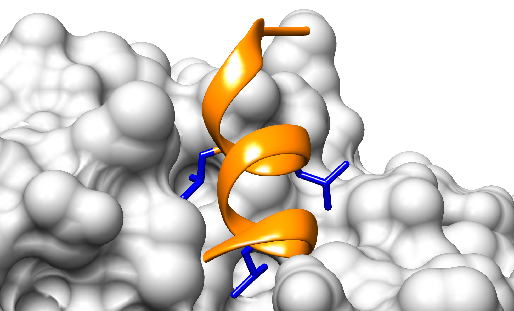
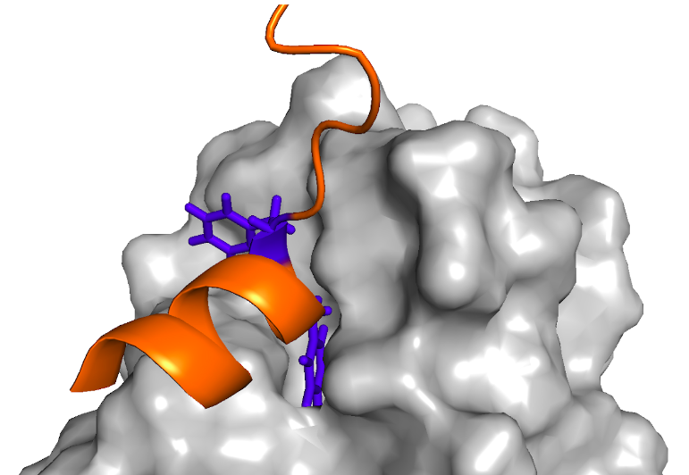

# **TP 7**. Motivos Lineales - Parte I { markdown data-toc-label = 'TP 7'}

## Recursos a utilizar
* Regex101: [https://regex101.com](https://regex101.com)
* WebLogo: [https://weblogo.threeplusone.com/create.cgi](https://weblogo.threeplusone.com/create.cgi)
* MEME: [https://meme-suite.org/meme/tools/meme](https://meme-suite.org/meme/tools/meme)
* SLiMSearch: [http://slim.icr.ac.uk/slimsearch/](http://slim.icr.ac.uk/slimsearch/)
* SLiMFinder: [http://www.slimsuite.unsw.edu.au/servers/slimfinder.php](http://www.slimsuite.unsw.edu.au/servers/slimfinder.php)
 
## Objetivos
* Familiarizarse con la simbología utilizada en expresiones regulares
* Utilizar la simbología para poder realizar búsquedas basadas en texto
* Familiarizarse con la creación e interpretación de logos de secuencia.
* Familiarizarse con el análisis de enriquecimiento de motivos en un set de secuencias
* Identificar candidatos a nuevos motivos.

## Introducción
La simbología comúnmente utilizada en expresiones regulares es:


| Sı́mbolo | Definición  |
|:-------:|:-----------:|
| `.`   | Cualquier aminoácido es permitido |
| `[XY]` | Solo los aminoácidos X e Y son permitidos |
| `[^XY]` | Los aminoácidos X e Y están prohibidos | 
| `{min,max}` | Número mı́nimo y máximo de veces que se puede repetir una posición |
| `^X` | El aminoácido X se encuentra en el extremo N-terminal | 
| `X$` | El aminoácido X se encuentra en el extremo C-terminal |
| `A|B` | Se encuentra, o bien el aminoácido A, o bien el aminoácido B |
| `(AB)|(CD)` | Se encuentran, o bien, la secuencia de aminoácidos AB, o bien, la secuencia de aminoácidos CD |

Las expresiones regulares admiten otros símbolos especiales con funciones más avanzadas.

Estos símbolos nos permiten definir patrones que son observados en proteínas naturales para luego identificarlos en otras proteínas y ser puestos a prueba experimentalmente.

Esta forma de escribir las expresiones regulares es una convención. Es muy utilizada para la búsqueda de motivos y también en lenguajes de programación, como por ejemplo Python. Existen otras, así que debemos conocer la sintaxis correcta de la aplicación o sistema que estemos usando.

## Ejercicios
### Ejercicio 1. Familiarizándonos con las expresiones regulares
Los receptores nucleares interactúan con diversas proteínas mediantes un motivo lineal llamado NRBox (Nuclear Receptor Box) (Heery,1997). Existen numerosas estructuras de péptidos unidos a diferentes receptores nucleares (PDBs: 3CS8, 2GPO, 1GWQ, 1RJK, 1M2Z) que permitieron estudiar y entender algunas características de la interacción.

La evidencia experimental recolectada de la literatura indica que:

* El motivo NRBox forma una hélice alfa
* Existen tres leucinas cuyas cadenas laterales se encuentran en una misma cara de la hélice e interactúan con un bolsillo hidrofóbico en la superficie del receptor nuclear (Figura 1).

<p style="text-align:center">

</p>

<figcaption style ="text-align:left;max-width:70%">
Figura 1. Fragmento de la proteína PGC-1 alfa unido al receptor nuclear PPAR-gamma. Se muestra en naranja el backbone de la proteína representado en Cartoon y en azul las tres leucinas que median la interacción representadas en Sticks (PDB:3CS8) y que integran el motivo NRBox.
</figcaption>

Los siguientes fragmentos de secuencia de distintas proteínas incluyen regiones que interactúan con diversos receptores nucleares y cuya interacción se verificó de manera experimental por distintos métodos.

```
>sp|Q15648|MED1_HUMAN|644-650
SMAGNTKNHPMLMNLLKDNPAQDFSTL
>sp|O43593|HAIR_HUMAN|565-571
AKHLLSGLGDRLCRLLRREREALAWAQ
>sp|Q16881-4|TRXR1_HUMAN|46-52
GPTLKAYQEGRLQKLLKMNGPEDLPKS
>sp|P48552|NRIP1_HUMAN|500-506
DVHQDSIVLTYLEGLLMHQAAGGSGTA
>sp|Q9UQ80|PA2G4_HUMAN|353-359
YKSEMEVQDAELKALLQSSASRKTQKK 
>sp|Q90ZL7|Q90ZL7_DANRE|69-75
VQHADGEKSNVLRKLLKRANSYEDAVM
>sp|Q9UBK2|PRGC1_HUMAN|143-149
PPPQEAEEPSLLKKLLLAPANTQLSYN 
>sp|Q9JL19|NCOA6_MOUSE|1494-1500
MSPAMREAPTSLSQLLDNSGAPNVTIK
>sp|Q15596|NCOA2_HUMAN|689-695
HGTSLKEKHKILHRLLQDSSSPVDLAK
>sp|Q92793|CBP_HUMAN|69-75
LVPDAASKHKQLSELLRGGSGSSINPG
```

1. Copie y pegue las secuencias en el recuadro Test String en [regex101](https://regex101.com). 

    Escribiendo en el campo Regular Expression, intente definir una expresión regular que permita identificar el motivo que media la interacción de estas proteínas con los receptores nucleares y que cumpla con la evidencia experimental observada.

    !!! danger "Regex101"
    
            **Regex101** no es una herramienta que se use comúnmente. Simplemente es un recurso educativo para entender expresiones regulares.
    
2. Considerando que el motivo se encuentra en una hélice, 

    * ¿Modificaría la expresión regular que obtuvo?
    * ¿Cuál sería la utilidad de definir una expresión regular más específica?
 
### Ejercicio 2. Un poquito más de expresiones regulares
La reparación del ADN durante la replicación ocurre por un proceso llamado Translesion synthesis (TLS). En este proceso, una polimerasa TLS, inserta un nucleótido en la lesión del ADN y luego, una polimerasa de la familia B extiende el templado. La acción coordinada de estas polimerasas se logra por la interacción de proteínas de andamiaje como PCNA (Proliferating Cell Nuclear Antigen) y la polimerasa TLS Rev1.

Existen estructuras cristalográficas de distintos péptidos unidos a Rev1 (PDBs: 2N1G, 2LSK, 2LSJ, 4FJO, 2LSI y 4GK5) que permiten entender algunas características de la interacción.

La evidencia experimental recolectada de la literatura indica:

* La interacción está mediada principalmente por dos residuos consecutivos de fenilalanina (Ohashi,2009).
* Las fenilaninas interactúan con un bolsillo hidrofóbico en la superficie de Rev1 (Pozhidaeva, 2012; Zhao,2017).
* Las fenilalaninas se encuentran en el primer giro de una hélice α.
* Se requieren al menos 4 residuos posteriores a las fenilalaninas que formen parte de una hélice (Ohashi, 2009)
* El resto de la región de interacción se pliega formando hélices α de longitud variable (Pustovalova, 2016)
* Se observan uno o dos residuos cargados positivamente en la 2da y/o 3ra posición luego de las fenilalaninas, que median interacciones electrostáticas con una superficie acídica de Rev1. La posición de estos residuos es variable: también pueden estar inmediatamente después de las fenilalaninas.
 
<p style="text-align:center">

</p>

<figcaption style = "text-align:left;max-width:70%">
Figura 2. Fragmento de la proteína Rev1 unido al motivo RIR de la polimerasa η (pol eta) humana. Se muestra en naranja el backbone del segmento de polimerasa η representado en Cartoon y en azul las dos fenilalaninas conservadas que median la interacción representadas en Sticks (PDB: 2LSK) y que conforman el motivo RIR.
</figcaption>

Los siguientes fragmentos de secuencia corresponden a regiones de distintas proteínas que participan en la reparación del ADN y que se unen a la proteína Rev1. La interacción se verificó de manera experimental por distintos métodos.

```
>sp|Q03834|MSH6_YEAST|31-38
SQKKMKQSSLLSFFSKQVPSGTPSKKVQ
>sp|Q04049|POLH_YEAST|625-632
KKQVTSSKNILSFFTRKK
>sp|Q60596|XRCC1_MOUSE|191-200
DDSANSLKPGALFFSRINKTSSASTSDPAG
>sp|Q9H040|SPRTN_HUMAN|418-428
RPRLEDKTVFDNFFIKKEQIKSSGNDPKYST
>sp|Q15054|DPOD3_HUMAN|236-245
NKAPGKGNMMSNFFGKAAMNKFKVNLDSEQ
>sp|Q9UNA4|POLI_HUMAN|569-579
SCPLHASRGVLSFFSKKQMQDIPINPRDHLS
>sp|Q9Y253|POLH_HUMAN|481-490
TATKKATTSLESFFQKAAERQKVKEASLSS 
>sp|Q9Y253|POLH_HUMAN_2|529-539
PFQTSQSTGTEPFFKQKSLLLKQKQLNNSSV
>sp|Q9QUG2|POLK_MOUSE|564-575
LAKPLEMSHKKSFFDKKRSERISNCQDTSRCK
>sp|Q9UBT6|POLK_HUMAN|565-576
FVKPLEMSHKKSFFDKKRSERKWSHQDTFKCE
```

1. Copie y pegue las secuencias en el recuadro Test String en regex101 (https://regex101.com).
    Escribiendo en el campo Regular Expression, intente definir una expresión regular que permita identificar el motivo que media la interacción de estas proteínas con Rev1 y que cumpla con la evidencia experimental observada.

2. Copie y pegue las secuencias en un archivo de texto plano. 

3. Abra el archivo en Jalview y realice un alineamiento con Clustal. Explore el alineamiento. ¿Quedaron alineadas las posiciones invariables del motivo?

4. Suba el alineamiento obtenido en la página web de [weblogo](https://weblogo.threeplusone.com/create.cgi) para construir un logo de secuencia. 

    !!! info "Logos de Secuencia"

        Un **logo de secuencia** consiste en un gráfico que muestra un apilamiento de símbolos (las letras que denominan a cada aminoácido o nucleótido) por cada posición del alineamiento. La altura total es proporcional a la conservación de la secuencia en dicha posición; la altura de cada símbolo indica la frecuencia relativa de cada símbolo en esa posición. De esta forma, un logo provee una descripción más precisa de la conservación secuencial que una secuencia consenso, y provee una medida del contenido de información de cada posición. 
 
    No trabajaremos en profundidad el contenido de información, pero podemos conocer su forma matemática.
    
    El contenido de información (IC) de una posición L del alineamiento es la diferencia entre la incerteza esperada (H previa, corresponde a todos los estados posibles) y la incerteza observada en la posición del alineamiento (H posterior, todos los estados observados), según surge de su definición:
    
    <p style="text-align:center">
    
    </p>

    donde para proteínas:

    <p style="text-align:center">
    
    </p>

    <p style="text-align:center">
    
    </p>
 
    Para secuencias nucleotídicas La incerteza previa tiene un valor máximo de 2 bits (log<sub>2</sub> 4) correspondiente al caso en que todos los símbolos (o nucleótidos) sean igualmente probables. 
 
    Por lo tanto, el contenido de información de una posición del alineamiento será máximo cuando todos los símbolos de dicha posición sean iguales (y por lo tanto, se verifique que U posterior = 0).
 
    De esta manera, el contenido de información está directamente relacionado con el **grado de conservación**.
 
    Puede utilizar las siguientes opciones (o probar las variantes que crea convenientes) al construir el logo:
    
    * *Output Format.* PNG High Resolution
    * *Sequence type:* Protein
    * *Scale stack widths:* No tiene que estar tildado
    * *Composition:* No adjustment for composition
    * *Error bars:* No tiene que estar tildado
    * *Show Sequence Ends labels:* No tiene que estar tildado
    * *Version fineprint:* No tiene que estar tildado
    * *X-axis Label:* Position
    * *Y-axis Label:* Information Content
    * *Y-axis scale:* 4.5
    * *Y-axis tic spacing:* 0.5
    * *Color scheme:* Chemistry (AA)
 
5. Analice el logo de secuencia obtenido. 
    * Recuerde, ¿qué indican la altura y el color de cada letra?
    * ¿Qué posiciones de este logo tienen mayor y menor contenido de información? ¿Se relacionan con las posiciones del motivo?
    * ¿Puede identificar posiciones definidas y variables del motivo a través del logo de secuencia?
    * ¿Puede relacionar el logo de secuencia con la expresión regular que describe al motivo? 
 

### Ejercicio 3. Identificando sobre-representación de motivos en un conjunto de secuencias
 
El algoritmo MEME (*Multiple EM for Motif Elicitation*) permite la identificación de motivos novedosos y sin gaps, es decir, identifica patrones de longitud fija y recurrentes en un conjunto de secuencias, sin necesidad de tener información previa sobre el motivo, y sin necesidad de alinear los motivos! 
 
MEME se utiliza mucho para motivos lineales en proteínas y también para identificar sitios funcionales a nivel genómico, como sitios de unión al ADN de factores de transcripción o maquinaria transcripcional, por ejemplo los TATA box y otros elementos vinculados.
 
MEME divide patrones de longitud variable en dos o más motivos separados. 
 
1. Ingrese las secuencias del ejercicio anterior sin alinear en MEME, en la sección: **Input the primary sequences**. (Puede subir un archivo con las secuencias, o seleccionar la opción **Type in sequences** en el menú desplegable para habilitar un cuadro de texto donde pegarlas).

    Puede utilizar las siguientes opciones (o puede probar las variantes que crea convenientes):

    * *Select the site distribution:*

        Esta opción se relaciona con el número de veces que aparece un motivo en la secuencia.

        * Seleccione: *Zero or One Occurrence Per Sequence (zoops)* 

    * *Select the number of motifs:*

        Esta opción se relaciona con el número de motivos que MEME va a buscar.
        * Ingrese: 10.

    En las opciones **avanzadas**:

    * *What should be used as the background model?*

        Esta opción se relaciona con la distribución esperada de aminoácidos o nucleótidos que debe usar MEME.
        
        Por default, (0-order) MEME calcula una distribución background a partir de las secuencias primarias ingresadas por el usuario.

        * Seleccione: *0-order model of sequences*

    * *How wide can motifs be?*

        Esta opción se refiere a la longitud mínima y máxima del motivo. 

        Ingrese:

        * *Minimum width:* 4
        * *Maximum width:* 12

        * ¿Por qué cree que elegimos estos parámetros?

    * *How many sites must each motif have?*

        Ingrese:

        * *Minimum sites:*  1
        * *Maximum sites:*  10

        * ¿Con qué se relaciona este parámetro?

2. Repita la búsqueda pero ahora, en las opciones avanzadas, habilite una opción más. 

    * *Should MEME shuffle the sequences?* Esta opción reescribe las secuencias en orden aleatorio.

    Seleccione: *Shuffle the sequences*

    * Observe el resultado obtenido. ¿Recupera MEME el logo de secuencia esperado?
    * Compare los resultados con los de la búsqueda anterior. ¿Cómo podría explicar las diferencias observadas?
 
### Ejercicio 4. Utilizando una expresión regular obtenida de instancias experimentales para identificar motivos nuevos
 
La expresión regular del motivo de unión a Rev1 está definida en la base de datos ELM (que veremos más adelante) como: `FF[^P]{0,2}[KR]{1,2}[^P]{0,4}`

* ¿Usted llegó a algo similar? 

    !!! Danger "Atencion!"

        Si no entiende esta expresión regular, o no llegó a algo parecido ¡consulte a sus docentes!

SLiMSearch es una herramienta que, utilizando expresiones regulares, permite buscar la presencia de motivos conocidos en las proteínas almacenadas en UniProt y priorizarlos según datos adicionales. Por ejemplo, SLiMSearch informa las características de la arquitectura de regiones y dominios de la secuencia portadora del motivo, sus variantes secuenciales y modificaciones postraduccionales, su estructura (en caso de ser conocida), medidas de conservación evolutiva y accesibilidad de los motivos, y el enriquecimiento del posible motivo en funciones conocidas.

* **Antes de Empezar con SLiMSearch:** Busque en [UniProt](https://www.uniprot.org/) a Rev1 (Q9UBZ9). ¿Cuál es la localización celular de Rev1?
 
Vaya a la web de [SLiMSearch](http://slim.icr.ac.uk/slimsearch/) e ingrese la expresión regular del motivo indicada en este ejercicio. En el campo *Choose species* puede elegir sobre qué proteoma buscar; por default se buscará en *Homo sapiens*.
 
1. ¿Cuántos motivos (hits) y cuántas proteínas obtuvo?

2. Explore la lista de proteínas. ¿Encuentra algunas de las proteínas o sus homólogos que estaban en sus secuencias originales? ¿Qué significa si las encontró?

3. En la parte superior de la tabla haga click en *expand*.

    Las últimas columnas que están resumidas van a mostrar más información.

    * ¿Cuáles de estos campos le parecen más interesantes para intentar reconocer verdaderos motivos?

4. Ordene la tabla por el score de conservación (a menor score, mayor conservación) en *Mammalia*.

5. Explore la lista de proteínas y observe las coloreadas en amarillo. Tienen un *Warning*. Al pie de la tabla se indica lo que significa cada tono de amarillo.

    * ¿A qué se debe el warning de la **BTB/POZ domain-containing protein KCTD8**? ¿Por qué cree que es útil?
    * Observe la **DNA polymerase delta subunit 3 (POLD3)**.
        * ¿Cuántas veces aparece en la hoja 1?
        * ¿Se corresponde con la región de la POLD3 en su conjunto de secuencias?

6. Busque en la lista la proteína **Kinesin-like protein KIF11 (KIF11)**, y averigüe su localización.

    * ¿Tiene sentido tener esta proteína como candidata para evaluar su interacción con Rev1?

7. SLiMSearch permite utilizar filtros para mejorar la búsqueda.

    Para eso vaya a la pestaña *Filters*.
    
    Haga click en *Localisation*.
    
    Luego, en la tabla busque los términos relacionados al núcleo (nuclear part, nucleus, etc serían aproximadamente doce términos que están primeros y últimos al escribir “nucl” en la búsqueda) y selecciónelos para realizar un *Filter In* (es decir, quedarse con las instancias que poseen dicha localización, asegúrese que Nucleus y nucleus estén seleccionados).

    Luego, haga click en **Add** y vaya a la pestaña de **Instances** en la parte superior de la página.

8. Encuentre en la lista de proteínas filtradas la proteína: **Chromosome transmission fidelity protein 18 homolog (CHTF18)** (Q8WVB6). Puede ordenar alfabéticamente para encontrarla más fácil.

    * Búsquela en ProViz.
    
    * Ubique la región donde se encuentra el posible motivo sugerido por SLiMSearch.

    * Evalúe el contexto estructural. ¿Es favorable?
    * Evalúe el grado de conservación. ¿Está conservado?
    * ¿Le parece que es un buen candidato para evaluar?

9. Vaya a *Functions*.

    * ¿Qué funciones están enriquecidas en su lista de proteínas filtradas?

    Según los conocimientos que posee sobre este motivo, elija las funciones correspondientes para filtrar los datos.

    * ¿Cuántos *Hits* y cuántas proteínas obtiene ahora?

    * Encuentre en la lista de proteínas filtradas la proteína: **Chromosome transmission fidelity protein 18 homolog (CHTF18)** (Q8WVB6). ¿Le sigue pareciendo que es un buen candidato para evaluar?

 
### Ejercicio 5. Utilice un conjunto de secuencias relacionadas para identificar motivos de novo 
 
La longitud y variabilidad de los motivos lineales hace difícil distinguir patrones que ocurren al azar de aquellos que constituyen verdaderos motivos en proteínas naturales. La herramienta SLiMFinder permite identificar motivos estadísticamente sobrerrepresentados en un conjunto de secuencias relacionadas. A diferencia de MEME, SLiMFinder permite identificar motivos con segmentos de secuencia y longitud variable. Incorpora filtros para concentrar la búsqueda en regiones desordenadas o de mayor conservación relativa, para aumentar así la confiabilidad en la predicción. Los resultados se presentan con un valor de significancia estadística que estima la probabilidad de que el motivo se hubiera encontrado por azar, adaptado al tamaño y composición de las secuencias provistas por el usuario. De esta forma, SLiMFinder otorga un método eficiente y con baja tasa de falsos positivos para descubrir nuevos motivos.

1. Vaya a la web de [SLiMFinder](http://www.slimsuite.unsw.edu.au/servers/slimfinder.php) y pegue las secuencias de unión a Rev1 del ejercicio 2 en el campo de la derecha (Alternative fasta input). 
 
2. En la opción *Masking Options* puede decidir que sólo se consideren motivos predichos en regiones desordenadas (*Disorder masking*) y/o conservadas evolutivamente (*Conservation masking*). Sobre la base de lo que conoce de este motivo, ¿qué filtros activaría?

3. Revise los resultados. En la pestaña *main* encontrará los resultados generales de la predicción de motivos, mientras que la pestaña *occ* detallará en qué proteínas ocurren. ¿Qué motivos se predicen? ¿Coinciden con lo esperado?
