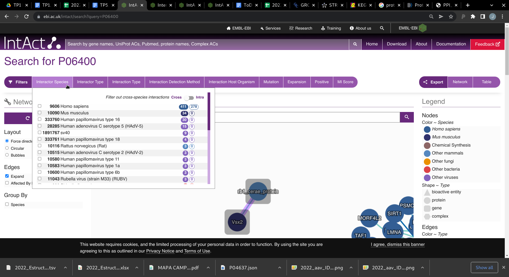

# **TP 4.** Interacciones proteína-proteína { markdown data-toc-label = 'TP 4'}

### Recursos Online
* AlphaFold Server: [https://alphafoldserver.com/](https://alphafoldserver.com/)
* Intact: [https://www.ebi.ac.uk/intact/home](https://www.ebi.ac.uk/intact/home)
* Boltz [https://github.com/jwohlwend/boltz](https://github.com/jwohlwend/boltz)

### Objetivos

* Familiarizarse con el uso de la base de datos de interacciones proteína-proteína
* Entender los distintos tipos de evidencia experimental, o no experimental, que se puede tener para el estudio de interacciones proteína-proteína
* Entender los distintos tipos de interacciones proteína-proteína que se pueden detectar experimentalmente

## Ejercicio 1: Análisis de interacciones moleculares en el complejo RbC-E2F1-DP1

Las interacciones proteína-proteína son esenciales en casi todos los procesos celulares, por lo tanto es uno de los campos más estudiados ya que su entendimiento es crucial para comprender la fisiología celular en estados normales o anormales (como enfermedades) y para el desarrollo de drogas. Además, el conocimiento de las distintas interacciones permitiría identificar posibles roles funcionales para proteínas aún no caracterizadas.

Las interacciones proteína-proteína son contactos físicos que ocurren entre determinadas proteínas. Estos contactos son específicos, ocurren entre regiones de interacción de las proteínas, definen una función específica y pueden ser transiente o estables.

Una interacción estable define un complejo proteico, mientras que una interacción transiente es una interacción breve que puede llevar a un cambio mayor y son la parte dinámica del interactoma celular.

Las interacciones proteína-proteína forman redes de interacción. El conjunto de redes de interacción dentro de una célula define el interactoma celular en un contexto biológico determinado.

Los datos relacionados con interacciones proteína-proteína aumentó muchísimo en la última década debido al desarrollo de técnicas high-throughput para detectar interacciones proteína-proteína (espectroscopía de masa, el ensayo de doble híbrido en levaduras, phage display) permitiendo determinar interactomas cada vez más completos y complejos. Sin embargo, esta información es aún incompleta y ruidosa ya que todos los métodos de detección proteína-proteína tienen sus limitaciones en relación al contexto fisiológico de la interacción.

Existen numerosas bases de datos de interacciones proteína-proteína.

Se pueden clasificar entre tres tipos principales:

* **Bases de datos primarias:** Colectan información experimental exclusivamente. Por ejemplo: IntAct, MINT y MatrixDB.
* **Bases de datos secundarias o meta-bases de datos:** Integran datos anotados (o curados) de bases de datos primarias en una base de datos. Por ejemplo, APID y PINA.
* **Bases de datos predictivas:** Combinan los datos experimentales de las bases de datos primarias con predicciones computacionales. Por ejemplo, STRING y UniHI.

### IntAct
IntAct es una base de datos pública de interacciones moleculares. Es mantenida por un grupo de curadores y desarrolladores en el European Bioinformatics Institute (EMBL-EBI, Hinxton, UK) y es la base de datos más abarcativa de interacciones moleculares. Los datos de interacciones moleculares son curados a partir de la literatura. Si bien la mayoría de las interacciones almacenadas en IntAct son interacciones proteína-proteína, existen otras interacciones que involucran pequeños compuestos químicos o ácidos nucleicos. IntAct además es miembro del consorcio internacional de intercambio molecular (International Molecular Exchange Consortium, IMEx). El objetivo de este consorcio es unificar el esfuerzo de curación de los datos experimentales de interacciones moleculares.

En este ejercicio analizaremos la estructura cristalográfica **2AZE** (RbC-E2F1-DP1), publicada por **[Rubin et al. (Cell, 2005)](data/1-s2.0-S0092867405012316-main.pdf)**. Además, compararemos estos contactos experimentales con los modelos generados por **AlphaFold 3** en la clase anterior.

#### Búsqueda de interacciones en IntAct
1. Busque en Intact la proteína retinoblastoma (Rb) humana usando su accession number (P06400).

    !!! Warning
    
        En esta base de datos no se puede utilizar el nombre de la entrada UniProt.

2. El resultado de IntAct es visualizado de dos maneras:

    * Mediante una **red** donde los nodos son proteínas o moléculas, que están conectados por edges que pueden representar distintas cosas como: número de experimentos anotados, nivel de confianza, entre otros.
    * Mediante una **tabla de interacciones** y una **tabla de interactores**, en ambos casos con columnas que pueden ser modificadas según el interés del usuario.

    En la parte superior de la tabla, hay dos pestañas que permiten cambiar entre Interacciones e Interactores. También, se puede observar el número total de interacciones que existen para Rb y el número total de interactores que existen para Rb.

    * ¿Cuántas interacciones hay?
    * ¿Cuántos interactores hay?

3. En la parte superior de la tabla de interacciones haga click en *Column Toggle* y tilde *Species A* y *Species B*. Esto hará que aparezcan las columnas que indican el organismo del cual provienen los interactores A y B.
    Mostrando de a 25 entradas en la tabla de interacciones, observe en la página 1 y en la página 13 de los resultados:
    * ¿Aparece más de un organismo?
    * ¿Por qué cree que esto ocurre?
    * ¿Siempre el interactor A y el interactor B provienen de la misma especie? ¿Por qué?

4. Si quisiéramos resultados para un único organismo, en la parte superior de la página de resultados se encuentran los Filtros.

    En el filtro: *Interactor Species* observe las distintas especies que hay. 

    * ¿Hay muchos patógenos que interactúen con Rb?

    Seleccione interacciones que sean entre Rb y otra proteína Humana tildando la especie correspondiente: *Homo sapiens* y luego seleccionando que ##sea **Intra** especie con el botón *Filter out cross-species interactions*.

    <p style="text-align:center">
    
    </p>

5. En el filtro: *Interactor Type* observe los distintos tipos de interactores que hay. Luego seleccione de manera que los interactores sean sólo **proteínas**.

6. Investigue el filtro *Interaction Detection Method*. 
    * ¿Qué tipos de técnicas experimentales hay?
    * ¿Todas las técnicas proveen evidencia de interacción directa entre proteínas?
    * ¿Puede dar algunos ejemplos de cuáles son evidencia directa y cuáles indirecta?

7. Investigue el filtro *Interaction Type*.
    * ¿Qué tipos de interacciones considera IntAct?
    * ¿Cuáles son interacciones directas y cuáles son indirectas?

8. Seleccione distintos tipos de interacciones en *Interaction Type* y observe los distintos tipos de técnicas experimentales en el filtro *Interaction Detection Method*.
    * ¿Coincide alguna con los ejemplos de evidencia directa e indirecta que usted seleccionó?

9. IntAct utiliza un método de puntuación para puntuar las interacciones observadas con un índice denominado el **MI score**.

    !!! Info

        El MI score es un método de puntuación modificable y heurístico que tiene en consideración tres factores:

        * El método de detección de la interacción: Observada, predicha o inferida.
        * El tipo de interacción: Direct interaction, physical association, co-localization etc
        * El número de publicaciones que reportan una interacción específica.

        En definitiva, el MI score provee un sistema de puntuación que representa el grado de confianza de una interacción en particular evaluando el grado de anotación/curación de la interacción en una base de datos. A mayor evidencia experimental que apoya la interacción, mayor es la puntuación.

        * La evidencia derivada de algoritmos predictivos o métodos de text-mining contribuye menos al score final.
        
        * La combinación de métodos experimentales de baja puntuación (por ejemplo, colocalización) con evidencia no experimental da una mayor puntuación que cada uno por separado.

    * A la derecha de la red de interacción está la leyenda. ¿Qué representan los edges sólidos?
    * A la izquierda de la red de interacción, destildá la opción *Expand*. ¿Qué representa ahora el color de los edges? ¿y el ancho?

    Utiliza el filtro MI Score que se encuentra en la parte superior y encuentra los interactores con el mayor score.

    * ¿Cuántos interactores hay?
    * ¿Cuántas interacciones hay?
    * ¿Qué tipo de evidencia experimental poseen?
    * ¿Cuánta evidencia posee cada interactor?

### Visualización de la estructura experimental 

La estructura **2AZE** contiene:

- **Cadena C**: RbC (residuos ~829-874)

- **Cadena A**: E2F1 

- **Cadena B**: DP1 

#### Pasos

1. **Descargar 2AZE** desde RCSB PDB:  
   [https://www.rcsb.org/structure/2AZE](https://www.rcsb.org/structure/2AZE)  

2. **Abrir Chimera** y cargar el archivo:  
   `File → Open → 2AZE.pdb`

3. **Colorear por cadena** para facilitar la identificación:
   - Cadena A (E2F1): 
   `Select → Chain → A`
   `Actions → Color → red`
   `Actions → Ribbon → Show`

   - Cadena B (DP1): 
   `Select → Chain → B`
   `Actions → Color → blue`
   `Actions → Ribbon → Show`

   - Cadena C (RbC): 
   `Select → Chain → C`
   `Actions → Color → orange`
   `Actions → Ribbon → Show`

### Análisis de puentes de hidrógeno 

Según el paper (Figura 4A y texto), RbC establece puentes de hidrógeno clave con DP1 y posiblemente con E2F1. Vamos a identificarlos en Chimera.

#### Pasos

1. Primero, seleccionamos RbC: `Select → Chain → C`  

2. **Calcular puentes de hidrógeno** en la selección actual:  
   `Tools → Structure Analysis → FindHBonds`

   - Seleccionar `Find these bonds: both`
   - Seleccionar `Relax H-Bonds`. Permitir relajación de 0.5 Å y 60°
   - Seleccionar `Only find H-bonds → with al least one end selected` 
   - Seleccionar `Include intra-molecule H-bonds`
   - Seleccionar `Include intra-residue H-bonds`
   - Seleccionar `Write information to ReplyLog`
   - Click en **Apply**

3. **Analizar los resultados**:
   - En la pantalla 3D aparecerán líneas punteadas verdes.
   - Abrir el **Reply Log**: `Favorites → ReplyLog`

4. Ingresar a la publicación **[Rubin et al. (Cell, 2005)](data/1-s2.0-S0092867405012316-main.pdf)**
   - Leer la sección "RbCcore-E2F1CM-DP1CM Interactions"
   - ¿Que cantidad de puentes de hidrógeno que conectan RbC rS1 y E2F eS2 según la publicación?. ¿Esta cantidad coincide con lo encontrado en Chimera?
   - Seleccione los residuos responsables de la interacción según el paper usando `select #0:xxx-xxx.C` (Reemplazando xxx por los residuos mencionados en el paper en la se)
   - Calcule los puentes de hidrógenos de la selección.
   - ¿El núevo número obtenido corresponde con lo indicado en la publicación?

### Análisis de la interfaz hidrofóbica

El paper menciona que la hélice **rH1** de RbC (residuos ~845-852) hace contactos hidrofóbicos con el **β-sándwich** expuesto de E2F1-DP1. Estos contactos son críticos para la afinidad.

#### Seleccionar Phe845 de RbC

En la línea de comandos (`Favorites → Command Line`) escribí:

    select #0:845.C

#### Encontrar todos los residuos de E2F/DP que están a menos de 4 Å de Phe845

Con Phe845 seleccionado, ingresá en la línea de comandos:

    select sel z<4

Ahora Chimera selecciona Phe845 **y** todos los átomos de cadenas A/B a menos de 4 Å.

#### Aislar visualmente los residuos seleccionados

- `Select → Invert (all models)` (se selecciona todo lo que no es tu interfaz).
- `Actions → Atoms/Bonds → Hide`.
- `Actions → Ribbon → Hide`.
- `Select → Invert (all models)` (vuelve a seleccionar solo Phe845 y sus vecinos).

Verás únicamente los residuos involucrados en la zona de contacto.

#### Colorear por hidrofobicidad para identificar residuos hidrofóbicos vs. polares

- `Tools → Depiction → Render by Attribute`.
- **Attribute of**: `residues`.
- **Render attribute**: `kdHydrophobicity`.
- Click en **Apply**.

**Interpretación de colores:**
- **Naranja / rojo** → hidrofóbico (no polar).
- **Blanco / celeste** → intermedio.
- **Azul** → hidrofílico (polar).

#### Identificar los residuos de E2F/DP que están en contacto

- Abrí `En la sección inferior a la derecha → Inspect Selection` (lupa verde).
- Seleccioná  **Residues** y apretá `Write List`. Se va a abrir una nueva pestaña y apretar `Log`.
- En el Reply Log mira el listado y anotá: número, nombre de tres letras y cadena.
- De los residuos correspondientes a la cadena no seleccion
- En la interfaz de Chimera anotar el color que ves (naranja o azul) para cada residuo.

Ejemplo: `ILE 262.A` (naranja), `ASP 295.A` (azul).

#### Buscar puentes de hidrógeno entre Phe845 y esos residuos

- `Tools → Structure Analysis → FindHBonds`.
- Click en **Apply**.

Observá líneas punteadas verdes en la pantalla. En el `Reply Log` (Favorites → Reply Log) aparece la lista detallada. Anotá si hay puentes de H con alguno de los residuos vecinos.

#### Completar la tabla para Phe845
<!--
| Residuo RbC | Residuo E2F/DP (cadena) | Color (naranja/azul) | ¿Puente de H? | Distancia <4 Å | Tipo de interacción |
|-------------|------------------------|----------------------|---------------|----------------|---------------------|
| Phe845 (C)  | ILE 262.A              | naranja              | No            | Sí             | van der Waals hidrofóbica |
| Phe845 (C)  | ILE 293.A              | naranja              | No            | Sí             | van der Waals hidrofóbica |
| Phe845 (C)  | HIS 294.A              | azul                 | Verificar     | Sí             | polar (posible H-bond) |
| Phe845 (C)  | ASP 295.A              | azul                 | Verificar     | Sí             | polar o iónica |
-->

| Residuo RbC | Residuo E2F/DP (cadena)| Hidrofobicidad       | ¿Puente de H? | Distancia <4 Å | Tipo de interacción |
|-------------|------------------------|----------------------|---------------|----------------|---------------------|
| Phe845 (C)  |                        |                      |               |                |                     |
| Phe845 (C)  |                        |                      |               |                |                     |
| Phe845 (C)  |                        |                      |               |                |                     |
| Phe845 (C)  |                        |                      |               |                |                     |

**Criterio de tipo de interacción:**  
Para decir que un par de residuos tienen fuerza de tipo Van der Waals se pueden usar los siguientes criterios: distancia <4 Å + residuos no polares + sin puente de H.  

#### Repetir el procedimiento para alguno de los otros tres residuos de la hélice rH1

- **Ile848** (seleccionar `#0:848.C`)
- **Met851** (seleccionar `#0:851.C`)
- **Val852** (seleccionar `#0:852.C`)

### Comparación con el modelo de AlphaFold 3

Ahora van a comparar la predicción de AF3 con la estructura experimental 2AZE.

#### Pasos
1. Realizar el modelado de las regiones cristalizadas en 2AZE:

Secuencias:
```
>2AZE_1|Chain A|Transcription factor Dp-1|Homo sapiens (9606)
GEFAQECQNLEVERQRRLERIKQKQSQLQELILQQIAFKNLVQRNRHAEQQASRPPPPNSVIHLPFIIVNTSKKTVIDCSISNDKFEYLFNFDNTFEIHDDIEVLKRMGMACGLESGSCSAEDLKMARSLVPKALEPYVTEMAQGTVGGVFITTA

>2AZE_2|Chain B|Transcription factor E2F1|Homo sapiens (9606)
GSHMGGRLEGLTQDLRQLQESEQQLDHLMNICTTQLRLLSEDTDSQRLAYVTCQDLRSIADPAEQMVMVIKAPPETQLQAVDSSENFQISLKSKQGPIDVFLCPEE

>2AZE_3|Chain C|Retinoblastoma-associated protein|Homo sapiens (9606)
SRILVSIGESFGTSEKFQKINQMVCNSDRVLKRSAEGSNPPKPLKK
```

1. Ingresar a AlphaFold Server (https://alphafoldserver.com/).
2. Crear un nuevo trabajo con tres entidades (cada una como “Protein”):
   - **Entity 3**: secuencia de la cadena A (DP1)
   - **Entity 2**: secuencia de la cadena B (E2F1)
   - **Entity 1**: secuencia de la cadena C (RbC)
3. Nombrar el trabajo como `2AZE_AF3`. 
4. Ejecutar y esperar a que terminen los 5 modelos.
5. Descargar el `.zip`, extraer el archivo `model_0.cif` (el mejor rankeado por ipTM/pTM).

2. Abrir el modelado el Chimera y replicar el análisis anterior para evaluar la capacidad de Alphafold de modelar puentes de hidrógeno y contactos hidrofóbicos. 

    ??? Importante
    
        Recordá que en el modelado los residuos comienzan en la posición 0, por lo que la numeración no será la misma que en la estructura cristalizada.

        Por ejemplo select #0:845.C sería select #0:17.C


Según tus observaciones:
- ¿AF3 reproduce correctamente los puentes de H de backbone? (Responde: sí, parcialmente, o no, y justifica cuántos y cuáles).
- ¿AF3 reproduce los contactos hidrofóbicos de la hélice rH1? (Responde: sí, en qué medida, y mencioná algún contacto que haya fallado).

---

## Ejercicio 2: Modelado y análisis de interacciones de c-Src quinasa con inhibidores

c-Src es una tirosina quinasa no receptora que juega un papel central en la proliferación celular y está hiperactivada en múltiples cánceres (colón, mama, pulmón, páncreas). El dominio quinasa (SH1) presenta una estructura bilobulada típica:

- **Lóbulo N-terminal**: contiene la bisagra (hinge region) donde se une el ATP (residuos clave: M344, E342).
- **Lóbulo C-terminal**: contiene el loop de activación con el motivo DFG (D407, F408, G409).
- **Gatekeeper residue (T341)**: controla el acceso al bolsillo hidrofóbico I; su mutación a Met o Ile causa resistencia a inhibidores como dasatinib.
- **αC-hélice**: su desplazamiento (conformación CHO) estabiliza inhibidores tipo II.

El inhibidor **dasatinib** (BMS-354825) es un inhibidor tipo I de alta potencia (IC50 = 0.5 nM) que se une a la conformación activa (DFG-in, αC-in). Forma tres puentes de H críticos:

1. NH del tiazol con backbone O de M344
2. N del tiazol con backbone N de M344
3. Amida con T341 (gatekeeper)

En este ejercicio, usaremos **Boltz** (herramienta de modelado de complejos proteína-ligando) para predecir estructuras de c-Src con inhibidores y evaluar el impacto de mutaciones.

### Recursos necesarios
- PDB 3G5D (c-Src + dasatinib, referencia experimental)

### Búsqueda en IntAct de interacciones de c-Src con inhibidores

#### Pasos

1. Ingresar a IntAct: https://www.ebi.ac.uk/intact/
2. Buscar "SRC"
3. En "Interactor Type" seleccionar "small molecule"
4. En la pestaña de Interactors buscar "dasatinib".

#### Responda

- ¿Cuánatas veces aparece este interactor en la búsqueda actual?

- ¿Qué otros inhibidores aparecen en IntAct? (ej: bosutinib, saracatinib)

### Exploración estructural
Ahora vamos a explorar la estructura cristalográfica de c-Src con un ligando. 

1. Explorar la entrada del PDB 3G5D.

2. Descargar la estructura en formato .pdb y abrir en Chimera

#### Responda

- ¿Cuántas cadenas tienen la estructura descargada?

- ¿Podés identificar la posición del ligando?

- ¿Hay puentes de hidrógeno entre la proteína y el ligando? En caso afirmativo, indicar en que residuos

- ¿Cual es la energía de afinidad indicada en la entrada del PDB?

### Modelado de c-Src con dasatinib usando Boltz

Boltz es una familia de modelos de inteligencia artificial diseñados para predecir la estructura tridimensional de complejos biomoleculares. Fue desarrollado por investigadores del MIT y Recursion Pharmaceuticals como una alternativa open source a AlphaFold3 de Google DeepMind.

#### Boltz-1

Primera versión [(Wohlwend et al., 2025)](https://www.biorxiv.org/content/10.1101/2024.11.19.624167v4). Permite modelar complejos multiméricos con métricas de confianza (pLDDT, ipTM). Es de código abierto.

#### Boltz-2

Segunda generación [(Passaro et al., 2025)](https://www.biorxiv.org/content/10.1101/2025.06.14.659707v1.full). Dos novedades principales:

**1. Mejoras estructurales:** entrenamiento con ensambles y dinámica molecular, controlabilidad (restricciones de distancia, plantillas), corrección física (Boltz-steering).

**2. Predicción de afinidad proteína-ligando:** es el primer modelo de IA que se acerca a la precisión de métodos de free energy perturbation (FEP), pero siendo >1000 veces más rápido. Alcanza correlaciones de Pearson de 0.66 en el benchmark FEP+ y double la precisión media en hit discovery (MF-PCBA) respecto a métodos previos.

Vamos a modelar la interacción de c-Src + dasatinib usando Boltz-2

#### Preparación de la secuencia y ligandos

```
**Secuencia del dominio quinasa de c-Src humano (residuos 250-533)**: 
GHMQTQGLAKDAWEIPRESLRLEVKLGQGCFGEVWMGTWNGTTRVAIKTLKPGTMSPEAFLQEAQVMKKLRHEKLVQLYAVVSEEPIYIVTEYMSKGCLLDFLKGEMGKYLRLPQLVDMAAQIASGMAYVERMNYVHRDLRAANILVGENLVCKVADFGLARLIEDNEYTARQGAKFPIKWTAPEAALYGRFTIKSDVWSFGILLTELTTKGRVPYPGMVNREVLDQVERGYRMPCPPECPESLHDLMCQCWRKDPEERPTFEYLQAFLEDYFTSTEPQYQPGENL
```

```
**Estructura química de dasatinib (SMILES)**: 
CC1=C(C(=CC=C1)Cl)NC(=O)C2=CN=C(S2)NC3=CC(=NC(=N3)C)N4CCN(CC4)CCO
```

#### Configuración de Boltz

1) Abrir la notebook de Boltz usando este link: https://colab.research.google.com/drive/1K93MOXsLXDxmAxT3GHIalO-GW8D46rs0?usp=sharing

2) Guardar una copia en Google Drive (Archivo → Guardar una copia en Drive).

3) Conectarse al entorno usando GPU T4:
   - Entorno de ejecución → Cambiar tipo de entorno de ejecución
   - Acelerador de hardware: T4 GPU
   - Guardar
   - Luego hacer clic en "Conectar"

4) Ejecutar la celda "Install Dependencies and Boltz2 with CUDA support". Esperar a que termine (2-5 minutos). Permitir el acceso de la notebook a nuestra cuenta de drive. Este acceso nos permitirá guardar los resultados del análisis. 

5) Ejecutar la celda "Download CCD Dataset and Test Boltz2". Esto descarga diccionarios de ligandos.

6) Ejecutar la celda "Generate Parameters". Crea el archivo YAML base.

7) Configurar entidades:
   - En la celda "Protein (Primary)": pegar la secuencia de la proteína (formato FASTA sin encabezado).
   - Para agregar ligando: hacer clic en "Add Entity" → seleccionar "Ligand".
   - En SMILES, ingresar la fórmula del compuesto.
   - Marcar la opción "Predict Ligand Affinity".
   - Hacer clic en "Save YAML" y luego en "Next".

8) Configurar la predicción:
   - En advanced options sleccionar Sampling Steps: 50
   - Job Name: nombre descriptivo (ej: cSrc_dasatinib)
   - Hacer clic en "Ok"

9) Ejecutar la celda "Run Boltz2 Engine". Esperar a que finalice (10-40 minutos).

10) Ejecutar la celda "Analyse Results" para ver métricas y vista previa.

11) Ejecutar la celda "Copy Results to Drive" para guardar en Google Drive.

12) Ejecutar la celda "Download Results (.zip)" y descargar el archivo.

13) Explorar la carpeta descargada. Contiene:
    - model_0.pdb (estructuras predichas)
    - confidence_summary.json (métricas ipTM, pTM, pLDDT)
    - input.yaml (configuración usada)
    - carpetas msa/ y templates/

#### Visualización en Chimera

1) Abrir ambos modelos (experimental + predicciones Boltz) en Chimera.

2) Alinear usando MatchMaker (referencia: 3G5D).

3) Analizar el modelado de la proteína y la ubicación del ligando.

##### Responda

a) ¿Boltz predice correctamente la orientación de dasatinib en el sitio ATP?

b) ¿Los puentes de H reportados se reproducen en el modelo?

c) ¿Se corresponde la afinidad con la reportada en la entrada del PDB?

### Modelado de c-Src con mutación T341M

La mutación **T341M** (treonina → metionina) aumenta el tamaño del gatekeeper, cerrando el acceso al bolsillo hidrofóbico I y generando resistencia a inhibidores tipo I como dasatinib.

#### Pasos

1. Modificar la secuencia de c-Src: cambiar el residuo en posición 341 de T a M.

    ??? info "Importante" 
        La secuencia proporcionada corresponde al dominio quinasa de c-Src, que abarca los **residuos 250 a 533** de la proteína completa (UniProt P12931). El número de residuo 341 (T341 en la proteína completa) se encuentra dentro de este fragmento ya que 341 > 250.

        Para calcular la posición relativa dentro de nuestra secuencia:

        **341 (posición en proteína completa) - 250 (inicio del dominio) = posición 91 en nuestra secuencia.**

        Es decir, la treonina que debe mutarse es el **aminoácido número 91** contando desde el extremo N-terminal de la secuencia que estamos utilizando.

        **Mutada T341M:**

        GHMQTQGLAKDAWEIPRESLRLEVKLGQGCFGEVWMGTWNGTTRVAIKTLKPGTMSPEAFLQEAQVMKKLRHEKLVQLYAVVSEEPIYIVMEYMSKGCLLDFLKGEMGKYLRLPQLVDMAAQIASGMAYVERMNYVHRDLRAANILVGENLVCKVADFGLARLIEDNEYTARQGAKFPIKWTAPEAALYGRFTIKSDVWSFGILLTELTTKGRVPYPGMVNREVLDQVERGYRMPCPPECPESLHDLMCQCWRKDPEERPTFEYLQAFLEDYFTSTEPQYQPGENL

2. Ejecutar Boltz con la misma secuencia del ligando en las mismas condiciones que el ejercicio anterior.

3. Alinear el modelo mutante con 3G5D.

#### Responda

a) ¿Cómo se orienta la metionina 341? ¿Ocluye parcialmente el sitio de unión?

b) ¿Se mantienen los tres puentes de H de dasatinib? Si no, ¿cuál se pierde?

c) Según el paper asociada a la entrada de PDB, dasatinib pierde actividad contra T341M (EC50 > 10 μM). ¿Su modelo es consistente con este dato?

### Ejercicio extra: Mutación de la triada catalítica

#### Residuos a modificar

- **D407A**: cambiar Aspartato (D) por Alanina (A) en la posición 157 de la secuencia del dominio quinasa (residuos 250-533).
- **F408A**: cambiar Fenilalanina (F) por Alanina (A) en la posición 158 de la secuencia del dominio quinasa.

En el motivo DFG original (`ADFGL`), luego de las mutaciones queda `AAAGL`.

#### Secuencia mutada (D407A + F408A)

```
GHMQTQGLAKDAWEIPRESLRLEVKLGQGCFGEVWMGTWNGTTRVAIKTLKPGTMSPEAFLQEAQVMKKLRHEKLVQLYAVVSEEPIYIVMEYMSKGCLLDFLKGEMGKYLRLPQLVDMAAQIASGMAYVERMNYVHRDLRAANILVGENLVCKVAAAGLARLIEDNEYTARQGAKFPIKWTAPEAALYGRFTIKSDVWSFGILLTELTTKGRVPYPGMVNREVLDQVERGYRMPCPPECPESLHDLMCQCWRKDPEERPTFEYLQAFLEDYFTSTEPQYQPGENL
```

#### Preguntas guía

1) En base a tu modelo de Boltz-2 para la proteína mutada + dasatinib: ¿observas cambios en los puentes de hidrógeno o en las distancias de contacto con respecto a la proteína WT? ¿Cuáles?

2) Compará la estructura predicha por Boltz-2 de la proteína mutada vs la WT. ¿Hay diferencias en el loop de activación? ¿Eso afectaría la unión del ligando?

3) ¿La mutación D407A podría alterar la afinidad de unión de un inhibidor que interactúa con el aspartato? Justificá con lo que observaste.

## Ejercicio Extra: STRING
La base de datos STRING contiene datos de interacciones proteína-proteína conocidos y predichos. Los datos derivan de experimentos high-throughput, datos de co-expresión, literatura y contexto genómico. Abarca más de 5 millones de proteínas de más de 1100 organismos. 

### Interacciones de la Proteína Retinoblastoma (Rb)

1. En STRING se puede realizar una búsqueda por el o los nombres de la proteína, o el identificador, múltiples proteínas, múltiples secuencias, organismos o familias de proteínas.

    Haga click en Search y en protein name e ingrese “retinoblastoma”

    * Observe el resultado. ¿Por qué hay más de un resultado? ¿Cuál es el que deseamos?

    En el campo *protein name* también puede ingresar el accession number: P06400.

    El número de interactores que devuelve la red puede cambiarse en la pestaña *Settings*, por defecto está elegido 10. Por lo cual devuelve los 10 interactores con mejor puntuación en STRING. La red también puede expandirse utilizando los botones *more/less* para obtener una segunda capa de interacción con proteínas que conectan con la primera capa aunque no necesariamente con Rb.

    * Presione *More*, ¿observa algún interactor que no interactúe con Rb?

    ??? info "Nota en score de STRING"

        Puede haber uno o más scores en STRING para cada interacción proteína-proteína.

        Estos scores no se relacionan con la fuerza o especificidad de la interacción. Son indicadores de confianza de STRING. Es decir, dada la evidencia disponible, cuán probable es que esa interacción sea verdadera.

        Un score de 0.5 indicaría que una de cada dos interacciones es errónea, o sea, sería un falso positivo.

        Para la mayoría de los tipos de evidencia hay dos scores:

        * **normal score**

        * **transferred score:** Este score se calcula a partir de datos que no provienen del organismo de interés si no de otro organismo y luego es *transferido* vía homología.

2. Presione en *Less*, y haga click en E2F4 y observe la información disponible. Haga click en el edge que conecta E2F4 y RB1:
    * De los siete tipos de origen de evidencia ¿De dónde proviene la evidencia de interacción entre estas dos proteínas?

3. Vaya a *Legend* y responda:
    * ¿Todas las interacciones entre las proteínas de esta red tienen evidencia **experimental** asociada?

4. ¿Se encuentran los interactores con mayor score detectados en IntAct?

5. Vaya a *Analysis*. Luego, Vaya a la sección *KEGG Pathways* de la tabla y asegúrese que esté ordenada por *strength* de mayor a menor. Luego, haga click en el nodo **Rb1** de la red de interacción y luego seleccione *Show this node's terms in the analysis table*. Observe que en la tabla se resaltan los términos enriquecidos en cada base de datos relacionados con Rb.
    * ¿A qué corresponden las primeras 10 líneas de KEGG?

    ??? info "KEGG PATHWAY"

        *KEGG (Kyoto Encyclopedia of Genes and Genomes)* es una colección de bases de datos. 

        * KEGG Pathway es una de las base de datos de KEGG que almacena mapas de rutas para las funciones celulares y de organismos.

        * El *strength* (como dice en *explain columns* en la parte superior de la primera tabla) es claculado como Log~10~(observado / esperado).
        
        Esta medida describe cuan grande es el efecto de enriquecimiento. Es la relación entre:
        
            1. El número de proteínas en la red que están anotadas con un término.
            2. El número de proteínas que se espera que están anotadas con ese término en una red *random* con el mismo tamaño.

6. Elija los dos interactores de mayor score detectados en Intact y haga lo mismo.
    * ¿Cuáles son los KEGG pathways comunes a las tres proteínas?

7. En la sección KEGG pathways haga click en el **identificador** que corresponde a Cell Cycle.
    * ¿Puede encontrar a Rb?
    * ¿Encuentra a los interactores con mayor evidencia?
    * ¿Puede nombrar al menos una enzima que fosforile a Rb y otra que la desfosforile?

<!--
#### Ejercicios

###### Ejercicio 1. Interacciones de la Proteína Spike de SARS-COV2

1. Busque en IntAct las interacciónes que existen de la proteína Spike de SARS-COV2 (P0DTC2) con humanos (recuerde usar los filtros para ver interacciones sólo con humanos). 

    A la izquierda de la red tilde la opción de agrupar por Species. 
    
    * ¿Cuántas proteínas Spike observa en la red? 
    
    Coloque el puntero sobre el nodo y encuentre los identificadores.
    
    * ¿Son los mismos?

2. Haga clic en la que el identificador es: P0DTC2-PRO_0000449647, verá que la tabla en la parte inferior sólo muestra las interacciones relacionadas con esta proteína. Siga el link a Uniprot:

    * ¿A qué corresponde?

3. Haga click en la que el identificador es: P59594. En la tabla haga click en el ícono que se encuentra en la primera columna. Se abrirá una nueva ventana con detalles de la interacción, que están detallados en la parte inferior.

    * ¿Por qué cree que se obtuvo esta proteína?

4. ¿Qué tipo de evidencia hay para las interacciones identificadas?
5. Destilde la opción *Expand*.
    * ¿Cuales son las proteínas con más evidencia?
    * ¿Poseen evidencia estructural?
    * ¿Qué técnicas se utilizaron?

###### Ejercicio 2. Análisis de interacción RBD-ACE2: Reconocimiento de superficie de Contacto
El objetivo de este ejercicio consiste en analizar la superficie de interacción entre RBD y ACE2. Se focalizará en la identificación de los residuos involucrados y en la determinación de la naturaleza de las interacciones. En particular se intentará establecer si existe algún contacto estrecho que estabilice la región RBM.

1. Abrir Chimera y abrir el archivo “6m0j.pdb” utilizando el atajo que se encuentra a la derecha de la ventana.

2. Esconder todos los átomos y colorear la visualización “ribbon” de acuerdo a su estructura secundaria.

    *Actions* → *Atoms/Bonds* → *hide*

    *Tools* → *Depiction* → *Color Secondary Structure* y `OK`

3. Recorrer la región de RBD que pudiera estar involucrada en la interacción con ACE2. La región RBM comprende los residuos Asn 437 y Tyr 508 de RBD. Marque esta región en el panel de secuencia.

    * ¿Qué tipos de estructura secundaria se encuentran en esta región de Spike?
    * ¿Cuál es la más abundante?
    * ¿Y en ACE2 cual es la estructura secundaria probablemente involucrada en la interacción? 
   
4. Se seleccionarán las regiones de ACE2 y RBD involucradas en la interacción. Para tal fin se utilizará la línea de comandos y a las selecciones se les asignarán los nombres “enACE2” y “enRBD” respectivamente.

    ```
    select :19-46.a,75-84.a,324-331.a,352-359.a,388-393.a
    namesel enACE2
    select :403-423.e,437-508.e; namesel enRBD
    ```
    
    Para acceder con mayor facilidad, se fijará la ventana de selecciones con nombre. De esta manera el menú queda en una ventana accesoria permitiendo acceder fácilmente a las selecciones previamente nombradas.

    *Select* → *Named Selections* (buscar la línea de puntos por arriba de “enACE2”)

    * ¿Qué ocurre al presionar el nombre de las selecciones en esta nueva ventana?

5. Colorear ambas regiones de modo que se puedan diferenciar de forma sencilla. 
6. Utilizar la ventana de selecciones previamente fijada para seleccionar la región “enACE2” y luego asignarle un color distintivo (evitando los colores “rojo”, “azul” y “amarillo”). 

    *Actions* → *Color*

    Recuerde que también puede hacerlo por línea de comandos:

    ```
    color green,a,r enACE2
    ```

    De esta forma se habrán coloreado tanto la representación **ribbon** (por eso la `r`), como los átomos (por eso la `a`) de cada residuo en la selección. Esto último dificulta distinguir los diferentes elementos químicos. Por lo tanto, adicionalmente se utilizará la coloración **by heteroatom**.

    *Actions* → *Color* → *by heteroatom*

    Recuerde que también puede hacerlo por línea de comandos:

    ```
    color byhetero enACE2
    ```

    Repetir la operación seleccionando en la ventana de selecciones “enRBD”.

    *Actions* → *Color* (elegir un color)
    *Actions* → *Color* → *by heteroatom* (para poder distinguir mejor los elementos químicos)

    Por línea de comandos:

    ```
    color pink,a,r enRBD
    color byhetero enRBD
    ```

7. Como primer abordaje para la identificación de contactos entre ambas cadenas, se seleccionarán con la línea de comandos aquellos residuos de ACE2 que tengan al menos un átomo a una distancia menor de 4 Å de un residuo de RBD. Estos residuos se denominarán “resACE2”. 

    ```
    select :.e zr < 4 & :.a; namesel resACE2
    ```

    * ¿Qué aparece ahora en la ventana de selecciones nombradas? ¿Utilizando la “lupa verde”, cuántos residuos involucra esta selección?   

8. De manera similar se procede con los residuos de RBD, y a esta selección se la llamará “resRBD”.

    ```
    select resACE2 zr < 4 & :.e; namesel resRBD
    ```

    * ¿Cuántos residuos abarca esta selección? En las ventanas de secuencias explorar qué residuos se resaltan al tocar las selecciones “enACE2”, “resACE2”, “enRBD” y “resRBD”.

9. Visualizar las cadenas laterales de los residuos en “resACE2” y “resRBD” utilizando la ventana de selecciones (asegurarse que se encuentren seleccionados). 

    *Actions* → *Atoms/Bonds* → *show*

    Por línea de comandos:

    ```
    display resACE2
    display resRBD
    ```

    Experimentar diferentes representaciones para los átomos de las cadenas laterales seleccionadas.

    *Actions* → *Atoms/Bonds* → *stick/ball stick/sphere/wire*

    ```
    represent stick
    represent bs
    represent sphere
    represent wire
    ```

10. A continuación, se hará foco en analizar algunas interacciones establecidas entre los residuos de RBD y los correspondientes de ACE2 utilizando la línea de comandos. Para las cuatro interacciones descriptas abajo, analice y responda:

    * ¿De qué tipo de interacción se trata? **I-** interacción hidrofóbica, **II-** puente de hidrógeno, **III-** puente salino. 
    * ¿Los contactos se dan entre residuos de cadena principal o lateral? 
    * Determine para cada caso la distancia de contacto.

    Para responder este punto, haga cada una de las cuatro selecciones indicadas a continuación, observe las interacciones y realice las mediciones como hizo previamente. Pista: si sospecha que hay un puente de hidrógeno puede buscarlo utilizando los comandos usados previamente de la siguiente manera:

    Luego de seleccionar el par de residuos correspondiente:

    *Tools* → *Structure Analysis* → *FindHBond*

    En la ventana puede tildarse la opción: *Only find H-bonds* y seleccionar *with both ends selected*.

    Luego presione `OK`.

    **Gln 493 (RBD); Glu 35(ACE2)**

    ```
    ~select; ~display; select :493.e, 35.a; namesel Q493-E35; display Q493-E35; focus Q493-E35; represent stick
    ```

    **Lys 417 (RBD); Asp 30 (ACE2)**
    ```
    ~select; ~display; select :417.e, 30.a; namesel K417-D30; display K417-D30; focus K417-D30; represent stick
    ```

    **Tyr 449 (RBD); Gln 42 (ACE2)**
    ```
    ~select; ~display; select :449.e, 42.a; namesel Y449-Q42; display Y449-Q42; focus Y449-Q42; represent stick
    ```

    **Phe 486 (RBD); Leu 79, Met 82, Tyr 83 (ACE2)**
    ```
    ~select; ~display; select :486.e, 79.a, 82-83.a; namesel F486-L79-M82-Y83; display F486-L79-M82-Y83; focus F486-L79-M82-Y83; represent stick
    ```

    Para Volver a la visualización completa de “resACE2” y “resRBD”. 

    ```
    ~select; ~display; display resACE2 | resRBD; focus resACE2 | resRBD; represent stick
    ```

11. Salvar y cerrar sesión.

    *File* → *Save Session As…*
    *File* → *Close Session*
-->

<!---
#### Recordings
- Cierre [[MP4]](https://drive.google.com/file/d/1QgWc-uD7JdZ2DHDW6e5tnod6JaISA1Vq/view?usp=sharing)
-->


#### Otros recursos

* https://www.ebi.ac.uk/training/online/courses/protein-interactions-and-their-importance/

* https://www.ebi.ac.uk/training/online/courses/network-analysis-of-protein-interaction-data-an-introduction/

* https://www.ebi.ac.uk/training/online/courses/intact-quick-tour/submitting-data-to-intact/

* https://biochem.slu.edu/bchm628/handouts/2013/PPI_Tutorial_2011.pdf

* https://www.ebi.ac.uk/intact/documentation/user-guide

